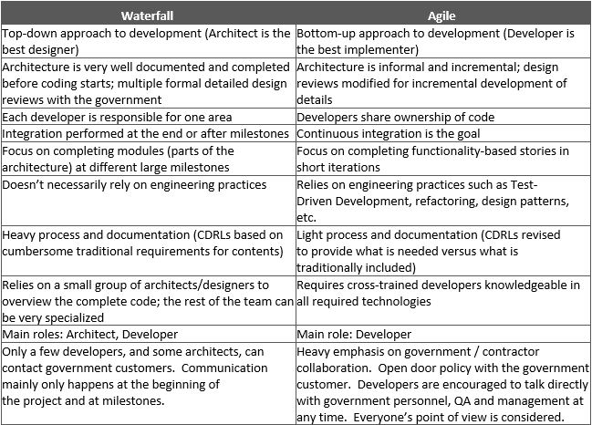

> # **2.2** Agile Introduction

## 2.2.1 4 Agile Values

The Agile Manifesto describes the overarching beliefs of Agile software development as follows (http://agilemanifesto.org): 

We are uncovering better ways of developing software by doing it and helping others do it. Through this work we have come to value: 
 
That is, while there is value in the items on the right, we value the items on the left more.

## 2.2.2 Benefits of Agile over Traditional Methods

1.	Higher quality product (incremental development, continuous integration and automated testing tools allow developers to fix issues quicker when they are fresh in their mind and have fewer secondary effects on code built on top of a bug).  

2.	Ability to change dynamically to customer/user wants, needs, and/or requirements (value adaptation based on increased transparency, formal feedback events, and high degree of customer collaboration).  

3.	Ability to balance workloads based on cross-functional teams (while team members often have areas of expertise, agile emphasizes 
cross-functionality which allows flexibility to surge resources as necessary).  Decreases and eventually eliminates the "throw over the wall" 
approach, thereby allowing development, operations, and security to work together iteratively to swarm on a particular issue or bug, 
should one come up, during releases to lower environments (this decreases the risk of failures in production if all environments are aligned and 
mirrored-appropriately). 

4.	Shorter implementation time to usable product (provides quicker return on investment, decreased risk of project failure, faster end-user feedback into the development cycle and increased customer satisfaction).  

5.	Ability to balance technical debt and new functionality, thereby decreasing technical debt over time. 

## 2.2.3 High-Level Differences
 

## 2.2.4 Friction Points with Waterfall

1.	Lack of Ownership - The traditional regulatory environment is based on establishment of fixed requirements, 
letting the external development team develop the product and then inspecting and validating the product to see if it meets the 
requirements (tennis match of throwing things back and forth between customers and developers with the assumption that both parties understand 
the requirements in the same way). 
--      **Recommended Mitigation**: The key to any agile methodology is collaboration.  A dedicated PO (PO) 
(can be a government employee or contractor on the business level or on the technical team) with decision making authority or immediate 
reach-back for those decisions is necessary to support the velocity of agile methodologies in being able to provide value in an 
ever-changing environment.

2.	Lack of Collaboration - Traditional design reviews (Preliminary Design Review / Critical Design Review) currently focus on developers 
presenting their design results at a fixed point of time after exhaustive analysis. 
--	**Recommended Mitigation**: What is needed is mini-collaborative design reviews that are done in such a way that integration elements are 
identified early enough while allowing additional design elements to be refined as close to the work being done as necessary 
(based on changes happening constantly - re-work will be generated on designs which are done too early and no longer apply to the current situation).

3.	Traditional CDRL formats - The traditional government waterfall process intentionally incurs oversight costs as a risk mitigation strategy 
to ensure that progress was made by contracted agents.  In terms of documentations, the government includes in their Contract Deliverable Requirements 
List (CDRL) a list of documents which are formatted and generated based on a waterfall development framework.  The reviewers of these documents 
are familiar with what the old contents were, and when reviewing delivered documents expect the same waterfall content which are focused on large 
immovable designs versus less-detailed more agile enabling designs. 
--	**Recommended Mitigation**: Contracts need to be modified up front so that only the necessary CDRLs that provide actual value are included and 
document deliveries are based on an agile timeline (smaller iterative updates versus large updates for significant milestones).  
(NOTE: While adequate documentation is necessary - the definition of "adequate" needs to be modified to provide timely value as determined 
by the document owners).  See recommended CDRL considerations attachment in Section 3.5. 

4.	Team and team member performance - Agile is based on team dynamics which take time to coalesce (normally that means there is a start-up period where less physical value is produced in the short-term while establishing the foundation to more rapidly produce value in the long-term).  
This means that by the straight-line value metrics of traditional project management, the project will appear behind at first.  
The normal strategy here is to provide more "waterfall" elements into the equation to try and "catch-up" the project which actually impedes / restricts 
the capabilities of the team to add value.  Then in the end if the blame is placed on the agile system versus on the waterfall regulatory restrictions 
that were placed on it in order to "catch it up". 
--	**Recommended Mitigation**: Establish trust and transparency (see Communication Management section) as the team learns together how to implement 
an agile-based process which is understood and accepted by the government and development team.  Include more formalized process to 
"ramp up" new government and contractor team members and their understanding of the system and environments.

5.	Uncontrolled change/scope creep versus managed change to provide increased value. Waterfall methodologies focus on a formal change 
management process in order to manage scope creep.  Agile is inherently flexible in nature - it welcomes change based on the need to provide value 
to an ever-changing reality versus provide the value determined during a snapshot in time planning event which could have taken place months or 
years previously.  However, the issue with agile is this inherent flexibility leads to general requirements which allow for the customer to 
revise in an ad hoc manner which facilitates uncontrolled scope creep (which is okay unless there is a hard deadline in providing the product 
based on the initial general requirements). 
--	**Recommended Mitigation**: Establish a flexible change management system (this will be based on the amount of trust established by the team).  
It should be flexible enough to rapidly adapt to the changing reality of what the definition of value is within existing requirements while 
implementing formal steps to manage scope creep (an example is adding a new requirement / feature versus revising an existing one). 

6.	Earned value reporting - EV is an attempt to monitor the progress of a project by linking contract to cost to contents - these fixed linkages 
established at the beginning of the contract are normally difficult to change as the work adapts to reality 
(I.e.  we already reported these features and their value to our superiors and it is too hard to revise - so we would rather use the logic we 
reported instead of revising that logic to fit reality).  This often causes a disconnect between the development team and the contracting team 
as the metrics based on past logic which EV is measuring does not reflect the evolved reality existing in the agile development environment. 
--	**Recommended Mitigation**: Link earned value costs to features (can be based on high-level estimates done during feature driven planning.  
Conduct final feature refinement (work / story breakdown) as close to the actual development effort as possible (as an example for Scrum - conduct 
feature refinement 2 sprints out to better reflect reality.  Base the EV metrics on the percentage of the features decomposed work items / user stories 
completed.  

7.	External testing requirements - external test organizations (including those involved with Development Testing and Evaluation (DT&E), 
Quality Testing and Evaluation (QT&E), etc) often require advanced information for their test events (examples include the release contents, 
developers test plan, test cases, conditions, etc. Sometimes up to 270 days prior to a test event).  
Also, these test events are scheduled at fixed milestones versus being iterative in nature.  These two items constrain the flexibility of 
agile to both react to evolving requirements as well as receive timely feedback from testers to incorporate in current development efforts 
(waiting until the contents of 6 sprints are released before receiving any feedback on their results - see Extreme Programming (XP) Test Driven 
Development section for possible practices). 
--	**Recommended Mitigation**: External testers need to be integrated into the government / development team to derive the evolution of the 
requirements in preparation for their external testing.  An additional step is to establish an iterative external testing cycle which 
coincides with the agile framework battle rhythm (rather than conduct annual large testing events).  

8.	Pure agile theorists - unable to allow for regulatory requirements because they are "not agile".  One of the final and most difficult 
problems is not the transition from waterfall to agile of the government, but the inability of agile implementers to allow for the regulatory 
requirements mandated by the government.  Just as a waterfall purist will blame agile for all difficulties encountered, the agile purist will 
blame all issues on the waterfall regulations imposed. 
--	**Recommended Mitigation**: What is necessary is to find the correct hybrid framework between the two extremes that allow the process 
to work in the most efficient manner possible and also allows buy-in from all team members (the transition from a strictly waterfall to an 
appropriate hybrid framework may also be iterative in nature). 