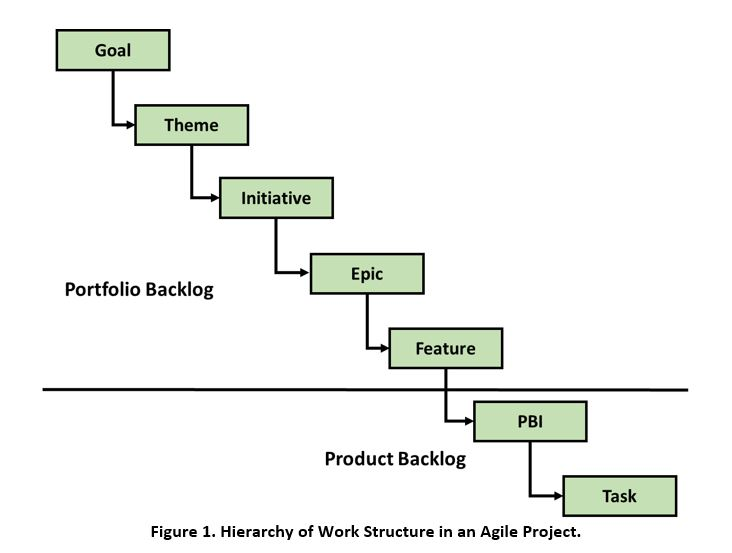

> # **3.3** Project Management

This section describes how project management practices need to be adjusted in support of Agile projects by first identifying common Agile practices
and then describing how these management practices work in terms of scope, schedule and cost baselines for the project work.

## 3.3.1 Planning

An integrated project management plan (PMP) is developed for the Agile project to define the basis of all project work and how the work will be performed.
It describes how the project will be executed, monitored, control and closed. From the Agile perspective, the performance measurement baseline is an
integrated scope, schedule, and cost baseline for the software release project work maintained in the Product Backlog against which project execution
metrics are used to measure and manage performance. The PMP describes the series of phases (themes, initiatives, and epics) the project passes through
from initiation to closure. The PMP also describes the Agile development management approach; i.e. Agile iteration-based (Scrum/XP), flow-based (Kanban)
or a hybrid model. **Figure 1** describes the hierarchal structure of the Agile project work effort. Notice that this view of the project work hierarchy is
similar to the WBS in predictive (Waterfall) projects.

One additional consideration is that the above hierarchy promotes a multi-team or "scaled" agile approach. While methodologies exist to support
the scaling of agile (i.e. Scaled Agile Framework (SAFe), Scrum of Scrums, Disciplined Agile Delivery (DAD), etc), these will not be presented in this
playbook but are a topic for further elaboration as an organization's agile process matures.

## 3.3.2 Scope

In Agile projects the requirements are defined by the organization's stakeholders and Product Owner with support from the Agile Team in the form
of Epics, Features, user stories or PBIs that are maintained in the Product Backlog. Therefore, the project scope for an Agile project begins with
the organization's governance process which commonly consists of a Configuration Control Board (CCB) that produces a high-level product backlog for
a release consisting of a list of approved requirements defined in the form of epics, features and sometimes high-level PBIs.

The product owner then works with the Agile Inception Team to prioritize these items (epics, features, PBIs if applicable). The PMO can initially
use the MoSCoW (Must Have, Should Have, Could Have, Won't Have this time) method to prioritize requirements.

## 3.3.3 Forecasting Schedule and Cost

Once the user stories and PBIs in the product backlog are defined, prioritized and the MVP determined, Agile estimating techniques can
be applied to estimate the effort for each feature, sum up the effort for all the features in a project as well as determine which
features would be part of which release. The PMO and development team are then able to forecast a schedule and cost for the release project.
There are several gross-level estimation techniques used by teams using agile approaches such as Scrum, Kanban, and eXtreme Programming which
include T-shirt Sizes (for Features), and Affinity Mapping.

**T-Shirt Sizes**. This estimation technique can be applied when providing a quick and rough estimation to a project feature. Here, the features
are estimated in T-shirt sizes, ranging from XS to XL, which would be later converted to numbers, as per requirements. In this type of estimation,
the estimators assign a size to each of the features. Points are assigned to the each of the T-Shirt Sizes using the Fibonacci-like
format: 0, 1, 2, 3, 5, 8, 13, 20, 40, 100. These points are summed up and based on a rough estimate of how many feature points can get done
within a time period by a normal agile team (note, the more detailed the refinement, the better the estimates).

## 3.3.4 Cost

The cost for the release is estimated by using the team's iteration average cost and multiplying it by the number of iterations estimated to
complete the backlog. For example, the following formula to determine budgeted cost can demonstrate this estimation for the above example:
(Team monthly cost (example: $15,000.00 per month) multiplied by the number of months/iterations (example: 5 months) = $75,000.00 + other
expenses = forecast budgeted cost.

The above example is utterly simplistic and does not take into account the following factors:

1. The Inception phase at the beginning that is required to develop the product backlog, estimate the size in story points and develop an architecture vision;
2. Changes in scope during the Construction iterations caused by adding new features driven by urgent business needs or Cybersecurity issues;
3. A Transition phase at the end of development for Government Acceptance Tests and Security Tests required to achieve customer acceptance and Authority to Operate (AtO) for deployment;
4. Many other variables such as Cloud Migration and implementation of a DevSecOps reference model.

## 3.3.5 Project Management Consideration Checklist

- The project manager removes ensures funding, organizes stakeholder interactions and keeps the team from being distracted
- Work in increments. Buy, build, and fail small. Make proceed and pivot decisions regularly. Learn from mistakes but don't punish the people
- Leverage the efficiency of commercial contracting methods. If and when possible, use services and tools sold by private sector vendors.
- Use living roadmaps not fixed Integrated master schedules