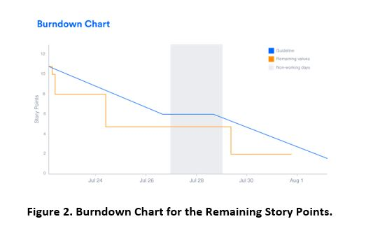
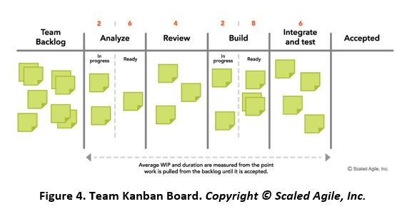
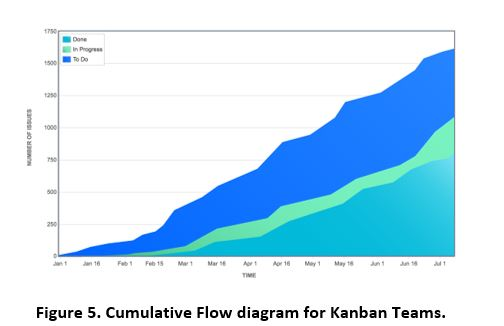

> # **3.5** Measuring Agile Delivery, KPIs, and Metrics - Status Reporting

In Agile, the system always runs, thus Agile metrics are empirical and business value-based measurements instead of predictive measurements such
as the performance measurement baseline and earned value that are used in traditional Waterfall. Agile metrics measure what the Agile Team delivers,
not what the team predicts it will deliver. Project teams use this data for improved schedule and cost forecasts as well as for surfacing problems and
issues that the Agile Team can diagnose and address.

The metrics described below address Team Metrics, Program Metrics and Portfolio Metrics. These metrics were derived from the Project Management Institute, Inc.
Agile Practice Guide, SAFe Metrics, DAD, and Atlassian web sites.

## 3.5.1 Team Iteration Metrics

The Agile team metrics discussed below focus on the delivery of software. Whether the project team is a Scrum or Kanban team, each of these agile metrics will
help the team better understand their development process, making releasing software easier.

### Scrum Metrics

**Sprint burndown.** Scrum teams organize development into time-boxed sprint iterations. At the outset of the sprint, the team forecasts how many
story points they can finish during a sprint. A sprint burndown report (Figure 2) then tracks the completion of work during the sprint. The x-axis
represents time, and the y-axis refers to the amount of story points left to complete. The goal is to have all the forecasted work completed by the end of the sprint.

A team that consistently meets its forecast is a compelling advertisement for Agile in their organization, however, it may be too good to be true if the team is inflating the numbers by declaring an item complete before it really is. In the long run cheating hampers learning and improvement.

There are several anti-patterns to watch for in team performance:

1. The team finishes early sprint after sprint because they aren't committing to enough work in the sprint backlog.
2. The team misses their forecast sprint after sprint because they're committing to too much work.
3. The burndown line makes steep drops rather than a more gradual burndown because the work hasn't been broken down into granular user stories or PBIs.
4. The product owner adds PBIs or changes the scope mid-sprint.

**Velocity** Velocity is the average amount of work a Scrum team completes during a sprint, measured in story points and we used it in the example
from the prior section to forecast a release schedule. The product owner can use velocity to predict how quickly a team can work through the product
backlog, since the velocity chart report tracks the forecasted and completed work over several iteration-the more iterations, the more accurate the forecast.

Each team's velocity is unique. If team A has a velocity of 25 story points and team B has a velocity of 50 story points, it doesn't mean that team B has higher throughput. Because each team's story point estimation technique is unique, their sprint velocity will be as well. Organizations should resist the temptation to compare velocity across teams. Instead, Program Management should measure the level of effort and output of work based on each team's unique interpretation of story points.

### Kanban Metrics

**Team Kanban Board** Flow-based Agile Teams using Kanban methods and Kanban Boards need to use different measurements like work in progress, lead time for delivery of a feature
to customer, cycle time for completion of a task on the Kanban Board, and response time - the amount of time the item waits until work begins. **Figure 4** shows
an example of an Agile team's initial Kanban board, which captures their current workflow states: analyze, review, build, and integrate and test.

After defining the initial process and Work in Process (WIP) limits and executing for a while, the Kanban team's bottlenecks should surface. If this is the case, the Kanban Team refines the workflow process step where the bottleneck occurred or reduces some WIP limits until it becomes evident that a workflow state is 'starving' or is too full. In this manner the Kanban Team continually adjusts the process workflows to optimize their flow. For example, changing WIP limits
and merging, splitting, or redefining workflow states.

**Cumulative Flow Diagram** The cumulative flow diagram is a key resource for Kanban teams, helping them ensure the flow of work across the team is consistent.
With number of issues on the Y axis, time on the X axis, and colors to indicate the various workflow states, it visually points out shortages and bottlenecks
and works in conjunction with Work in Process (WIP) limits.

The cumulative flow diagram should look smooth(ish) from left to right. Bubbles or gaps in any one color indicate shortages and bottlenecks, so when the Agile
Team sees one, they should look for ways to smooth out color bands across the chart. Anti-patterns to look for are:

- Blocking issues create large backups in some parts of the process and starvation in others.
- Unchecked backlog growth over time. This results from product owners not closing issues that are obsolete or simply too low in priority to ever be pulled in.
