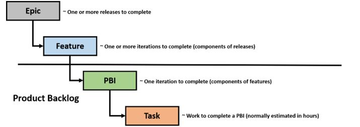
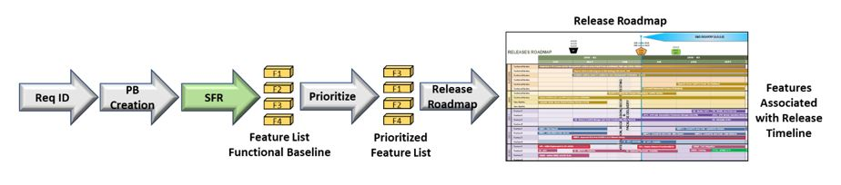

> # **5.1** Part I - Establish the Product Backlog (PB) and Constraints:

## 5.1.1 Establish the Product Backlog

For a government project the initial list of requirements is established within the contract and will be used as the
foundation for the initial PB development (and captured within the appropriate Backlog Management tool). The establishment
of the PB is comparable to the establishment of a language - in this case it is the language of "value" that provides
for understanding between the government and the development team. For this "value" language - the individual PB
components provide the words and grammar (think of Epics as Paragraphs, Features as sentences and User
Stories/Cards as words), while the order of the backlog based on prioritization of "value" provides the context of the
product story.

This initial section focuses on the creation of the Product Backlog. Later sections will discuss how the PB is
prioritized to provide the most value up front as well as how it evolves based on a changing environment to continue
to remain value relevant. As the PB will generally follow a rolling-wave planning process with more detail provided
as it becomes available or necessary, it can initially be setup with larger organizational elements (epics and features)
which will be iteratively refined later. A recommended nested organization for these components include:

- Epics - These include functionality which can take one or more releases to complete. For government contracts,
  these can be linked to a Contract Line Item Number for easier reference to cost tracking and earned value metrics.
- Features - These include functionality components that will generally take more than one iteration to complete and
  provide the functionality to the users through releases.
- Product Backlog Items (PBI) - These include the product increments which consolidate to provide the functionality of
  the feature and generally can be accomplished within a single iteration. PBIs can be decomposed into specific tasks with
  hours estimated for completion.

The main component of the PB is the PBI that may be named something different depending on the framework (for Scrum
and XP can be a user story, for Kanban can be a simple work item or card). In translating a requirement to a PBI, it
is necessary to understand that the PBI can contain 1 or more requirements as it is based on the customer functional need
(can be captured in government use case documents). However, while functional requirements will most likely include BES
Process Directory requirements terms including "shall" which dictates the provision of a functional capability, they may
also include conditional requirements indicated by the "must", "must not" and "required" requirements descriptions indicating
additional performance requirements or constraints). Additional non-functional requirements to be considered include:

- Preparation and conduct of design reviews
- Hardware setup (Different environments)
- Tool setup (Software tools)
- Network Setup (establishing connectivity - access requirements, ports and protocols)
- UAT, Pre-Prod, Prod transitions (can be facilitated by continuous integration and Devops)
- Documentation (User Guides / CDRL's / Training Materials
- Regression testing (can be facilitated by automated testing)
- Cybersecurity testing

The typical PBI contains a minimum of 3 elements -

- Title: Ensure this ties to the logic of the work (many times the titles of a PBI can cause confusion between the
  PO and development team if improperly stated).
- Description: Explains the customers need and the functionality required.
- Acceptance Criteria: Explains the conditions under which the PO will accept the work item as complete (note that there are additional criteria which will be discussed in presenting a "Definition of Done"). These criteria should be testable (I.e. should be specific enough to be able to qualify as complete or not complete).

A typical PBI descriptions contains the following elements:

- "As a..." - Defines the perspective of the user who needs the functionality.
- "I need..." - Defines the functionality needed.
- "So that..." - Defines the why of the functionality (enables the developers' ingenuity as they may have a better
  solution which still meets the "why" of the user's request though the how may be something different).

Example:
As a maintenance scheduler
I need to be able to review the Daily Schedule
So that I can review the events scheduled for the day and the status of
their completion

Additional information can be included within the description. One recommendation is to include the requirement
number(s) from the original contract in this section to facilitate the creation of the Requirement's Traceability
Matrix necessary for design reviews and deliveries.

While the PO is the primary owner of the backlog, the initial creation of the backlog is most effective when completed
in a collaborative manner. While the term Sprint 0 is not an official Scrum term, it does provide a context for doing
the preparation work necessary to initiate an agile methodology (without the PBI's it is not possible to do the work).  
Whatever it is called, there is a preparation session which is necessary to prime the pump of the agile framework by
building the initial PB. Here is a recommended approach to doing this which ends with the government System Functional
Review (SFR) which established the PB as the Functional Baseline:

### Preparation Phases

(Phases are provided here as timeline will have to adjust based on size and complexity of requirements
as well as whether preliminary planning has been done...i.e. feature driven planning):

**Phase 1: (Government and Development Team collaboration preparation)**

- Government provides initial Requirements Traceability Matrix (RTM).
- Government provides initial feature backlog linked to RTM to development team (with minimum of description filled out and rough draft of acceptance criteria).
- Development team reviews feature descriptions and provides feature backlog feedback to government at end of the phase with recommended revised acceptance criteria and questions of clarification for review prior to physical collaboration.

**Phase 2 (Physical Collaboration - government and development team)**

- Collaboratively refine features with end-state of initial Title, Description, and Acceptance Criteria agreed on by government and development team
- Conduct breakout sessions as necessary to provide additional details to development team necessary to make initial estimates of feature sizes
- Development team makes initial estimates of feature sizes (T-Shirt sizing).
- Development team prepares for SFR.

## 5.1.2 System Functional Review (SFR)

The SFR is a multi-disciplined system-level technical review ensures that the functional baseline is established and
has a reasonable expectation of satisfying the requirements of draft capability development document (CDD) within the
current budget and schedule. It completes the process of defining the system-level technical requirements that are
documented in the system performance specification. According to the BPD, a successful completion of SFR provides a
sound technical basis for proceeding into preliminary design. If the above collaboration is done correctly, this review
becomes a "value language" confirmation brief ensuring that the PB correctly reflects the requirements of the contract
and are consistent with cost (program budget), risk and other system constraints.

- **Audience**: Functional Review Board (FRB) members
- **Objectives**:

    - Reconfirm that Capability Package Requirements are linked to PB Features derived during the preparation event above (Sprint 0)
    - Initial identification of system-level document changes which will need to be addressed during design reviews (see CDRL section (link within main document))
    - Establish Functional Baseline.
    - Add Feature list to the Program Product Backlog to be considered in Release Planning for development based on
    PMO priorities and value determination.
    - Determine based on Release Planning when each Feature should be considered within either the Preliminary Design Review or the Critical Design Review.

- **Outputs**:
    - Required inputs for a Configuration Control Board (CCB).
    - Approved PB and Functional Baseline based on Configuration Control Directive (CCD) from CCB.
    - Updated system release roadmap with new features.
    - Updated Requirement Traceability Matrix with links from requirements to PB. 
    - Identified system-level CDRLs to update for design reviews based on PB contents.
    - Identified features for design reviews (Preliminary Design Review [PDR] and Critical Design Review [CDR])
    

## 5.1.3 Release Management

Release management is about determining what is expected to be in each release and what comes next for the development
team as well as identifying PBI dependencies early enough so that they can be rectified prior to becoming impediments
during development. The PB includes those features approved in the functional baseline by the PMO during the System
Functional Release (SFR) conducted at the end of Sprint 0. The features are prioritized within the PB by the PMO and
considered by a Release Planning committee for inclusion in upcoming releases. Those features which are selected for
inclusion in upcoming releases are updated on the Release Roadmap based on their tentative estimate of completion. The
Release Roadmap is a high-level view of the PB features, with a loose time frame for when the team will refine and develop
those features.

**Proposed agenda for Release Planning meeting:**

- Objective Overview
- Review Current Release Roadmap (Starting point)
- Review Current Status of Development Streams (Establish current status which may have changed since last release
  planning session)
- Determine dates for:
  
    - Next Release (Feature focus for the CDR)
    - Next Release (+1) (Feature focus for the PDR)

- Review Product Backlog Feature Priority Lists (Confirm priorities)
- Confirm Features for Next Release
- Identify Features for Next Release (+1)
- Update Release Roadmap (Use information from session to update the release roadmap)
- Discuss any release process improvement steps (Continuous Improvement)

  

## 5.1.4 System Engineering Design Reviews

Link to DAU System Engineering Overview (Add to links appendix - will not be contained in base document):
https://www.dau.mil/guidebooks/Shared%20Documents%20HTML/Chapter%203%20Systems%20Engineering.aspx#toc83

A secondary advantage of implementing a pro-active release management system is the ability to establish what features will be reviewed at what level for Agile-based design review gates (here we are talking about Preliminary and Critical Design Reviews but not in the level of detail that was expected within traditional development engineering management plans as Agile is about doing architectural design "just in time" and iteratively "just enough"). The Design Reviews can be synchronized with the above release management process to fulfill their primary objectives based on two different perspectives:

- Preliminary Design Review (PDR):
    - **Focus**: The features included in the release after the upcoming release (long-term perspective).
    - **Objectives**:
        - Provide sufficient confidence in the preliminary design's integration with necessary system components to serve as the starting point for Agile incremental design during development.
        - Provide technical confidence that the capability need can be satisfied within cost goals based on the schedule included in the release roadmap.
        - Confirms that high-level design decisions are consistent with the user's performance, schedule needs, and the validated Capability Development Document (CDD).
        - Establishes the allocated baseline (based on features), which is placed under formal configuration control.
    - **Agile Revisions**:
        - Identify dependencies on external requirements or other features to ensure proper sequencing and identify issues for resolution prior to them becoming impediments (identifies feature risks early).
        - Determine required infrastructure requirements so they can be acquired prior to development.
    - **Agenda Template**:
        - Review Release Roadmap
        - Review Features for the release after the immediate upcoming release.
            - Review Feature description
            - Review Feature acceptance criteria
            - Review Features system-level design integration (focused on necessary design integration of feature capability)
            - Review Feature dependencies (I.e. external interface requirements, additional software requirements) - these will become an initial set of assumptions for risk management (the goal is to mitigate the risks so that the assumption will not impede our development efforts later)
            - Review Feature CDRL requirements (what CDRLs will need to be updated based on the completion of the feature development)
            - Review Feature size estimates (establishes metric for estimating duration)
    - Revise Release Roadmap as necessary based on updated information
  
- Critical Design Review (CDR):
    - **Focus**: The features included in the next (upcoming) release (short-term perspective). 
    - **Objectives**: 
        - Establishes the initial product baseline (based on features), which is placed under formal configuration control. 
        - Confirms the high-level system design is expected to meet system performance requirements 
        - Confirms the system is on track to achieve affordability and should-cost goals as evidenced by the design documentation 
        - Establishes requirements and system interfaces for enabling system elements such as support equipment, training system, maintenance and data systems. 
    - **Agile Revisions**: 
        - Confirms that dependencies identified in the PDR have a resolution strategy that will be completed in time to enable development of the dependent features (will not become impediments during development).
        - Confirms that features are ready for further refinement into work items for the development team.
    - **Agenda Template**: 
        - Review Release Roadmap
        - Review Features for the upcoming release.
            - Review Feature description 
            - Review Feature acceptance criteria 
            - Review Features system-level design integration and system requirements:
                - UI change requirements (mock-ups if available)  
                - Middle tier requirements (services) 
                - Data structure requirements
            - Review Feature dependencies to ensure they have been resolved or a feasible resolution strategy is in place prior to beginning work on the feature (these address the initial assumptions determined during the PDR) 
            - Review Feature CDRL requirements - update as required 
            - Review Feature size estimates (establishes metric for estimating duration) - update based on additional information 
        - Revise Release Roadmap as necessary based on updated information
  

## 5.1.5 Refine the Product Backlog (Features -> Initial PBIs)

In general, the refinement process establishes the "development language" between the Development Team and the Government
through their designated PO. Feature refinement should be conducted about 2 months prior to working on the first PBI of the
feature. The objectives of feature refinement are to:

- Break down feature to individual PBIs (user stories, cards, work items, etc) with, at a minimum, a description and
  acceptance criteria;
- Provide an initial estimate of the complexity of the work item (sizing estimates can be associated with established
  costs and used for EV metrics);
- Gain the formal approval of the PO to include the refined work items into the Product Backlog.

Feature refinement in preparation for development work conducted between the government PO and Development Team:

- Normally takes 1-2 hours per feature if done correctly (the more discussion, the better clarity of understanding
  between the government and the development team increasing the likelihood that the development product will meet government
  expectations).
- Refine initial title, description, acceptance criteria at the feature - level based on knowledge acquired since design
  review - this is the focus of the PMO input - provides the WHAT of the feature.
- Identify the logic of the work.
- Identify the initial user stories.
- Ensure that the stories have a description and acceptance criteria which provide a common reference for the team to
  produce an initial sizing estimate (provides metric for EV - can be updated later).
- Identify infrastructure requirements (i.e. suites) necessary for development.

Three questions to guide Feature Refinement Discussion and what they are attempting to elicit:

1. What do you want to see at the end? (Acceptance Criteria)
2. What are the high-level steps to get there? (Logic)
3. What are the sub-steps for each of the high-level steps? (PBIs)

## 5.1.6 Prioritize the Product Backlog

Agile is about providing value to the government customer as quickly as possible. Less valuable work is ranked lower in
the priority scale. Thus, after refinement of the features into PBIs within the PB, it is necessary to rank them based on
the value they provide. There are multiple considerations in evaluating the value of each individual PBI including:

- What provides most value functionally to the government user?
- What impact does the PBI have on other items within the backlog (i.e. are their dependencies between work items)?
- Cost / impact assessment of each PBI.
- Learning - Are their efficiencies to be gained for the remaining work items by completing a specific story earlier (i.e. taking a smaller item which is easier to do to establish the templates and processes for doing more complex work items of a similar nature later but at a more rapid pace)?
- Are their negative impacts to other PBIs by not completing one earlier?
- Regulatory deadlines (not considered agile, but is a consideration for prioritization)

It is the responsibility of the PO, as the representative of the government to continuously reprioritize the PB to provide the most value to the government based on the current environment (especially as new PBIs are added or removed from the PB).

Prioritization considerations to avoid (as they are normally short-term perspectives which may reduce long-term value):

- Highest Ranking Person in the Room
- Flavor of the Day

## 5.1.7 Constraints Analysis

The above sections focus on refining requirements into work items, but there are several; other areas of regulatory
constraints within the governmental regulatory environment that should be addressed prior to determining as well as
implementing an Agile development methodology. The following is a non-exhaustive list of items that may impact the execution
of development based on scope (these provide a basis for discussion between the Government and Development Team to determine
which will be enforced and to what level):

- External testing requirements such as DT&E and QT&E (capacity may be required to prepare and support testing - need to
  delineate what falls to the development team and what will be done by the government)
- Additional BPD Design, Test, Functional Readiness Reviews (all come with a preparation and documentation overhead - will
  need to discuss expectations and agile modifications based on iterative versus up front design)
- Development environment limitations (discussion around whether the contractor will control the environment or whether it
  is an externally administered environment - I.e. the Capabilities Integration Environment (CIE))
- Access requirements (security requirements may dictate which personnel resources can be allocated to a team)
- Re-usability and compatibility requirements (establishes the boundaries of initiative for the developers -
  "can be innovative within these limits")
- Cybersecurity requirements (the pre-requisite cybersecurity requirements may limit development options)

## 5.1.8 Change Management

While there is an inherent flexibility within Agile methodologies to accept change specifically through backlog grooming and
PBI refinement, there is still the challenge of differentiating between contractual scope additions versus simple requirement
refinement. The differentiation of what will be left within the authority of the PO to approve through backlog refinement
and what requirement changes need formal approval in the form of a Configuration Change Directive (CCD) should be established
prior to the beginning of development to ensure proper steps are taken within the established constraints to adapt to change.
When a formal configuration change is necessary, the government Configuration Control Board (CCB) with input from the Functional
Review Board (FRB) should:

- Review the list of any new user requests, deficiency reports and change requests received in the project space;
- Assess the impact of a change;
- Assign a priority to the change;
- Assign a business value to the change; and
- Implement a CCD to insert an approved work item for the change into the Product Backlog (upon completion of any
  contractual modification requirements to accept in the new work)
