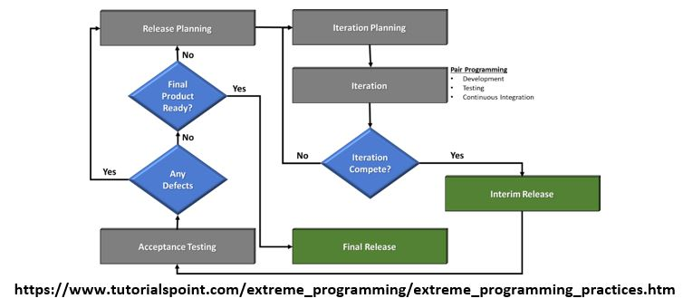

> # **5.4** Extreme Programming (XP)

XP's primary contribution to the software development world is an interdependent collection of engineering practices that teams can use to be more effective and
produce higher quality code. Many teams adopting agile start by using a different framework and when they identify the need for more?disciplined engineering practices
they adopt several if not all of the engineering practices espoused by XP. The recommended methodology here is to begin with the Scrum Framework Events listed before
and then adopt as necessary the XP engineering practices which enhance the process.

General differences between Scrum and XP:

1. Scrum uses sprints which are normally 2-4 weeks long. XP uses iterations which are normally 1-2 weeks long. 
2. Sprint backlogs are normally sacred while XP embraces more flexibility if a higher priority work item comes in (understanding that it will replace an
   equivalent work item already accepted into the iteration). 
3. If the team identifies some stories that they are unable to estimate because they don't understand all of the technical considerations involved, they can
   introduce a spike to do some focused research on that particular story or a common aspect of multiple stories. Spikes are short, time-boxed time frames set aside for
   the purposes of doing research on a particular aspect of the project. Spikes can occur before regular iterations start or alongside ongoing iterations. 
4. XP focuses on practice excellence. The method prescribes a small number of absolutely essential practices and encourages teams to perform those practices as
   good as they possibly can, almost to the extreme. This is where the name comes from. Not because the practices themselves are necessarily radical rather that teams
   continuously focus so intently on continuously improving their ability to perform those few practices.

With that in mind, the initial recommended XP methodology will focus on the following initial events with selected engineering practices being employed during
execution of these events:

1. Product Backlog Refinement 
2. Iteration Planning 
3. Iteration 
4. Iteration Review 
5. Iteration Retrospective 

The core of XP is the interconnected set of software development practices listed below. While it is possible to do these practices in isolation, many teams have found
some practices reinforce the others and should be done in conjunction to fully eliminate the risks you often face in software development.
The XP Practices have changed a bit since they were initially introduced. The original twelve practices are listed below. If you would like more information about how
these practices were originally described, you can visit? http://ronjeffries.com/xprog/what-is-extreme-programming/.

- Planning Games
- Small Releases
- Metaphor
- Simple Design
- Testing
- Refactoring
- Pair Programming
- Collective Ownership
- Continuous Integration
- 40-hour week
- On-site Customer
- Coding Standard

Below are the descriptions of the practices as described in the second edition of Extreme Programming Explained - Embrace?Change.?These descriptions include
refinements based on experiences of many who practice extreme programming and reflect a more practical set of practices.

- **Sit Together**. Since communication is one of the five values of XP, and most people agree that face to face conversation is the best form of communication,
  have the team sit together in the same space without barriers to communication, such as cubicle walls (note that there are always exception to this rule for remote
  workers - but these exceptions should be minimized).
- **Whole Team**. A cross functional group of people with the necessary roles for a product form a single team. This means people with a need as well as all the
  people who play some part in satisfying that need all work together on a daily basis to accomplish a specific outcome.
- **Informative Workspace**. Set up the team space to facilitate face to face communication. Allow people to have some privacy when they need it, and make the work
  of the team transparent to each other and to interested parties outside the team. Utilize Information Radiators to actively communicate up-to-date information.
- **Energized Work**. Teams are most effective at software development when they are focused and free from distractions.?Energized work means taking steps to make
  sure the team is able physically and mentally to get into a focused state. This means do not overwork the team (surges should be minimized).
- **Pair Programming**. Pair Programming means all production software is developed by two people sitting at the same machine. The idea behind this practice is that
  two brains and four eyes are better than one brain and two eyes. This practice effectively provides a continuous code review and quicker response to nagging problems
  that may impede one person doing it on their own.?Teams that have used pair programming have found that it improves quality and does not actually take twice as long
  because they are able to work through problems quicker, and they stay more focused on the task at hand, thereby creating less code to accomplish the same thing.
- **Stories**. Describe what the product should do in terms meaningful to customers and users. These?stories?are intended to be short descriptions of things users
  want to be able to do with the product that can be used for planning and serve as reminders for more detailed conversations when the team gets around to realizing that
  particular story.
- **Weekly Cycle**. The Weekly Cycle is synonymous to?an?iteration. In the case of XP, the team meets on the first day of the week to reflect on progress to date,
  the customer picks the stories they would like delivered in that week, and the team determines how they will approach those stories. The goal by the end of the week is
  to have running tested features that realize the selected stories. The intent behind the time boxed delivery period is to produce something to show to the PMO for
  feedback.
- **Quarterly Cycle**. The Quarterly Cycle is synonymous to a release. The purpose is to keep the detailed work of each weekly cycle in context of the overall
  project. The Customer lays out the overall plan for the team in terms of features desired within a particular quarter, which provides the team with a view of the
  forest while they are in the trees, and it also helps the customer to work with other stakeholders who may need some idea of when features will be available. Remember
  when planning a quarterly cycle the information about any particular story is at a relatively high level, the order of story delivery within a quarterly cycle can
  change and the stories included in the quarterly cycle may change. Revisiting the plan following each iteration provides an opportunity to keep everyone informed as
  soon as those changes become apparent to keep surprises to a minimum.
- **Slack**. The idea behind slack in XP terms is to add some low priority tasks or stories in your weekly and quarterly cycles that can be dropped if the team gets
  behind on more important tasks or stories. Put another way, account for the inherent variability in estimates to make sure you leave yourself a good chance of meeting
  your forecasts.
- **Ten-Minute Build**. The goal with the Ten-Minute Build is to automatically build the whole system and run all of the tests in ten minutes. The founders of XP
  suggested a 10 minute time frame because if a team has a build that takes longer than that, it is less likely to be run on a frequent basis, thus introducing longer
  time between errors. This practice encourages the team to automate the build and test process to run on a regular basis. This practice supports the practice of
  Continuous Integration and is supported by the practice of Test First Development.
- **Continuous Integration**. Continuous Integration?is a practice where code changes are immediately tested when they are added to a larger code base. The benefit
  of this practice is the development team can catch and fix integration issues sooner. Most teams dread the code integration step because of the inherent discovery of
  conflicts and issues that result.
      - Most teams take the approach "If it hurts, avoid it as long as possible".
      - Practitioners of XP suggest "if it hurts, do it more often".

The reasoning behind that approach is that if the development team experiences problems every time they integrate code, the more frequently they integrate, the
smaller the changes and the easier to determine the source of the problem. This practice requires is highly dependent on Ten Minute Build and Test First Development.

- **Test-First Programming**. Instead of following the normal path of:

Develop code -> write tests -> run tests

The practice of Test-First Programming follows the path of Test Driven Development (TDD):

Write failing automated test -> run failing test -> develop code to make test pass -> run test -> repeat

As with Continuous Integration, Test-First Programming reduces the feedback cycle for developers to identify and resolve issues, thereby decreasing the number of bugs that get introduced into production.

- **Incremental Design**. The practice of?Incremental Design?suggests that the team does a little bit of work up front to understand the proper breadth-wise
  perspective of the system design, and then dives into the details of a particular aspect of that design when it delivers specific features. This approach reduces
  the cost of changes and allows the team to make design decisions when necessary based on the most current information available. The practice of Refactoring was
  originally listed among the 12 core, but was incorporated into the practice of Incremental Design. Refactoring is an excellent practice to use to keep the design
  simple, and one of the most recommended uses of refactoring is to remove duplication of processes. The biggest impact on instituting this practice is determining
  the scope of the governments formal design reviews (PDR/CDR) as this practice provides the inputs to these activities during the actual development iteration.

## 5.4.1 XP Process Cycle

## 5.4.2 XP Events (Similar to Scrum - minor revisions, associated engineering practices)

Using the Scrum framework for the baseline of events to start the XP process, the following events are summarized here to avoid redundancy with the Scrum section above. Only key differences will be presented here along with a recommendation of which engineering processes could be incorporated into these events (note that many of the engineering practices can be employed in multiple events - below is only one recommendation):

a. **Product Backlog Refinement** - Are the Backlog priorities still correct? Is the Release Roadmap up to date?

- Play: Link to Play below in the Appendix
- **Overview**: Backlog refinement focuses on providing a prioritized set of "ready" (see Definition of Ready above) user stories for the development team to accept
  into the next iteration as well as a "ready" reserve set of user stories which are available to the team during the iteration in case additional capacity becomes
  available.
- **XP differences**: Introduction of Spike to do focused research on stories which require more clarity.
- **Applicable Engineering Practices**: Quarterly Cycle, Stories, Incremental Design

b. **Iteration Planning** - Are the Backlog priorities still correct? Is the Release Roadmap up to date?

- Play: Link to Play below in the Appendix
- **Overview**: During this meeting, the Product Owner will review the current list of Ready user stories to ensure that they are still valuable (relevant), as well
  as reprioritize the Backlog based on existing value as necessary (this facilitates the team's acceptance of work into the iteration as they simply take user stories
  from the top of the list within their established iteration capacity.
- **XP differences**: XP uses iterations which are normally 1-2 weeks long.
- **Applicable Engineering Practices**: Weekly Cycle, Slack

c. **Iteration** - Are the Backlog priorities still correct? Is the Release Roadmap up to date?

- Play: Link to Play below in the Appendix
- **Overview**: Iteration execution consists of developers completing their work, testers executing the tests developed prior to the iteration (with the addition of
  any necessary negative test cases), and BAs and testers reviewing the completed work with the Product Owner in order to receive early feedback or formal closure of the
  story as meeting the teams "Definition of Done".
- **XP differences**: Focus of XP is on Test-First Programming and Pair Programming in the execution stage (tests fail at the beginning because the code is notdeveloped - working in pairs, the developers develop the code to pass the tests, when development testing is done - the team testers do a final verification of the
  initial tests along with any additional negative tests they have written. This process can also be facilitated by implementing a Continuous Integration system to maximize the use of automated testing.
- **Applicable Engineering Practices**: Sit Together, Informative Workspace, Energized Work, Pair Programming, Test-First Programming, Continuous Integration,
  Ten-Minute Build

d. **Iteration Review** - Are the Backlog priorities still correct? Is the Release Roadmap up to date?

- Play: Link to Play below in the Appendix
- **Overview**: The iteration review is a presentation to Stakeholders of the completed increment based on acceptance by the Product Owner. The key to the review is
  that it is interactive between the Stakeholders and Development Team - the focus being to provide a feedback mechanism to improve the product.
- **XP differences**: None.
- **Applicable Engineering Practices**: None

e. **Iteration Retrospective** - Are the Backlog priorities still correct? Is the Release Roadmap up to date?

- Play: Link to Play below in the Appendix
- **Overview**: This is where the Product Owners and the Development Team focus on improving the Agile process. Critical to understanding the concept of the
  retrospective is that learning always occurs during these events whether the iteration was successful or not.
- **XP differences**: Focus will not only be on events - it will include the team's selected engineering practices.
- **Applicable Engineering Practices**: Whole Team
