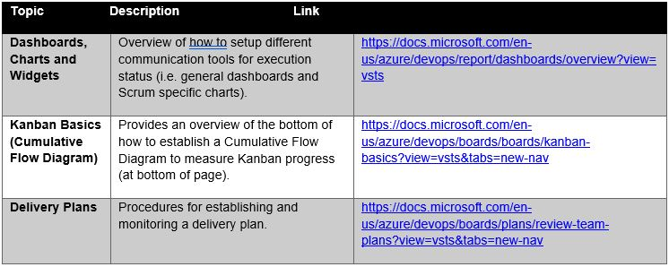
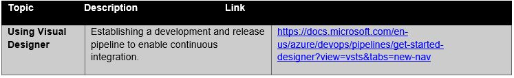
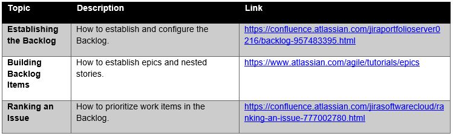
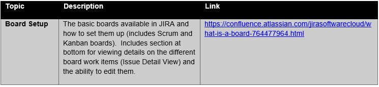

> # **8.2** Agile Tools

## 8.2.1 VSTS / TFS

Overview: https://msdn.microsoft.com/en-us/library/ms364062(v=vs.80).aspx

Backlog Management:

Work Mangement:

Communication Management:

Continuous Integration:

## 8.2.2 Atlassian (JIRA)

Overview: https://confluence.atlassian.com/jirasoftwarecloud/jira-software-overview-779293724.html 

Backlog Management:

Work Management:

Communication Management:

Continuous Integration:

