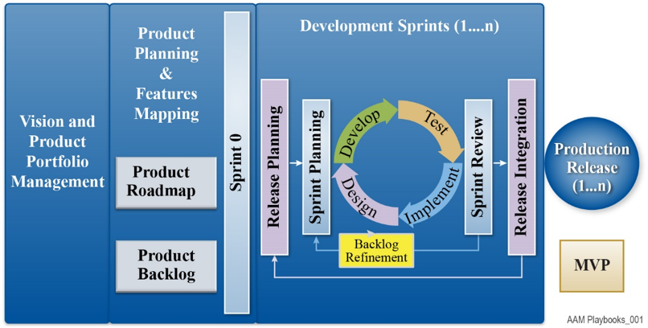

> # **4.2** Low-Code Software Development Lifecycle

In this section we describe how the Low-Code App development project is broken down into four (4) activity categories or phases:  Setup, Define Needs, App Delivery, and Run App where the processes phases and work items are optimized for delivering Low-Code business apps. We also demonstrate how the Low-Code development life cycle maps to the Agile software development methodology.

## 4.2.1 Agile Development Practices

No new project management framework would be complete without consideration of the development processes that need to be modified or established to support Low-Code software delivery. The process dimension of digital business project management prescribes how different parts of an organization should interact, where Low-Code fits with agile development, and how business (represented by the BES PMO and its stakeholders) and IT (represented by the App development contractor) work together to ensure success. The contractor project team, consisting of the project leadership team and the development team Tech lead, will drive the implementation of innovative solutions that solve complex technical and business issues. The Tech Lead uses an iterative agile methodology (for example see **Figure 1**) to establish the connection between business and technical teams and harness the promise cross-functional agile teams can realize on Low-Code product delivery. 

__

**Figure 1. Typical Agile Scrum Development Framework for an App Release.**

### Vision and Product Portfolio Management for IT Applications Platforms in BES:

The BES PMO will perform Vision and Product Portfolio Management with the goal to: (1) align the PMO’s IT Application Platform portfolio to deliver the digital strategy; (2) identify gaps and issues in application and information architecture; (3) align IT investments to critical business objectives; (4) shorten time to realize business value through improved flexibility; (5) make PMO Apps platforms and services cloud ready, and (6) facilitate selected move of Apps to cloud native architectures (PaaS or SaaS) to improve flexibility, take advantage of cloud services certified for workloads up to IL5 security and (7) to reduce fixed IT costs to manage existing IT applications and their hosting infrastructure.

It is recommended that BES PMOs use the product vision board in Jira to help Product Owners and Stakeholders describe, visualize, and validate the PMO’s product vision and product strategy. Use the Jira product vision board to capture the target group, assumptions about the users and the customers of the new App or App changes, the needs the product should address, the key product features, and the value the product should create for PMO stakeholders and users. Keep the information on the vision board concise. Do not write personas and user stories or create a design sketch. Experience demonstrates that the product details are best captured in the specific Apps product backlog Epics, Features and high-level User Stories.

### Product Planning and Features Mapping: 

For new App development, Agile methodology leverages Scrum iteration sprints with upfront Product Planning and Features Mapping with the product owner and stakeholders in a Sprint 0 to develop a product roadmap and build the App product backlog Epics, Features and User Stories; estimates their initial size in story points; and inputs these requirements into the Jira work management tool.

### Development Sprints:

Following the Sprint 0, in subsequent Development Sprints, the PMO’s Product Owner and Stakeholders work with the PMO’s App Development contractor’s development team in release planning sessions to groom the product backlog and prioritize the items in the product backlog assigned to an App release. Then at the beginning of each sprint in Sprint Planning Sessions, the Product Owner selects User Stories from the product backlog for the sprint iteration and collaborates with the development team to refine User Stories, estimate their size in story points using Planning Poker techniques, break them out into Tasks, and prioritize the sprint backlog (see **Figure 1** above). In development sprints, the development team analyzes, designs, develops/configures, and tests the User Stories in Scrum sprint iterations using the Low-Code platform, Human Centered Design (HCD), Test Driven Development (TDD) techniques and Continuous Integration (CI) pipeline process in Development and Test environments for unit testing, builds, system integration, functional testing, security testing and regression testing. At the end of each sprint, a Sprint Review consisting of functional demonstrations are performed with the PMO’s Product Owner and Stakeholders in the CI pipeline Test environment to verify the sprint User Story ‘definition of done’ checklist criteria are met.  The contractor development Team conducts sprint retrospectives at the end of each sprint to learn from the previous work and make small improvements.

When all development sprints have been completed in the final Release Integration, the development team performs a Release Demo with the Product Owner and Stakeholders for the initial ‘Government acceptance’. After all issues have been resolved and regression testing is completed, a Release Review is held with the Product Owner to validate the release ‘definition of done’ checklist and attainment of ‘minimum viable product (MVP)’ for the product features. The Product Owner and Development team review any feedback on the Release Demo’s completed features and Create User Stories to be added to the Product Backlog for CCB approval.”

### Production Release:

Government App Release Testing is performed in the CD pipeline Staging environment which is identical to the Test environment as formal User Acceptance Testing (UAT) and Security Testing events. Critical Priority 1 and High Priority 2 defects discovered during Government testing are routed back to the Development team for resolution and the release is recycled to the Government test team.” Upon successful completion of Government testing, the App release is promoted to the CD pipeline Production Environment.

### Mapping Agile Development Practices to Low-Code Development Processes:

The following table in **Figure 2** maps the agile activity to the Low-Code activity and work items.

__

**Figure 2. Mapping Agile Practices to No-Code Process Phases and Work Items.**

Work item details and project team roles are provided in  Section 4.4 – Project Management Processes.
For more in-depth details on Agile Project Management please review the “Agile” BES Playbook Chapter found here: [https://besplaybook.github.io/BESPlaybook/agile/1-1-purpose/](/agile/1-1-purpose/)

## 4.2.2 Architecture Considerations

The PMO’s architecture runway is developed during the App Development Sprints after the visioning and product portfolio management is complete. The architecture runway is best thought of in terms of a DevSecOps architecture framework of conventions, technologies, strategies and processes that define the boundaries within which development and operations teams can innovate and evolve their App development and operations solutions. The PMO’s architecture runway will address the following concerns:

1. Establishes the “rules of the road” for collaborative Low-Code development platforms, Web services, SOA services, microservices or native cloud services in terms of the protocols and conventions that Developers will follow.

2. Puts in place large scale shared infrastructure such as COTS Low-Code technology platforms, on-premises API gateways, message brokers, shared database platforms or equivalent cloud native services. 

3. Identifies shared Low-Code platform solutions and services to maximize software reuse and avoid re-inventing the wheel.

4. Provides Development and Operations teams guidance in terms of widely accepted best practices.

Beyond these practical deliverables the PMO will develop a sense of an over-arching vision for how the emerging IT architecture will address the longer-term PMO digital strategy. The PMO’s product manager will define any architecturally driven work as Epics and break down the work into User Stories and Tasks that are performed by Agile Development teams in much the same way as PMO App business requirements are developed.

## 4.2.3 DevSecOps

Implementation of CI/CD pipeline processes referred to in Section 4.2.1 Agile Development relies on the implementation of a DevSecOps reference architecture and the supporting DevSecOps Tool Set. Organizations successfully implementing DevSecOps are focused on relentless automation of development processes (e.g. adopting Low-Code development platforms) and implementing ALM work management tools; version control and digital repositories; automated builds and component integration; automated unit, integration, functional, security and regression testing; Infrastructure as Code (IaC) provisioning, setup and configuration of the Development, Test, Staging and Production environments; and automated deployment of Apps into Production.

## 4.2.4 Automated Testing

It is a best practice to improve App release test coverage by practical adoption of test automation frameworks and related test tools deployed within a CI/CD pipeline processes. Automated test frameworks and tools include open source (Junit, Nunit, Selenium, & Cucumber) and commercial (Micro Focus UFT One, UFT Developer, UFT Mobile; IBM Rational Functional Tester; and SmartBear TestComplete) who are recognized as leaders in the Gartner Magic Quadrant for Software Test Automation. 

Where appropriate and economically practical, Testers will recommend automated testing approaches used during App development testing to improve unit, component integration, functional, security and regression testing. Appropriate test automation allows test teams to execute more tests in less time, increasing test coverage and freeing human testers to do more high-level, exploratory testing. Automation is especially beneficial for test cases that are executed repeatedly, such as those for cross-browser and cross-device compatibility, and those that are part of a full or partial regression suite. As appropriate, Testers from the App development contractor team will need to provide training and knowledge transfer to Government UAT testers and associate PMO contractor technical support personnel in the use of software test automation tools and procedures.

For more in-depth details on Automated Testing please review the “Automated Testing” BES Playbook Chapter found here: [https://besplaybook.github.io/BESPlaybook/testing/1-1-purpose/](/testing/1-1-purpose/)

## 4.2.5 Cyber Security Considerations (ATO)

During the release Development Sprints, the required RMF artifacts are developed and refined in order to validate that the security controls are implemented in the IT infrastructure and App during development. Vendor secure coding methods are used and the OWASP Top 10 List (2019) which consists of the 10 most seen application vulnerabilities are tested for in security testing. These are:

1. Injection
2. Broken Authentication
3. Sensitive data exposure
4. XML External Entities (XXE)
5. Broken Access control
6. Security misconfigurations
7. Cross Site Scripting (XSS)
8. Insecure Deserialization
9. Using Components with known vulnerabilities
10. Insufficient logging and monitoring

It is a best practice to run automated Application Security Testing (AST) tools on App code during development. At a minimum we recommend open source tools; i.e. the OWASP ZAP or Burp Suite tools be used during web application development by Low-Code developers or by experienced security experts during penetration tests to assess web applications for vulnerabilities. For higher levels of security vulnerability testing confidence, the Gartner Magic Quadrant and Forrester Research recommended leader category AST tool vendors (Microfocus, Vericode, Checkmarx and Synops) have improved UX/UI features and reporting that can be used to generate RMF artifacts automatically and help the PMO App owner achieve ATO faster.

## 4.2.6 Operations Considerations

Traditionally, there are two distinct groups within IT: developers and operations. Developers create applications. Operations is more complex. For simplicity, consider “Operations” as everything IT does that does not involve generating code, either manually or using a Low-Code solution. These “non-code” tasks include functions such as security vulnerability scanning, testing, component integrations, infrastructure hosting, backups/disaster recovery, monitoring, analytics, etc. An enterprise-class Low-Code development platform helps IT operations connect Dev and Ops groups so that everyone works together on a single Low-Code development platform to achieved improved business value and improved DevOps IT Operations metrics. Some areas where an enterprise-class Low-Code platform might benefit IT Operations Teams:

### Deployment:

An advantage of using Low-Code is that it can speed up the entire deployment process. When the code has been built and tested, with the click of a button, the code undergoes a dependency check to ensure that any connected code won’t be negatively impacted upon deployment. Passing the dependency check, the entire code is immediately deployed and updated, including the user interface (UI), database, workflows, and everything else needed to run the application.

### Analytics:

Another benefit of Low-Code development platforms is the ability to easily embed feedback mechanisms into the Apps. Once deployed, DevOps engineers can begin to track and analyze metrics such as usage, issues with availability, and overall adoption sentiment. With Low-Code’s ability to quickly iterate based on feedback, DevOps can identify App problems or necessary changes in real-time, and product owners can build and deploy fixes or new features across the entire user-base at once.

### Management:

Professional developers use a multitude of different Apps and Systems to do things like development code changes, versioning control, CI/CD pipeline testing and deployment. Low-code development platforms provide these capabilities directly, or better yet, allow developers to integrate with the DevOps tool set of their choice. This extends the capabilities of the Low-Code development platform, but in ways that are already familiar and comfortable for the Developers and DevOps personal using the Low-Code platform.
