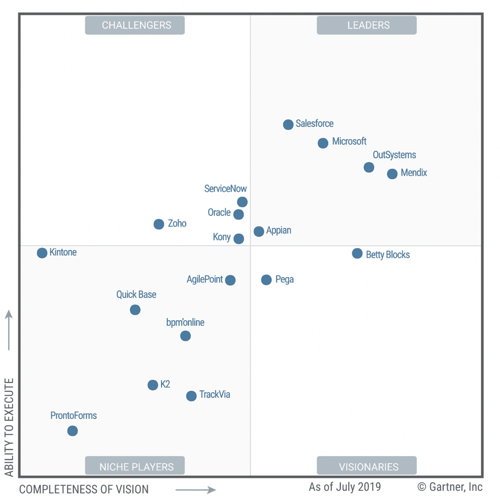
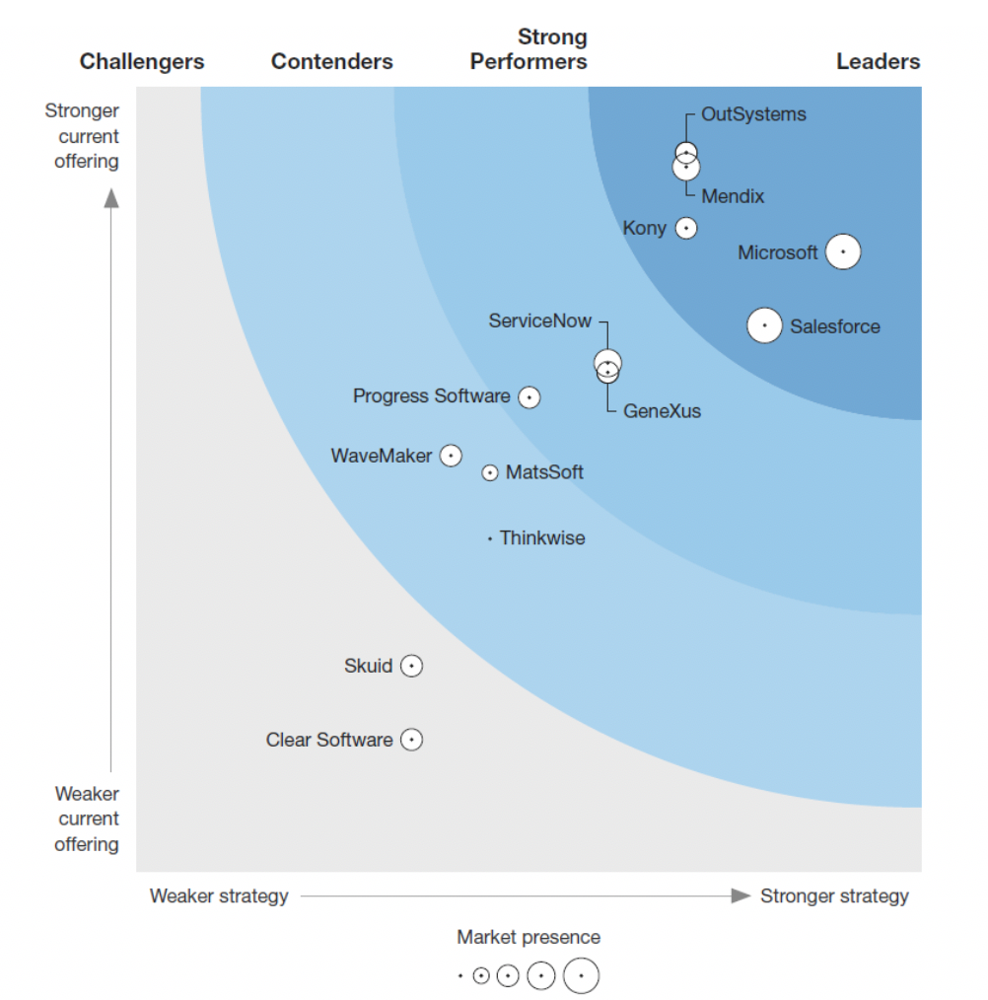

> # **5.2** Current Market Leaders

### Microsoft:  

A new entrant to hpaPaaS/Low-Code development platforms, Microsoft has reached the top three (3) vendors with PowerApps – a drag and drop, citizen developer focused platform to build Apps; provides access to Microsoft Common Data Services; incorporates Microsoft Flow for simple App integration; and provides integration with Microsoft Azure for more complex external business workflows and event-based workflows.

### Mendix: 

Introduced in 2005, Mendix Low-Code Web Developer and Atlas UI framework offers professional developers and to a lesser degree, citizen developers a model-driven visual development environment for data-driven, event-driven and process-oriented Apps. In addition, an integral 3GL Integrated Development Environment (IDE) enables extending the Low-Code visual development tools. Deployed on AWS, Mendix supports open source Cloud Foundry and Docker images.
Appian. Delivering its cloud platform since 2007, Appian’s Low-Code platform enables developers to create data-centric and process-centric Apps using its strong Business Process Modeling (BPM), Case Management Content Management capabilities. Appian has taken a unified platform approach which enables Apps developed on the Appian platform to be deployed without change on a variety of devices on-premises and as PaaS services. 

### ServiceNow: 

The Now Platform, offered since 2013, is a stand-alone Low-Code hpaPaaS solution which comprises all platform services used on ServiceNow’s SaaS IT Service Management solutions with an emphasis on workflow and integration.

## 5.2.1 ©Gartner Magic Quadrant

Gartner defines Low-Code Application Development Platforms as high-productivity application Platform as a service (hpaPaaS) solutions for declarative, model-driven applications design, development and simplified software deployments.  Gartner selected 18 vendors for inclusion in their hpaPaaS assessment. Garner’s vendor inclusion criteria stated, “Only vendors providing “enterprise” hpaPaaS – as a public cloud service - are considered in this ©Gartner Magic Quadrant for July 2019” (see **Figure 7**).

__

**Figure 7. Low-Code Application Development Platform Leaders are in the upper right quadrant.**

## 5.2.2 Forrester WaveTM

For Forrester Research’s Low-Code development platform assessment, we drew the current Low-Code market leaders (see Figure 8) from the Forrester WaveTM Low-Code Development Platforms For 1st Quarter 2019 and Forrester WaveTM Software for Digital Process Automation 2nd Quarter 2019. According to Forrester Research, their inclusion criteria for Low-Code cleared 13 vendors and for digital process automation 10 vendors were cleared for the assessments. Forrester Research moved Vendors that were previously categorized in 2018 Low-Code assessment (included Appian, AgilePoint, Bizagi, K2, and PNMSoft)  to the Forrester WaveTM Software for Digital Process Automation assessment. The vendor inclusion criteria paraphrased from the Forrester WaveTM Low-Code Development Platforms are as follows:

### Offers a comprehensive declarative development approach: 

According to Forrester, declarative tools allow Low-Code developers to define data, logic, flows, forms, and other application artifacts for Low-Code use cases without writing code. Forrester’s assessment emphasizes model-driven development and visual configuration of Apps in application deployment projects.

### Designs its product/services to serve the needs and preferences of Low-Code developers: 

Forrester favored vendors in their assessment that targeted professional developers building enterprise scale digital experiences as their primary customers and addressed other participants (i.e. citizen developers) in Low-Code development as secondary users.

### Provides a low-cost-of-entry commercial model: 

Forrester selected Low-Code development platforms that do not have a high cost barrier for adoption and do not require formal paid training courses to build business apps.

### Supports building many business use cases: 

Forrester selected vendors that take on a wide range of use cases, including web and mobile apps, transactional database apps, automated business processes, event-processing apps, and business reporting and analytical applications.

### Primarily targets large enterprises: 

Forrester selected vendors who server enterprise scale customers having revenues in excess of $1 billion in multiple geographic regions.

__

**Figure 8. Forrester WaveTM Low-Code Development Platforms For 1st Quarter 2019.**

According to PCMag, one area in which all these tools are weak is change management. Feature enhancements are sorely needed around the ability to stage a release to a subset of users plus the ability to roll back a release in case of an error or release failure. Mendix and OutSystems have one-click deployment and rollback, but there are still some issues that they need to work out in syncing data model changes to the UI/UX.

