> # **6.1** Air Force Contracting Information Technology (CON-IT)

Contracting Information Technology System (CON-IT) provides a single contract writing system for the Air Force (AF) contracting community to support all contracting needs including base operations, logistics, contingency, and weapons system contracting world-wide. CON-IT will enable strategic sourcing and other acquisition efficiencies by standardizing data, business rules, and milestone tracking. Furthermore, CON-IT will allow for a standardized and integrated method of anticipating, reacting, and responding to the current pace and changes in process, regulation, and technology across the contract domain. When fully implemented, CON-IT will enable process changes necessary to converge on a common contract writing/management capability within the AF. CON-IT will address the current inefficiencies in the contracting domain, given there are multiple contract writing systems that continue to challenge the ability to operate responsively, consistently, and cost-effectively to award, administer, and close out mission critical contracts in a timely fashion. CON-IT will allow the contracting community to fully support compliance with financial auditability and Financial Improvement Audit Readiness (FIAR) goals that depend on the integrity of the data flow through the Procure to Pay (P2P) process.

## 6.1.1 Program Overview

Contracting professionals provide contracting support capabilities to a wide spectrum of missions, including (but not limited to) weapons systems, research & development, logistics and sustainment, installation and mission support, and contingency operations which includes supporting other federal agencies during natural disasters. The Air Force Contracting Strategic Plan 2009-2013 outline these capabilities. Specifically, Goal 3 states “We will posture the Air Force as a demanding customer to our suppliers and ensure our Air Force Contracting processes and systems are able to meet the challenges of today and tomorrow.” Objective 3.2 further states that “technology offers significant possibilities for improvement” through “two technical upgrades: (1) implementing a single contract writing system and (2) developing a web-based capability for decentralized ordering.” The goal of CON-IT is to become the Air Force’s single contract writing system. CON-IT shall provide contracting professionals with a seamless workspace that supports all requirements defined in the CON-IT Bounded User Requirements.
CON-IT is a Low-Code mission application directly supporting AF-Contracting. AF Contracting’s mission is to deliver responsive information systems to support more efficient and effective contracting operations worldwide in any environment - supporting all domains that form a foundation for sovereign operation of the USAF.  CON-IT supports over 4,700 registered users in the production system and 105 geographic locations worldwide. CON-IT consumes external mission applications using various secure transfer methods.  

__

The following 13 external interfaces are used with the CON-IT system to support the contracting mission requirements: 

1. Integrated Logistics System Supply (ILS-S (SBSS)), 
2. Wholesale and Retail Receiving/Shipping (WARRS), 
3. Defense Medical Logistics Standard Support (DMLSS), 
4. Automated Business Service System (ABSS), 
5. General Fund Enterprise Business System (GFEBS), 
6. Integrated Accounts Payable System (IAPS), 
7. Mechanization of Contract Administration Services (MOCAS), 
8. Contracting Business Intelligence System (CBIS) using DLATS/GEX, 
9. Defense Enterprise Accounting and Management System (DEAMS), 
10. System for Award Management (SAM), 
11. FedBizOps (FBO), 
12. Procurement Integrated Enterprise Environment (PIEE) (including Clause Logic Service (CLS), and 
13. Electronic Document Access (EDA)), and Federal Procurement Data System – Next Generation (FPDS-NG).  
## 6.1.2 Integrated Program Office

### AF CON-IT Program Management Office (PMO)

| POC               | Role                                                                                    |
| ----------------- | --------------------------------------------------------------------------------------- |
| Mr. Michael Allen | Program Manager                                                                         |
| Mr. Ted Blonk     | Deputy Program Manager                                                                  |
| Mr. Bob Harts     | Chief Engineer (Owner of DevSecOps & entire Architecture)                               |
| Mr. Nathan Hay    | Lead Engineer (deputy owner of all DevSecOps, Networking, Infrastructure, architecture) |
| Mr. Jake Haney    | ISSM (ATO package and Security compliance management)                                   |
| Mr. Dave Mitchell | Data Interface Product Owner (all Data Interfaces for Ingress and Egress for CON-IT)    |

### AF Program Management Office Key Personnel that are part of the Agile management process.

__

### AF CON-IT Functional (Customer) 
| POC                 | Role                                                                                                                                           |
| ------------------- | ---------------------------------------------------------------------------------------------------------------------------------------------- |
| Major General Holt  | AF Functional (Customer) System Owner                                                                                                          |
| Mr. Patrick Knepper | Function Owner/Requirements AQCI – Program Manager                                                                                             |
| Mrs. Lara Emmons    | Deputy Function/Requirements Owner AQCI – Program Manager                                                                                      |
| Mr. Bill Woods      | Function customer interface and Functional requirements representative. (Bill is the hands-on functional liaison to AF PMO and AQCI customers) |

## 6.1.3 Program Management Methodology

### Program Management Lifecycle Methodology (Waterfall vs. Agile):

Using an agile approach uses like concept e.g. requirements, design, build, test and deploy to production with key differences on when each concept is addressed. The pitfall is customers are engaged at the end of the process normally having an adverse effect. Customers looks at what was built based on documented requirements however the total solution was not in alignment with customer expectations. With a traditional waterfall approach each topic is serial. Each step is completed in totality of the full application lifecycle versus agile with automation breaking the lifecycle into smaller quick deliverables address the requirements, design, test, build and deployment to production.  

_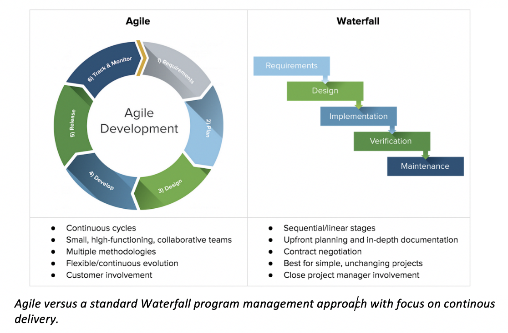_

**Agile versus a standard Waterfall program management approach with focus on continuous delivery.**

### Agile and Scrum

Using Agile methodology further breakdown into the “how” or execution management of the program lifecycle. CON-IT uses Scrum; Scrum is an agile process that focuses on delivering the business value in the quickest time possible meeting the business requirement(s). Scrum rapidly and repeatedly inspects actual working software and the end customers are shown the built software to validate the software address the business requirement(s) in three- or four-week sprints (collection of work that can fit within the time schedule). Scrum emphasizes accountability, teamwork, and iterative progress toward a well-defined goal. The Scrum Framework usually deals with the fact that the requirements are likely to change or most of the time not known at the start of the project.

__

**The diagram shows an Industry Standard Software Development Scrum Overview Process**

__

**CON_IT Agile Schedule Roadmap shows delivery capability by type**

CON-IT has defined the process based on five-week time block or sprints. Each sprint contains the most valuable business requirement that is agreed on with the product teams. Using the approach allows for the CON-IT program to establish a schedule road map.

_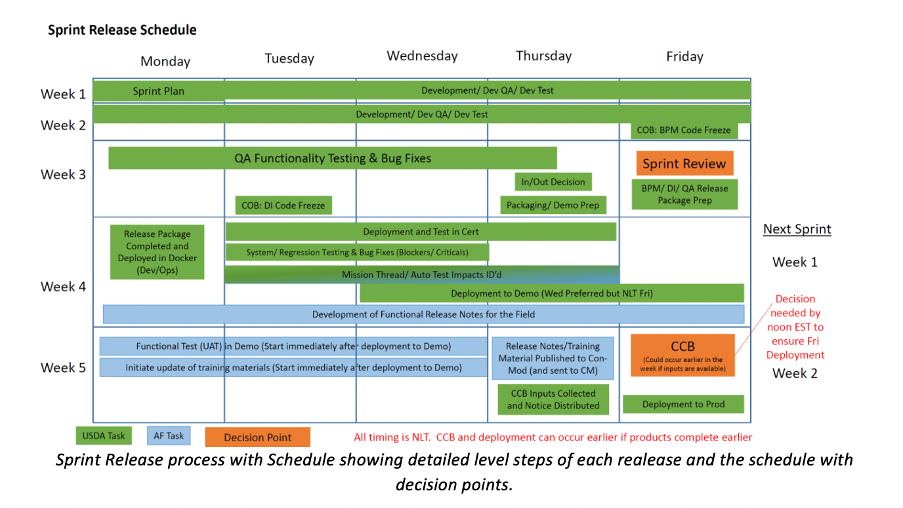_

**Sprint Release process with Schedule showing detailed level steps of each release and the schedule with decision points.**

__

**Change Control Board (CCB) Process for CON-IT and Team Members – USDA is the System Integrator for CON-IT**

__

**Sprint Review expectation deliver with Inputs and Decision Points.**

## 6.1.4 High Level Design

CON-IT is based on an N-tier architecture or a multi-tier architecture. The N-Tier architecture is defined as The “N” in the name n-tier architecture refers to any number from 1. The CON-IT system is engineered to have the processing, data management, and presentation functions physically and logically separated.  The processing, data management and presentation functions are hosted on several clusters configured in a high availability configuration, ensuring the services provides optimized efficiency with compute processing resources (CPU, Memory, Storage, Network). Each service is built to deliver maximum capacity and scalability without unplanned outages. Each service/function of CON-IT architecture is dependent on layer tier to provide the processing, data management and presentation to ensure when a change is not impacting another tier.

The CON-IT program provides the Air Force with a procurement capability for processing all contract requirements from inception to closeout, supported by a modern, secure technical architecture enabling end-to-end alignment of business processes and data, compliant with regulation, supporting FIAR audit readiness, and providing business information for decision makers. CON-IT will share data using the DLA Transaction Services (DLATS) Global Exchange (GEX) with several AF, DOD, and Federal procurement, contracting and financial information systems. CON-IT shall utilize Procurement Data Standard (PDS) and/or Purchase Request Data Standard (PRDS) which enforces FAR- and DFARS-based business rules that have been documented as constraints and data values in the PDS and PRDS eXtensible Markup Language (XML) schemas.

### Purchase Request Data Standard (PRDS):

To achieve traceability and transparency of contract expenditures, the Department of Defense must properly link requirements, as documented in purchase requests (PRs), to their commitments and through to any subsequent procurement actions and payments. The PR is the source of much of the data used in procurement actions, and therefore defines the supplies or services to be delivered, paid for, and recorded on the Department’s books. Alignment of requirements through the procure-to-pay (P2P) process enables more accurate order fulfillment and promotes greater auditability in the Department. Key to this traceability is the establishment of a standard business process and data set for exchanging PRs.

The Purchase Request Data Standard (PRDS) is based on and designed to be congruent with the Procurement Data Standard (PDS). Much like the PDS, the PRDS represents an entire purchase request as discretely identifiable data elements in an XML structure. In addition to the necessary data on a purchase request, the PRDS is capable of transmitting the additional pieces of data found in a Military Interdepartmental Purchase Request (MIPR, DD form 448), the MIPR Acceptance (DD-448-2), and other inter/intra-Governmental transactions (IGT).

### Procurement Data Standard:

The Procurement Data Standard (PDS) is a system-agnostic data standard that is adopting and implemented DoD-wide for creation, translation, processing, and sharing of procurement actions. It defines the minimum requirements for contract writing system output to improve visibility and accuracy of contract-related data, to support interoperability of DoD acquisition systems and to standardize and streamline the procure-to-pay business process. Further, the PDS will improve visibility of contract-related data, enabling senior DoD leadership to make better informed business decisions. And finally, this data standard will support future migration to enterprise and federal systems and processes where appropriate.

The PDS was developed under the guidance of the Defense Procurement and Acquisition Policy office (DPAP). Phase 1 was released in the third quarter of FY08. This version addresses contract awards. Future versions are intended to cover contract modifications and expand the data available within clauses and provisions

The CON-IT program will deploy system capabilities as a series of development / test / delivery capability increments and releases following an agile approach to both acquisition and development. CON-IT provides the key contracting tool towards meeting the Air Force’s requirement for improved contracting effectiveness and efficiencies, as directed by SAF/AQC.

_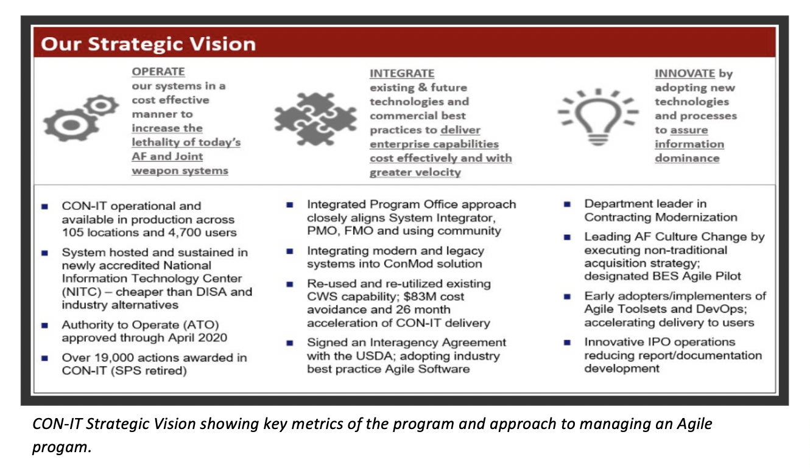_

_CON-IT Strategic Vision showing key metrics of the program and approach to managing an Agile program._

_CON-IT Production Architecture following Industry N-Tier Application Model_

_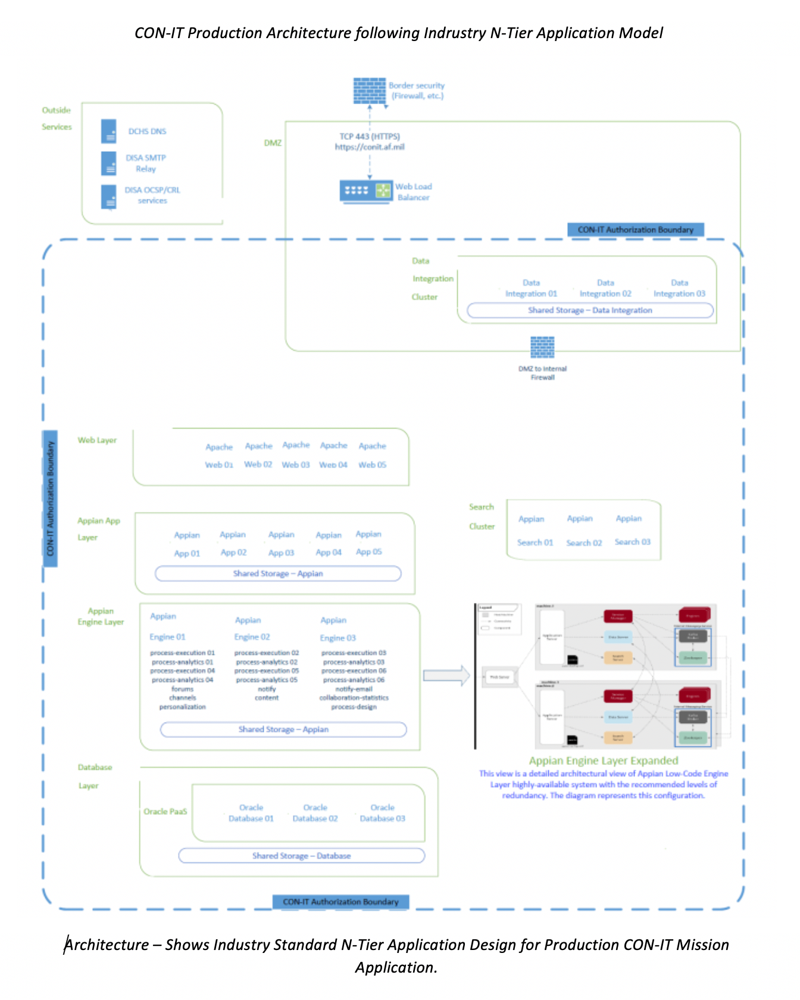_

_Architecture – Shows Industry Standard N-Tier Application Design for Production CON-IT Mission Application._

_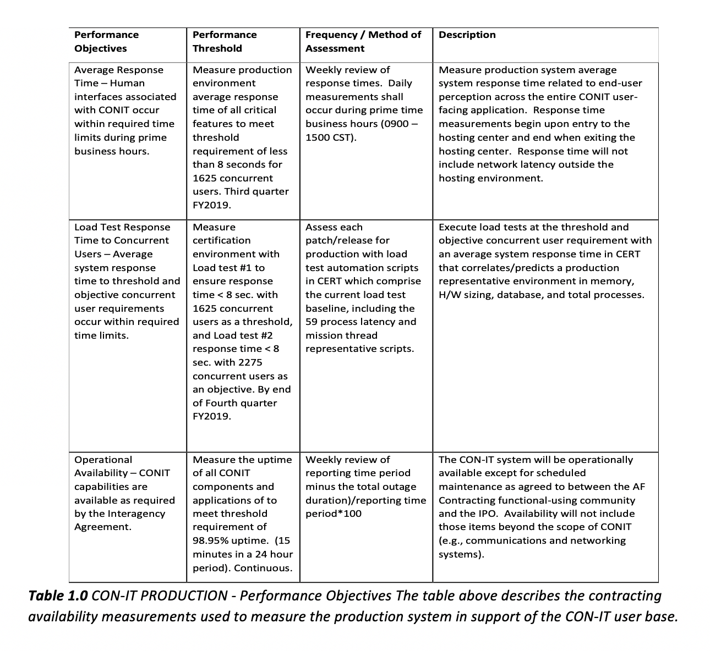_

_**Table 1.0** CON-IT PRODUCTION - Performance Objectives The table above describes the contracting availability measurements used to measure the production system in support of the CON-IT user base._

__

_Cumulative Measurement of Production CON-IT Availability_

## 6.1.5 Platform Selection Process

CON-IT was assessed against an existing DISA contracting system based on the Appian Low-Code platform. CON-IT was able to work with DISA team members and lift the code base and existing functionality for contracting. CON-IT made system updates to the DISA code base to enhance the existing code to meet AF contracting requirements. CON-IT is hosted in Unite States Department of Agriculture (USDA) data centers with Disaster Recover/Failover Site. The system is Impact level 4 categorized. CON-IT has an ATO managed through AF program management office located at Wright Patterson AFB. 

Unlike many programs, CON-IT existed in various forms since initiation in 2001 as the Defense Acquisition Domain Sourcing (DADS) program and shortly thereafter as the Defense Business Sourcing Environment (DBSE) program. After ASD/NII MS A approval, the executive agent at the Department’s Business Transformation Agency (BTA) put the program in abeyance as it did not have the funding required to initiate post-milestone A tasks. DBSE would have replaced all Department of Defense (DOD) contract writing and contract management programs and/or applications with a standard DOD-wide system. Shortly after putting DBSE in abeyance, MG Pair (USA) identified a follow-on Standard Procurement System (SPS) increment, version 4.2.3, as a partial, low-cost solution to meet many DBSE requirements. However, on 3 Jan 2007 after several version 4.2.3 test failures, MG Pair cancelled SPS version 4.2.3, re-baselined the program to the final 4.2.2 version and restructured the program office to provide minimal support in the form of service releases to keep the product current until the Department could find a replacement. For the Air Force, CON-IT represents the Air Force’s solution to satisfy DBSE requirements as the Air Force spun off CON-IT from DBSE. With this in mind, the CON-IT Program Manager requests the Program Executive Officer (PEO) for Business Enterprise Systems (BES), in his capacity as MDA, to ask the Assistant Secretary of Defense, Cost Assessment and Program Evaluation (CAPE) for relief from conducting a full AoA on CON-IT by using and refreshing the DBSE AoA to meet today’s needs. 

### How Appian was selected for CON-IT:

CON-IT used the effort and energy applied from the Defense Information Systems Agency (DISA) business case. CON-IT was able to generate a cost avoidance saving taxpayers $83M through the reuse of IDEAS software code base. 

_CON-IT Program Specific Cost Avoidance through reuse and lessons learned from DISA IDEAS._

_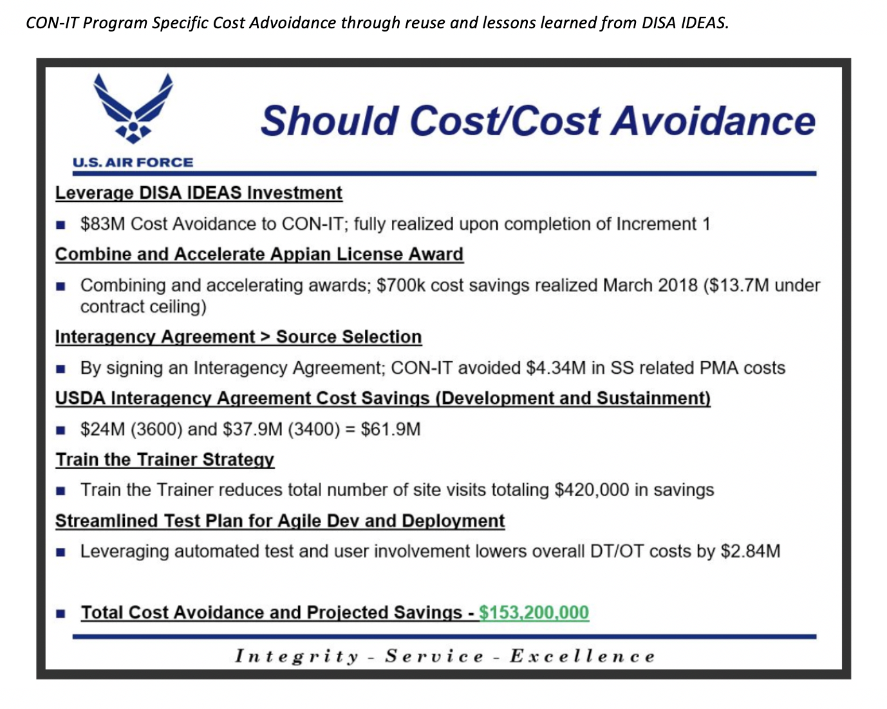_

### Business Problem

DISA needed to improve efficiency and drive automation in its procurement processes. The Agency wanted increased collaboration through a single web-based system for customers, contractors, and administrators to manage all pre-award, award and post-award activities. DISA’s previous approach to procurement was hampered by separate manual checklists outside of the system, separate log-ins to all sub-systems, and contract documents that were manually edited by contracting staff.

Using Appian, DISA created the cloud-based and mobile-enabled Integrated Defense Enterprise Acquisition System (IDEAS) – the largest and most comprehensive BPM-based acquisition management solution in the United States Federal Government. IDEAS connects procurement operations, systems, and DISA personnel (including over 300 Contracting resources) in a single end-to-end procurement solution that manages all aspects of procurement work from pre-award to award and post-award activities. Appian has allowed DISA to drive improvements in productivity and work quality by automating complex agency processes and providing real-time access to critical Government information and applications.

Since go live, IDEAS has processed more than $1.7 Billion in contracts, covering more than 36,000 procurements requirements and producing more than 38,000 contract actions. IDEAS has replaced 12 separate legacy systems, streamlining the work and the work experience for procurement professionals and contractors, while also greatly 

## 6.1.6 Key Benefits of Implementing Low-Code

Digital Transformation requires a new approach to application development and modernization. 

The digital transformation initiative has led enterprises to develop a long list of software priorities that are quickly exceeding development and delivery capacity. With the business requirements continuously evolving as new technology evolve using data to drive success business groups seek alternatives to traditional IT delivery. Traditional software delivery requires a longer process and highly skilled technical resources. 

**The top drivers for digital transformation:**

- Improving existing IT capabilities to promote agility and innovation 
- Innovating with new products 
- Improving customer experience (CX)

IT organization have a backlog of projects that never ends. The business needs apps to keep up with expectations, and IT has trouble keeping up with demand and keeping operations humming.

Custom apps have emerged as key points of competitive differentiation for businesses. But traditional coding means long development cycles. All requirements must be known and locked down because coding is inflexible and making changes at a later stage could mean costly delays writing large amounts of code with limited resources is hard. This builds technical debt and schedule impacts by constantly playing catch-up to keep up with business requirements and app demand.

The complexity of custom apps makes it difficult to alter them once they are finally completed. Small tweaks to the underlying code must be thoroughly tested and brought carefully into production. This limits operational flexibility as rigid app architectures are challenging to change. 

### Make vs. Buy:

The business could buy Commercial off-the-shelf (COTS) solutions to meet business requirements. However, then integration becomes an issue. Silos of data and process start to build up, and before you know it, you’ve created a bigger problem than you had before purchasing COTS.

The second approach is to make your own application. This has equal challenges with developers unable to keep pace with demand. To address speed and backlog would be to add additional developers further adding to cost and schedule. 

Low-code development addresses all of these challenges and more, by making it easier for both non-developers and IT developers alike to create enterprise-class apps, fast.

Low-Code augments the app-building capability of experienced developers. But it’s also worth noting that Low-Code development platforms are designed to support any app throughout its lifecycle.

**Appian customers are combating these fears and challenges while also seeing increased productivity, revenue, and a five-year ROI of up to 509%.**

For example, a Java Enterprise Edition (JEE) application requires a skilled team of senior Java skills to build or modernize the application. There is pre-work to get the Java project created with an Integrated Digital Environment (IDE). This drives cost and schedule just to start the process of modernization or creation. A key benefit of using a Low-Code platform is all of the tooling and optimized software code base is pre-built into the Low-Code IDEs. This is a major cost, schedule and risk savings to the project. Using a Low-Code approach generally is 20X more efficient producing delivered results within a week vs month or longer. 

1. Low-Code approach offers a simplified design that results in a dramatic increase in developer productivity and application output.
2. Aligns Business and IT so business leaders can solve digital challenges and get the right solution to the market…faster than the competition
3. Allows enterprises to create applications that are immune to technical debt –easier to change, more mobile, more integrated, and more secure.
4. Makes deploying, managing, and changing an application simple.
5. On-boarding customers faster and speeding time and production functional requirements with demonstrable working business application and functionality. 
6. Quickly taking advantage of fast-moving business opportunities giving employees access to the information they need, anytime, anywhere, on any device.
7. Streamlining processes across multiple customer touch points in your organization.
8. Creating consistent, customer experience across web, social and mobile.
9. Using visual composition over traditional writing code, Low-Code breaks down barriers that hamper collaboration between business and IT.
10. Non-developers can get involved in the beginning of the project with building solutions and testing them out with customers. 

## 6.1.7 Lessons Learned

### Ensure the engineering and management teams fully understands the Architectural impacts of Low-Code implementation and processing requirements. 
1. How much compute and system resource processing in terms of CPU, Memory and storage are required based on concurrent user counts. (Performance)
2. Ensure the Low-Code system can support concurrent development; more than one developer working on same part of the code or application base. (can more than one person work on the same code at the same time and each person’s code is not overwritten with last person to check-in code) 
    1. Each developer pulls and pushes to origin. But besides the centralized push-pull relationships, each developer may also pull changes from other peers to form sub teams. For example, this might be useful to work together with two or more developers on a big new feature, before pushing the work in progress to origin prematurely
    2. When the source code in the develop branch reaches a stable point and is ready to be released, all of the changes should be merged back into master somehow and then tagged with a release number. 
    3. Therefore, each time when changes are merged back into master, this is a new production release by definition.

### Ensure engineering and program management teams define, understand and agree to the development life cycle. 
1. Use of concurrent development where members following development models using distributed or centralized repository(s) and set expectation with defined and documented process flow for check-in, build and release process. (CI/CD process)
2. Define Code repository and how the developers will check-in code to maximize the most end-user requirements are completed within each story. Ensure on the developers are quality code checking each other’s work. To successfully check in code to the repository the author sends in the code for review and a peer developer will quality check and commit the code to the branch and repository. (ensure code quality)
3. Ensure there are safeguards in place account for a deviation for releases to support end-user emergency requirements or zero-day security threats. (Change Control Board (CCB) Wavier process)

### Define Agile approach and release schedule communicate with all parties to ensure expectations are all aligned. 
1. Selection of program management process using industry-based tooling and standards. 
    1. CON-IT uses Atlassian Suite to manage Epics, Stories, Spikes, backlog, and documents. (JIRA & Confluence)
    2. CON-IT uses SCRUM with five-week release cycles. The developers develop weekly code drops and present the updates weekly to the functional community to show what was built. This approach allows for rapid correction or adjustments to the requirements. 
    2. Ensure Functional customers understand the process and the points where they are required to support to keep the continuous delivery model operating efficiently. (Everyone has a role and responsibility to make the approach successful)  

## 6.1.8 Demonstrations / Samples

The following screen captures show CON-IT mission application. Each screen will show a representation of how to award a contract, how to modify a contract and the details that are available within the CON-IT application.

_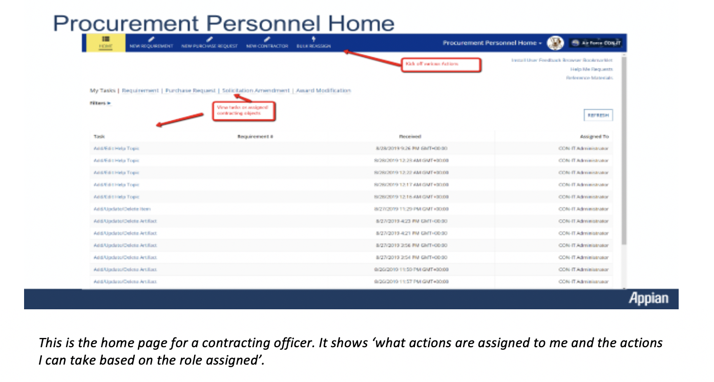_

The following screen show the Purchase Request dashboard and details required for a contracting professional to perform his or her duties. 

_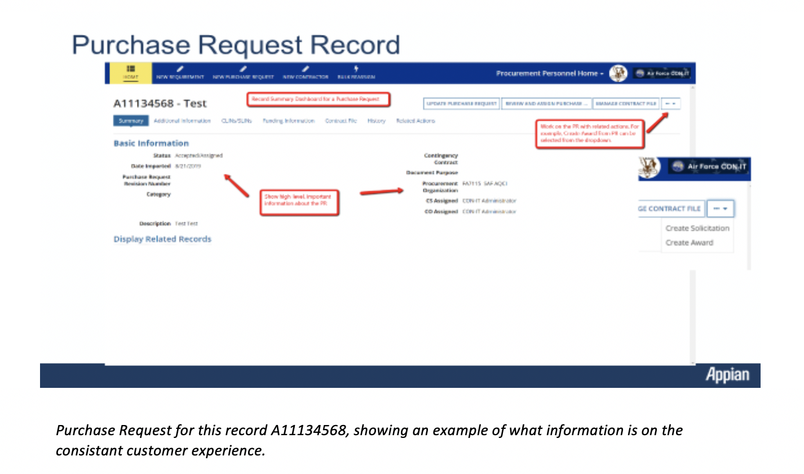_

_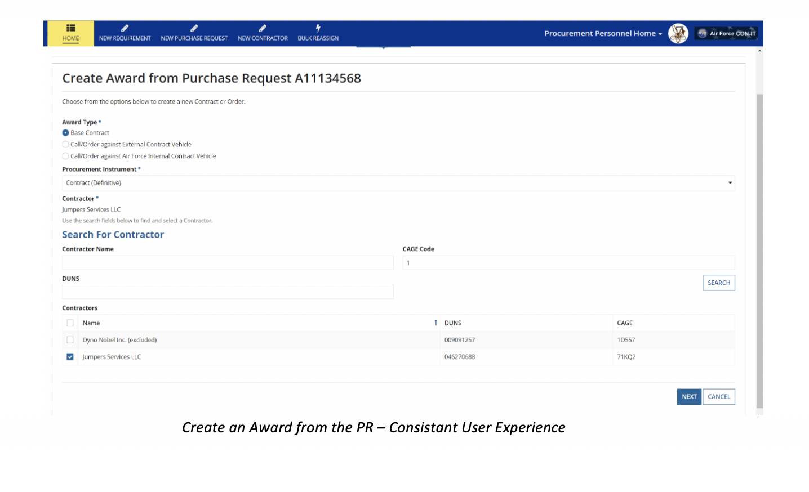_

__

_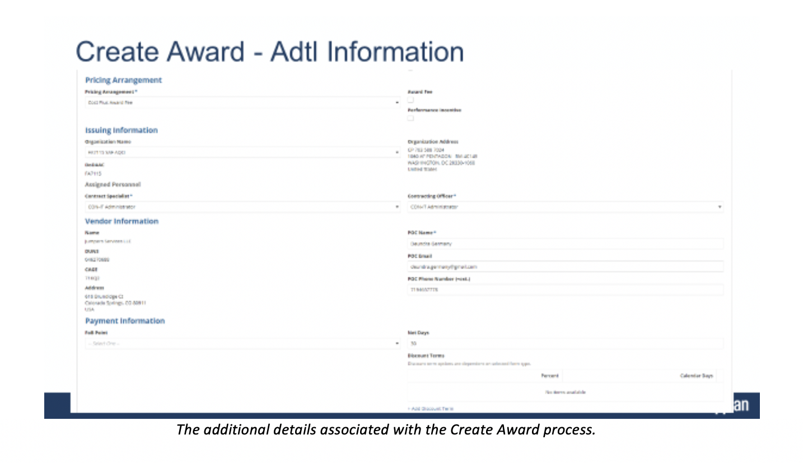_

_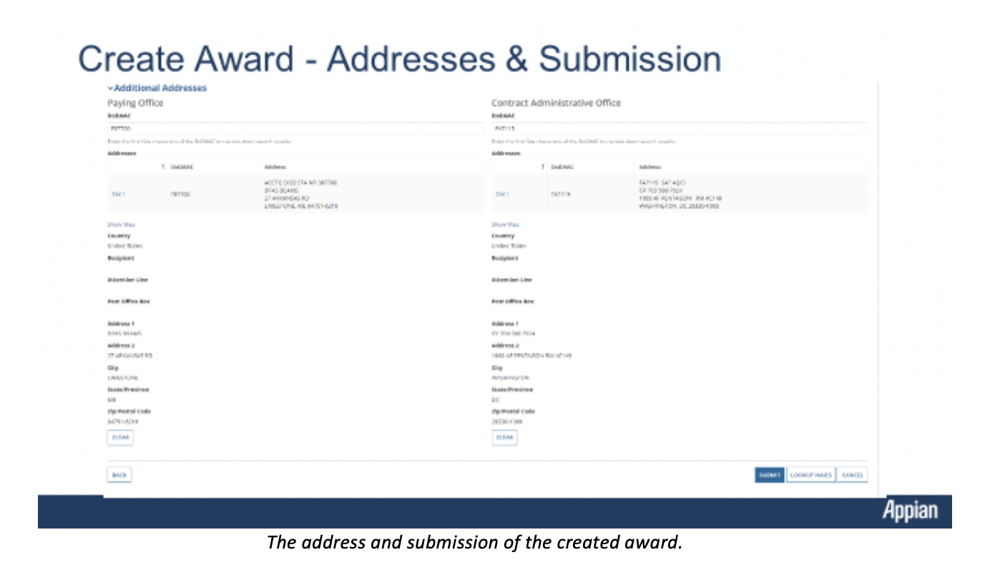_

The following screen shows how the create award was “developed” using a process flow within the Appian Low-Code frame work. 

__

This screen show the Appian Process Modeler for the “Create Award Process” (screens from above that awarded a Purchase Request)

_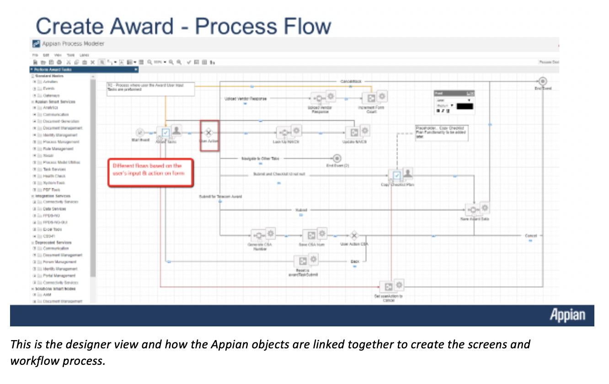_

_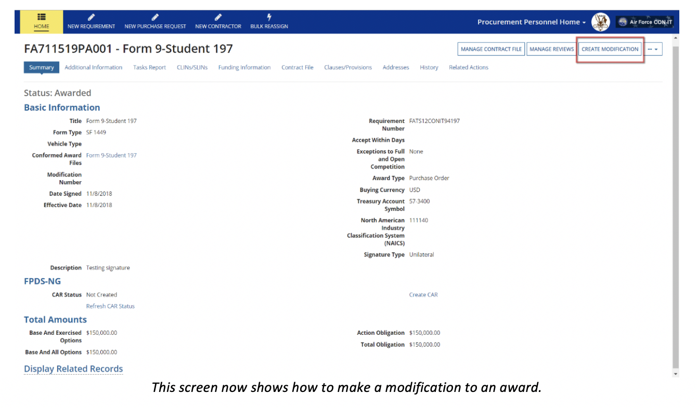_

__

As you can see the complexity of the process model is more detailed with the modification of the award. These models are all based on the business rules set forth by laws, policy and governance of the contracting community.

