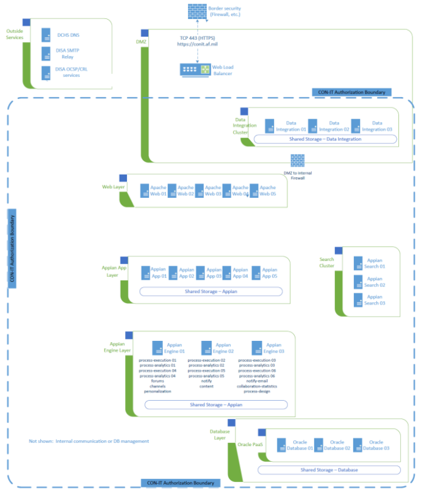

> # **6.1** Air Force Contracting Information Technology (CON-IT)

Contracting Information Technology System (CON-IT) provides a single contract writing system for the Air Force (AF) contracting community to support all contracting needs including base operations, logistics, contingency, and weapons system contracting world-wide. CON-IT will enable strategic sourcing and other acquisition efficiencies by standardizing data, business rules, and milestone tracking. Furthermore, CON-IT will allow for a standardized and integrated method of anticipating, reacting, and responding to the current pace and changes in process, regulation, and technology across the contract domain. When fully implemented, CON-IT will enable process changes necessary to converge on a common contract writing/management capability within the AF. CON-IT will address the current inefficiencies in the contracting domain, given there are multiple contract writing systems that continue to challenge the ability to operate responsively, consistently, and cost-effectively to award, administer, and close out mission critical contracts in a timely fashion. CON-IT will allow the contracting community to fully support compliance with financial auditability and Financial Improvement Audit Readiness (FIAR) goals that depend on the integrity of the data flow through the Procure to Pay (P2P) process.

## 6.1.1 Program Overview

The CON-IT program provides the Air Force with a procurement capability for processing all contract requirements from inception to closeout, supported by a modern, secure technical architecture enabling end-to-end alignment of business processes and data, compliant with regulation, supporting FIAR audit readiness, and providing business information for decision makers. CON-IT will share data using the DLA Transaction Services (DLATS) Global Exchange (GEX) with several AF, DOD, and Federal procurement, contracting and financial information systems. CON-IT complies with the Procurement Data Standard (PDS) and/or Purchase Request Data Standard (PRDS) which enforces FAR- and DFARS-based business rules that have been documented as constraints and data values in the PDS and PRDS eXtensible Markup Language (XML) schemas.

Contracting professionals provide contracting support capabilities to a wide spectrum of missions, including (but not limited to) weapons systems, research & development, logistics and sustainment, installation and mission support, and contingency operations which includes supporting other federal agencies during natural disasters. The Air Force Contracting Strategic Plan 2009-2013 outline these capabilities. Specifically, Goal 3 states “We will posture the Air Force as a demanding customer to our suppliers and ensure our Air Force Contracting processes and systems are able to meet the challenges of today and tomorrow.” Objective 3.2 further states that “technology offers significant possibilities for improvement” through “two technical upgrades: (1) implementing a single contract writing system and (2) developing a web-based capability for decentralized ordering.” The goal of CON-IT is to become the Air Force’s single contract writing system. CON-IT will provide contracting professionals with a seamless workspace that supports all requirements defined in the CON-IT Bounded User Requirements. The CON-IT program will deploy system capabilities as a series of development / test / delivery capability increments and releases following an agile approach to both acquisition and development. CON-IT will provide the key tool towards meeting the Air Force’s requirement for improved contracting effectiveness and efficiencies, as directed by SAF/AQC.

## 6.1.2 Program POC’s

AF CON-IT Program Management Office (PMO)

| POC                 | Role                                                                                                                                           |
| ------------------- | ---------------------------------------------------------------------------------------------------------------------------------------------- |
| Major General Holt  | AF Functional (Customer) System Owner                                                                                                          |
| Mr. Michael Allen   | Program Manager                                                                                                                                |
| Mr. Ted Blonk       | Deputy Program Manager                                                                                                                         |
| Mr. Bob Harts       | Chief Engineer (Owner of DevSecOps & entire Architecture)                                                                                      |
| Mr. Nathan Hay      | Lead Engineer (deputy owner of all DevSecOps, Networking, Infrastructure, architecture)                                                        |
| Mr. Jake Haney      | ISSM (ATO package and Security compliance management)                                                                                          |
| Mr. Dave Mitchell   | Data Interface Product Owner (all Data Interfaces for Ingress and Egress for CON-IT)                                                           |
| Mr. Patrick Knepper | Function Owner/Requirements AQCI – Program Manager                                                                                             |
| Mrs. Lara Emmons    | Deputy Function/Requirements Owner AQCI – Program Manager                                                                                      |
| Mr. Bill Woods      | Function customer interface and Functional requirements representative. (Bill is the hands-on functional liaison to AF PMO and AQCI customers) |

## 6.1.3 Platform Selection Process

Unlike many programs, CON-IT existed in various forms since initiation in 2001 as the Defense Acquisition Domain Sourcing (DADS) program and shortly thereafter as the Defense Business Sourcing Environment (DBSE) program. After ASD/NII MS A approval, the executive agent at the Department’s Business Transformation Agency (BTA) put the program in abeyance as it did not have the funding required to initiate post-milestone A tasks. DBSE would have replaced all Department of Defense (DOD) contract writing and contract management programs and/or applications with a standard DOD-wide system.

Shortly after putting DBSE in abeyance, MG Pair (USA) identified a follow-on Standard Procurement System (SPS) increment, version 4.2.3, as a partial, low-cost solution to meet many DBSE requirements. However, on 3 Jan 2007 after several version 4.2.3 test failures, MG Pair cancelled SPS version 4.2.3, re-baselined the program to the final 4.2.2 version and restructured the program office to provide minimal support in the form of service releases to keep the product current until the Department could find a replacement. CON-IT’s Appian development platform provides the Air Force a solution to satisfy DBSE functional requirements using low-code development.

CON-IT was assessed against an existing DISA contracting system that is based on the Appian Low-Code platform. CON-IT was able to work with DISA team members and adapt the Appian code base and existing functionality for contracting. CON-IT made system updates to the Appian code base to enhance the existing code to meet AF contracting requirements. CON-IT is hosted in United States Department of Agriculture (USDA) data centers with Disaster Recover/Failover Site. The system is categorized as Impact level 4. CON-IT has an ATO managed through AF program management office located at Wright Patterson AFB.

## 6.1.4 High Level Design

CON-IT is based on the Appian N-tier architecture engineered to have the processing, data management, and presentation tiers physically and logically separated.  The processing, data management and presentation components are hosted on compute clusters configured in a high availability configuration, ensuring the services provides limiting physical resources sharing. Each service is built to deliver maximum capacity and scalability with only planned outages.

_High Level Architecture – Shows Appian N-Tier CON-IT application_

_This view is a detailed architectural view of Appian Low-Code Engine Layer_

## 6.1.5 Key Benefits of Implementing Low-Code for CON-IT

The key benefits CON-IT realized from the Appian Low-Code Development Platform are:

- Ability to rapidly deliver applications in collaboration with Air Force product owners and contracting user stakeholders increases the PMO’s agility and responsiveness to business and mission needs.
- Speed is at the core of Appian low-code framework functionality: business SMEs ideas can become fully functional and the PMOs can launch apps in minutes, not months.
- Minimal hand-coding required.
- Minimal necessary upfront investment in setup, configuration, training, and deployment.
- Visual, drag-and-drop development tools and point-and-click interface creation to make creating and changing enterprise apps easy and fast.
- Seamless integration with 3 GL external Apps to unify all data, processes, apps, and existing systems.
- Apps are simple and intuitive to use, providing a streamlined user experience and work as expected on any device.
- Ability to roll out enterprise-apps across the Air Force, no matter how many people or how geographically diverse.
- Scale to meet the CON-IT line-of-business requirements and large number of concurrent users.
