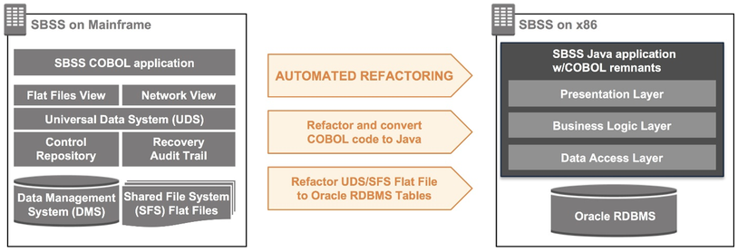
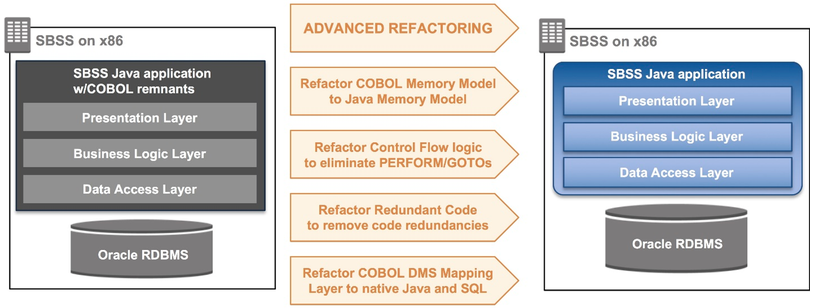

> # **10.2** Appendix B: Sample Design 2

# Automated Transformation (Code Conversion) and Refactoring of a USAF Mainframe Application to AWS

Note: This is a simplified description of a complicated set of projects.  Please contact the proper PMO to get further details.

The PEO BES ILS-S program management office (PMO) led a successful modernization of the legacy COBOL-based Standard Base Supply System (SBSS) application running on UNISYS 2200 mainframes to a Java-based system running on x86 Red Hat Enterprise Linux (RHEL).  The application that was modernized is a major defense program that provides a mission-critical defense capability used by nearly 20,000 users at over 250 global locations.

The goals were to introduce agility, reduce costs, modernize the technical stack, and enhance security. This was accomplished using automated code transformation tools and techniques while maintaining all functionality, screens, and reports. 

The intermediate modernization hosting target was a DISA X86 virtualized environment and the long-term hosting target is AF Cloud One in [AWS GovCloud (US)](https://aws.amazon.com/govcloud-us/).  AWS GovCloud was chosen to meet DoD’s stringent security and compliance requirements such as U.S. citizenship.

## Objectives

A major component of the SBSS system is the 50+ years old legacy supply application, written in COBOL, that provides retail-level business logic. This application runs on the UNISYS mainframe and has proven to be difficult to change and manage.  The DoD needed to modernize the application to drive down operating costs by moving to an open platform, while retaining all application functionality.

In the past, attempts made to modernize the supply application failed due to the massive size and complexity of the task. In fact, modernizing the component was regarded as such a difficult task that it was highlighted in the 2003 book [Modernizing Legacy Systems: Software Technologies, Engineering Processes, and Business Practices](https://www.amazon.com/Modernizing-Legacy-Systems-Technologies-Engineering/dp/0321118847).

After more than 50 years of operations, maintenance, and extensions, the applications’ code base had become relatively poorly documented. The technical design of the existing system, which was needed to support the modernization effort, had to be derived from the existing system and code.

Key characteristics of this application included:

- Annual operating costs in the tens of millions of dollars, largely attributable to mainframe hosting and maintenance costs.
- Over a million lines of COBOL Source Lines of Code (SLOC).
- A data management system, comprised of over a million lines of COBOL code, supporting approximately 500,000 transactions per day.
- Few remaining subject matter experts (SMEs).
- Difficulty finding qualified, affordable COBOL programmers.

The application needed to be modernized and migrated to an affordable open system and hosting environment, with no down-time, data loss, functionality loss, performance loss, and minimal mission risk. The DoD had never done anything like this.

## Modernization Solution

The project started by identifying and evaluating solution options:

- A total manual rewrite and re-architecting solution failed to meet the program’s time constraints, had historically low success rates (high risk), and would have been too costly.
- A replacement solution was not selected because the DoD needed to retain all the current business rules.
- A COBOL emulator re-host solution was a stopgap measure that failed to reach the J2EE/RHEL/SQL DB architectural future state requirement.

This analysis led to our decision to use a COBOL-to-Java code automated transformation and refactoring solution. This option would take a low-risk, incremental approach and apply a blended agile/traditional methodology and tools to ensure rapid, high-quality software delivery.

## Application Modernization Phases

Once the COBOL-to-Java code automated transformation and refactoring solution was selected, a three-phase approach emerged to meet the entirety of the DoD’s requirements and cost, schedule, and risk constraints.

- Phase 1: 
    - COBOL-to-Java code automated transformation and refactoring to x86/RHEL platform 

        This was the most complex and risky phase, as we automatically transformed and refactored COBOL code from a UNISYS mainframe to Java code on a virtualized x86 RHEL platform while not losing any functionality or performance. The resulting Java code contained design remnants of COBOL, and development and test environments were moved to the AWS Cloud.

- Phase 2: 
    - Java code advanced refactoring to remove COBOL design overtones 

        We refactored the Java codebase even more to remove residual COBOL remnants, operating system overtones, and we used architectural design patterns to improve code maintainability.

- Phase 3: 
    - Infrastructure moved to AWS GovCloud (US)

        We moved all remaining environments to AWS GovCloud (US) including staging and production. AWS GovCloud (US) allowed us to meet the many cyberthreat security requirements for the DoD.

**Figure B-1** shows our three-phrase modernization approach. The two Java logos illustrate the different Java phases. At the end of Phase 1, the Java program contains COBOL coding practices. At the end of Phase 2, the Java program is “clean” with COBOL remnants removed.

__

**Figure B-1 – Three-phase automated application modernization approach met the DoD’s stringent requirements.**

### Phase 1: Automated Transformation and Refactoring of COBOL to Java on x86

The modernization of the application involved a transformation of ~1.2M lines of COBOL code and ~10K lines of C code to Java to maintain current application capabilities, Graphical User Interface (GUI), and performance while migrating to a more affordable and sustainable x86 RHEL platform.

The applications’ COBOL online and batch applications were automatically transformed using TSRI JANUS Studio tool suite to run on a JEE platform using Java object-oriented software layers (data access, presentation, business logic) and design patterns to enable migration to a standard x86 architecture. Rather than simply transforming source COBOL code to target Java code, the TSRI JANUS Studio tool executes a mature automated transformation and refactoring process by first constructing a comprehensive Intermediate Object Model of the legacy system in an intermediate translation language.  Once modeled within the tool transformation engine, technical SMEs employ an iterative process of applying rules and tuning to output the transformed code into the target Java language. The modernized Java software reused identifier names from the original COBOL application, allowing the component functional SMEs to read and understand the new Java code and routines more easily.  Testing was accomplished using the existing test cases from the legacy application because their was no change in functionality.

During this phase, the COBOL Data Management System network database code was transformed to COBOL with SQL. This COBOL and SQL code was then transformed to Java and SQL code (See **Figure B-2**).

__

**Figure B-2 – The component COBOL automated transformation and refactoring to Java.**

###Phase 2: Advanced Refactoring to Remove COBOL Design Overtones

After Phase 1, the resulting converted Java code contained COBOL design remnants, or COBOL overtones, that required personnel to have specialized skills to maintain the codebase. A plan was developed to identify and replace COBOL overtones with standard Java solutions. 

The refactoring approach used the TSRI JANUS Studio tool and a semi-automated refactoring method (See **Figure B-3**) that performs further code optimization, naming changes, and other enhancements to improve architecture, design, security, sustainability and performance.

These techniques, along with the improved method synthesis algorithm, greatly improved the maintainability of the Java codebase.

__

**Figure B-3 – The supply application refactoring plan (to maintainable Java).**

### Phase 3: Infrastructure Migration to AWS.

After Phase 2 was completed, the entire application will be migrated to AF Cloud One on AWS GovCloud (US) including the development, testing, staging, production, and all support environments (See **Figure B-4**).

AWS GovCloud (US) was selected because it aligned with the future technical direction of the system. This included cybersecurity, DevSecOps, and automated continuous integration (CI) and continuous delivery (CD) pipeline processes and DevSecOps Toolchain. The applications’ architecture is being installed in AWS GovCloud (US) and continues to evolve.

__

**Figure B-4 – Amazon Web Services (AWS) GovCloud Hosting Design.**

## Customer Benefits

The application has been transformed from an expensive mainframe COBOL legacy system to a more affordable, modern maintainable Java-based system. All valuable existing business rules have been preserved in the modernized system, while development, test, and production environments were migrated to AWS providing flexibility at reduced cost.

## Lessons Learned

This project demonstrated that the DoD can apply automated transformation and refactoring to modernize major legacy systems, including complex COBOL-based mainframes, and preserve the existing business rules within a cost-effective, open system architecture capable of migration to the cloud.

Lessons learned during this project:

- When properly planned and executed, code conversions via automated refactoring provide a low-risk approach to modernizing legacy applications.
- Breaking efforts into clear phases (modernize, migrate, etc) keeps risk low and ensures project success.
- Moving from legacy COBOL to a modern architecture and language enable the application to benefit from modern tools and services.
- Agile development practices enable real-time course corrections and reduce delivery risk.
- Automation is crucial in order to transform millions of lines of code while preserving functionality, reducing risks, and reducing the project timeline.
- Migrating from a legacy proprietary mainframe and COBOL to an open Java platform allows access to a large pool of talented technology people to evolve the application.
