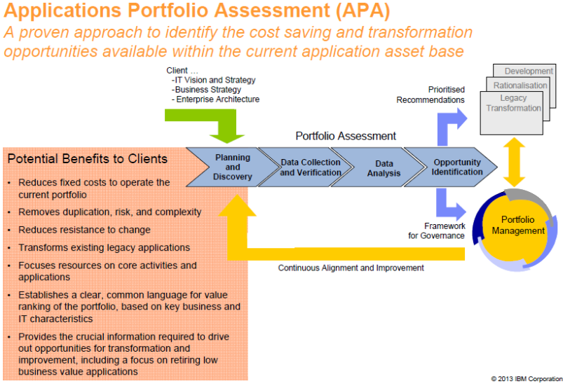
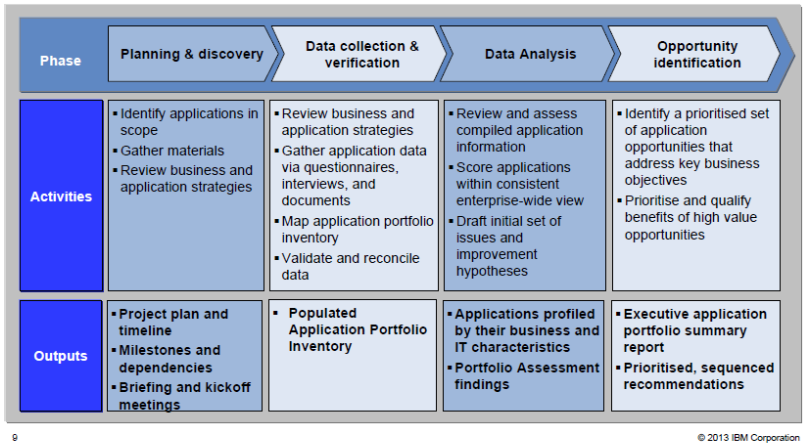

> # **11.2** Legacy System Application Portfolio Assessment Framework

Often dealing with legacy systems, organizations have developed their own approach to choosing an appropriate way to modernize business-critical software. Namely, we recommend taking several steps first to assess the existing application portfolio.

**1. Technologies Analysis** - The first step in Discover phase is to identify and analyze the technology stack of the existing product. Thus, we know if the programming language or frameworks used are still relevant and supported by the vendors. If the product relies completely on outdated technologies, the chances are we would need to completely rewrite it in the process of modernization.

**2. Architecture Audit** - In case the tech stack (or some parts of it) is still relevant, it is necessary to conduct an architecture audit. This will help you define the system elements which are functioning well and focus on the ones that need modernization. Plus, you will be able to see how different parts of the system interrelate, so that your future changes won’t affect the whole product.

**3. Code Review** - Legacy software usually has an excessive codebase, requiring regular reviews and refactoring. If not treated properly, the software tends to “rot.” This might lead to more design flaws and conflicts as you try to introduce new features or update some parts of the system. That is why, as a part of any modernization or changes, we typically conduct a complete code review, assessing the quality and “updateability” of the system’s source code.

**4. UI/UX Review** - The same principle applies to the UI and UX design. A thorough design review is required to understand which parts of the system interface need a “facelift.”

**5. Performance Testing** - Performance testing aims at uncovering further potential issues with the legacy systems. Poor performance or major flaws can serve as a reason for a complete system modernization as well as selective improvements.

**6. Current Requirements and Opportunities for Future Growth** - While considering the current business needs and requirements articulated by the client, focus on opportunities for the future growth. Thus, PMO Product Owners can make an informed decision by providing a well-grounded and unbiased opinion on the software modernization options.

Many organizations have adopted a proven Application Portfolio Analysis (APA) Framework approach developed by IBM to identify the cost saving and digital transformation opportunities available within their current legacy applications and asset base. For cloud migrations, we recommend supplementing the IBM APA process described herein to tailor it to the AWS Cloud Adoption Framework or Microsoft Azure Cloud Adoption Framework. We recommend using the cloud provider Application Discovery methods and automated tools to discover Apps on the customer network. AWS and Microsoft also provides APA methods and best practices tailored specifically to cloud adoption and cloud migration strategies on the AWS GovCloud or Azure Government cloud platforms respectively.

### APA Discovery Approach.

The IBM APA discovery approach (see Figure C-1) is based on an application inventory on the customer’s enterprise network. For each application, specific information is gathered on the Apps in order to perform analysis including comparisons. For Cloud adoption migrations use AWS Discovery Agent or Microsoft Assessment and Planning Toolkit tools to discover and inventory the Apps on the enterprise network. Another tool for Cloud adoption readiness assessment is the AWS Cloud Adoption Readiness Tool (CART). CART helps Air Force AAM project teams develop a plan for cloud migration and adoption. It enables answering 16 questions to generate a downloadable report that rates cloud adoption readiness of an application across areas of: business, people, process, platform, operations, and security. Each report provides recommendations to help plan an organization’s unique cloud journey. URL: [https://cart.splashthat.com/?sc_channel=sm&sc_campaign=Public_Sector&sc_publisher=LINKEDIN&sc_country=Global&sc_geo=GLOBAL&sc_outcome=lead_gen&trk=sm_O_CART2019_LINKEDIN&sc_content=CART&linkId=73513814](https://cart.splashthat.com/?sc_channel=sm&sc_campaign=Public_Sector&sc_publisher=LINKEDIN&sc_country=Global&sc_geo=GLOBAL&sc_outcome=lead_gen&trk=sm_O_CART2019_LINKEDIN&sc_content=CART&linkId=73513814)

AAM Project teams should use the tool/method best aligned with the needs of their solution.

__

**Figure C-1. IBM’s Application Portfolio Assessment Process.**

### APA Analysis Approach.

IBM’s APA analysis approach is a best practice that collects and verifies the application discovery data and then enterprise or cloud architects conduct four major process steps (see Figure C-2, each of which is tailored to the customer’s specific requirements. For example, for cloud migration adoption begin grouping applications based on patterns in the portfolio to enable identifying order of cloud migration and the migration strategy (i.e. which of the 6 R’s of the cloud migration strategy will be used) for migrating the given pattern. The result of this analysis is a broad categorization of resources aligned by common traits. Special cases may also be identified that need special handling.

APA methods are: (1) Quick - Address an enterprise’s urgent need to cut costs associated with providing applications and applications support; (2) Opportunity identification is within 4 weeks and Value proposition for selected legacy application modernization opportunities is provided within 6 weeks; (3) Comprehensive - focuses on key levers of IT cost reduction: consolidation, standardization, automation and transformation; and finally (4) Pragmatic - identifies cost saving and digital transformation options that can be designed and implemented in the phased approach we have described in the AAM Playbook.

__

**Figure C-2. IBM’s APA Analysis Approach is a Best Practice.**

