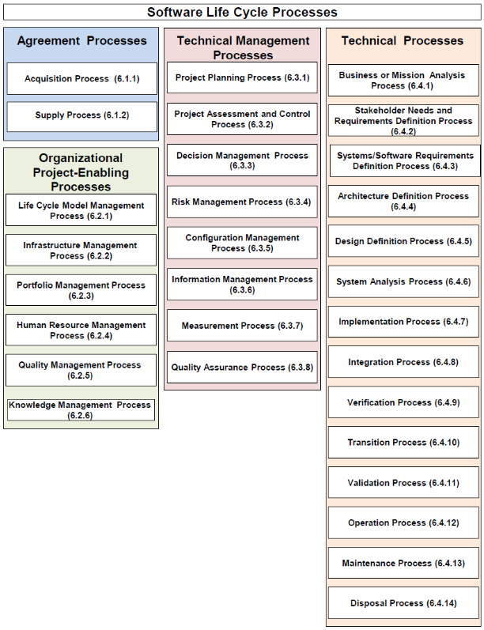

> # **5.** Software Life Cycle Processes

The BES BPD provides a directory of standardized life cycle management processes, templates, guides, forms and checklists artifacts the BES PMOs can apply to their acquisition projects. However, these standardized processes have not kept pace with the rapidly evolving changes in systems and software engineering and preferred Agile development methodologies. To simplify selection of the life cycle processes needed for AAM project contract acquisitions, the IEEE 12207:2017 Systems and software engineering—Software life cycle processes standard is the recommended for BES PMOs to adopt as best practices.  Many current Air Force PMOs currently use the IEEE 12207 standard in their application software development acquisitions to define their required life cycle processes in the Performance Work Statement (PWS).  This is because IEEE 12207:2017 has evolved to address changes in systems and software engineering, including:

- Internet, big data, software as a service, the cloud, virtual systems
- Highly complex integrated systems of systems
- Software construction through object-oriented, encapsulated, containerized methods
- Different ways of implementing software vs one-off custom/contract SW development (i.e, COTS integration, use of open source, native cloud services, microservices).
- Using iterative, continuous, concurrent processes and methods (i.e. Agile, Continuous Integration (CI), test-driven development)
- Automation of software application development methods and tools (i.e. automated application modernization, integrated development environments, test automation frameworks)
- Continuous Delivery (CD) release methods (i.e. DevSecOps)

Organizations that are aspire to be highly agile and responsive to customer dynamics complete more of their projects successfully than their slower-moving counterparts — 64 percent versus 49 percent, thus, “Agile” methods actually can be applied within a variety of life cycle models. While Agile methods are common in executing an “evolutionary” life cycle model, they can be used in other life cycle models such as the “iterative development” model at various stages. What the Agile methods have in common is an emphasis on continuous inspection and collaboration in the rapid production of working software in an environment where changes, including changes to requirements, are expected (See the Playbooks Website:  [https://arraybesplaybooks.github.io/ArrayBESPlaybook/](https://arraybesplaybooks.github.io/ArrayBESPlaybook/)  maintained by Isobar). 

The 12207:2017 software life cycle processes describe the activities that can be performed during the life cycle of a software system into four process groups. Each of the life cycle processes within those groups is described in terms of its purpose and desired outcomes with a set of related activities and tasks that can be performed to achieve those outcomes. The four process groups and the software life cycle processes included in each group are depicted in **Figure 5-1**.

These recommended IEEE 12207:2017 life cycle processes are not intended to preclude or discourage the use of additional processes that organizations find useful (i.e. BES BPD, CMMI-DEV and ITIL v3 processes) nor to determine the order in which the processes are performed during the system life cycle or any of its stages. The intent is to focus the life cycle processes used in an AAM acquisition to the minimum set required for AAM project success.  These processes will be reflected in the BES BPD Tailoring Worksheet for AAM Projects Template which will be an Appendix to this document and can be used by PMOs to quickly develop their acquisition PWS Description of Services and required CDRL artifacts focused on an Agile contract acquisition.  

**Figure 5-1. Software Life Cycle Processes (Excerpted from IEEE 12207:2017)**

A description of each process group is excerpted from IEEE 12207:2017 and rephrased as follows (Full descriptions of each life cycle process activities, tasks and outcomes is described in the IEEE 12207 standard):