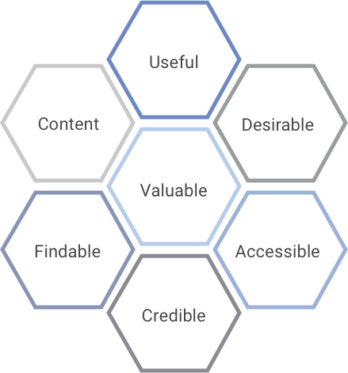

> # **2.1**  What is User Experience?

Defined broadly, “User Experience” is about how people experience and interact with an organization’s varied products, systems and services. 

The focus of the User Experience craft is typically on interactive, digital experiences, but UX practitioners tend to take a broader, more holistic view, looking not only at a given product or service itself but at its users’ expectations and the context in which it is used – which can include other products, non-digital communications and even people with whom the user communicates while using a product or service. This holistic view yields insights that help us to design digital experiences that fit more seamlessly into users’ lives while helping them achieve more successful and satisfactory outcomes. In many cases, the insights and recommendations uncovered by the UX process can extend to those very same people and non-digital communications that surround an experience as well.

## 2.1.1 The “Three Circles” of User Experience

This holistic focus is conveyed well via the classic “Three Circles” diagram first proposed by Peter Morville, considered one of the “founding fathers” of the modern UX field:

_{srcset="../../_assets/2.1_three_circles@2x.png 2x"}_
{.center}

The meaning of each circle in this diagram is as follows:

- **Content**: This refers not just to images and copy, but to all the content, features and functions that comprise the experience. It’s important to ensure that all aspects of the experience are included thoughtfully and purposefully to serve the needs of the system’s users.
- **Context**: This refers to all of the external factors that a user may consider or encounter while using a given product, system or service. These factors vary greatly depending on the system and can include anything from distractions in the environment, to the device on which the experience is viewed, to other tools and systems that a system’s user might be using simultaneously.
- **Users**: This refers to the people who use a given product, system or service. In most cases, the goal is to move beyond a singular, demographic-driven view of the user to establish a more nuanced understanding of distinct user profiles along with the unique needs, mindset, motivations, behaviors and limitations of each one.
A deep understanding of the needs and context for each user profile results in more insightful design solutions that align more closely with the way that the system’s users think and work.

## 2.1.2 Important Qualities of User Experience

Usability is often the first aspect that comes to mind when considering the focus of user experience, but there are in actuality a number of other factors that UX practitioners take into account when shaping a product, system or service. This is captured well by another classic model created by Peter Morville:
 
_{srcset="../../_assets/2.1.2_important_qualities@2x.png 2x"}_
{.center}

Each hexagon within this Honeycomb diagram is defined as follows:

- **Useful**: This refers to the relevance of content and features within a given system to its users. Content and features on a given interface are typically positioned and emphasized based on their level of usefulness or relevance in relation to other content on the screen.
- **Usable**: This refers to the ease of use of a given product or service, which includes the clarity of how features are presented as well as how reliably they behave.
- **Desirable**: This refers to emotional aspects of a system’s design, which can include not only the sense of satisfaction experienced when a system aligns seamlessly with the users’ needs, but also whether the organizational values reflected in the design resonate with those of the system’s users.
- **Findable**: This means ensuring that navigation and content are designed and positioned in ways that are intuitive to end-users, allowing them to quickly find what they need in the places where they might expect to find them.
- **Accessible**: This means ensuring that products and services are usable for people with disabilities, which can include anything from hearing or vision impairment to color-blindness.
- **Credible**: This means designing so that users can feel that they can trust and rely on the information being presented within an experience, having confidence in the data integrity and system status presented therein. 
- **Valuable**: This means ensuring that a product or service effectively advances the goals of the organization that sponsors it, whether the nature of those goals is educational, operational or otherwise.

UX practitioners can design more effective digital experiences through careful and balanced consideration of these factors.

## References

- The Definition of User Experience (UX) [https://www.nngroup.com/articles/definition-user-experience](https://www.nngroup.com/articles/definition-user-experience/)
- User Experience Design [http://semanticstudios.com/user_experience_design](http://semanticstudios.com/user_experience_design/)