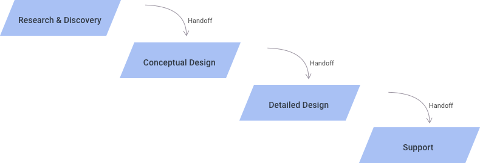
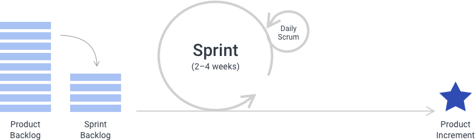
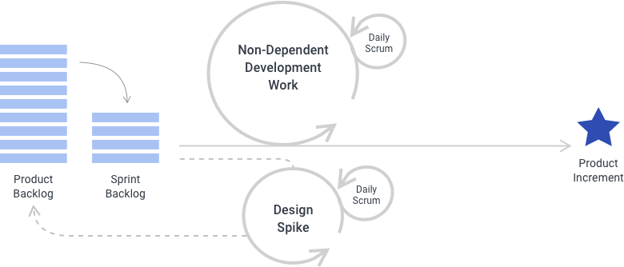

> # **2.3** UX in Software Lifecycle Methodologies

When planning a software development project, the process typically breaks down into four discrete stages, each of which will be described in greater detail within section 3.0.

_{srcset="../../_assets/2.3_graphic@2x.png 2x"}_

- **Research & Discovery**: This is the stage where initial research activities will be performed and insights will be synthesized based on the research findings. A high-level strategy should be established at this stage that includes experience goals, tactics, plans and content/feature recommendations which can then be used as a foundation for Conceptual Design.
- **Conceptual Design**: During this stage, key aspects of the experience will be modeled and discussed in order to establish alignment around the overall approach and design framework for the experience. The conceptual models produced during this stage can describe things like site architecture,  processes, navigation patterns and key page layouts to help lay the foundations for an efficient Detailed Design process. A key goal of this stage is to establish clear expectations about how a digital experience will be presented at a high level in order to minimize the need for significant rework in the future.
- **Detailed Design**: Once foundations for the experience have been established, the Detailed Design stage then builds on those foundations, designing and specifying detailed elements and interactions for each section and component of the experience. This provides the basis for visual design comps to be created in addition to a clear and detailed plan that developers can follow in order to implement the experience.
- **Support**: During this stage, UX practitioners play a supporting role to the visual design and technical development teams who are producing the experience. This can involve addressing questions to clarify intended interactive behaviors, revising designs to resolve technical implementation challenges, and assisting with the testing and delivery of the implemented experience.

These stages can sometimes be named or broken down differently, but in essence outline the stages of a typical user experience process. However it is important to note that some of these stages may not be required at times depending on the nature and goals of the project. For example, if a project entails targeted refinements and enhancements to an existing experience, full Research/Discovery and Conceptual Design stages may not be needed; however in this scenario, some level of user input should be collected and reviewed in order to determine what refinements should be made. Similarly, a Conceptual Design stage can in some case proceed without a Research/Discovery stage, assuming that existing research sufficiently addresses key questions relevant to the design problem at hand. 

The approach to planning and managing each of these stages can vary considerably depending on the software development process leveraged by the project team as a whole, described in further detail below.

## 2.3.1 Waterfall Process Considerations

_{srcset="../../_assets/2.3.1_waterfall_process@2x.png 2x"}_

In a “waterfall” process, each of these stages happens in sequential order, with the output of each stage being typically reviewed, finalized and approved in its entirety before proceeding to the next stage. In this type of process methodology, the typical expectation is that all documentation is comprehensive and exhaustive, addressing all possible questions and scenarios prior to any development being performed.  Representative members of each project team can be incorporated into each stage to ensure that proper communication occurs and relevant questions are identified early in the process, but often this is not the case in a classic waterfall process. Instead, each project team often works independently from each other, with the resulting documentation being tossed “over the wall” so to speak to other project teams in order to guide their efforts for the next process stage.

The main advantage of this approach is the upfront clarity and stability of plans and specifications prior to the beginning of technical implementation. However there are several disadvantages to the waterfall approach:

- Reduced communication and collaboration between project teams
- Heavy and often unwieldy design documentation
- Longer overall project timelines
- Working software not available for evaluation until late in the project lifecycle
- Inflexibility to changing requirements and circumstances surrounding the project

Cross-team communication challenges can sometimes be circumvented in a waterfall process through adopting daily “stand-up” or “scrum” meeting that are typical in an Agile process; however daily scrum meetings alone do not make a project truly “Agile, and leave many of the other disadvantages of the Waterfall methodology unaddressed.

## 2.3.2 Agile Process Considerations

The Agile methodology was devised in order to address many of these disadvantages of waterfall processes. However the classic Agile methodology focuses more so on technical development aspects and less so on user experience or design aspects of the software development lifecycle. In order for user experience and design teams to work efficiently and effectively within the process, some additional process considerations must be made.

The core Agile values are what remain consistent regardless of project role or the type of Agile process being employed. These core values are:

- Individuals and interactions over processes and tools
- Working software over comprehensive documentation
- Customer collaboration over contract negotiation
- Responding to change over following a plan

Putting these values into context, things like plans, processes, tools and documentation are still relied upon heavily in an Agile environment, however all of these are secondary to effective communication, collaboration and adaptability among members of the project team.

As such, there are many crucial “ceremonies” that also remain consistent within an Agile process, playing a key role in ensuring that the values and benefits of the Agile methodology are realized. A daily “scrum” or “standup” meeting is one type of Agile ceremony that ensures that team members across disciplines have a daily view of what features are in focus today and what key challenges might impact their completion. Teams typically work from a “product backlog” – a prioritized list of all features and capabilities that will ultimately be part of the final experience – and break that product backlog down into “sprints”, typically 2 weeks in duration, where a portion of the items from the backlog are expected to be complete. As changes occur or new requirements are realized, this product backlog is continually “groomed” to ensure that the project plan is optimized for the best outcome, and planning sessions at the start of each new sprint offer an opportunity to put the adjusted plan into effect. See the Agile Playbook for further details on typical Agile ceremonies, tools and methods.

_{srcset="../../_assets/2.3.2_agile_sprint_cycle_diagram@2x.png 2x"}_

In addition to values and ceremonies, the Agile management framework is another aspect of the methodology that remains relatively unchanged when design teams are incorporated, however slight amendments must be made to define a clear role for User Experience. The Agile management framework identifies two key roles – the Scrum Master and the Product Owner – where the Scrum Master’s primary role is to keep the project team focused on its goals for the sprint, and the Product Owner’s primary role is to keep the team’s work aligned with the overall product vision. While the Agile methodology does not directly prescribe a role for User Experience teams, their role is best considered as an extension to the Product Owner role. This means helping to establish the product context during the Research/Discovery stage, summarizing core user needs and business requirements. This also entails modeling the product vision during the Conceptual Design stage, creating preliminary wireframes and user stories that describe the expected user needs and behaviors that each feature of the experience will be designed to support. Lastly, this means leading the creation, prioritization and ongoing “grooming” of the product backlog, ensuring that the most valuable features are delivered first and meet the expectations of the users for whom they are designed. As a project moves into detailed design, the task of backlog grooming is often shared with members of the Project Management team, with members of the UX team offering significant guidance while focusing mainly on the creation of design specifications for each item in the backlog.

The aspect in which the classic Agile methodology is least prescriptive for User Experience teams is its guidance around planning each of the process stages and determining what user experience practices to incorporate within them. Many of the Agile ceremonies outlined above are more relevant to the Detailed Design and Support stages than they are to the initial Research/Discovery and Conceptual Design stages. In Agile terms, these first two stages are often combined and named “Sprint Zero”, continuing to resemble a waterfall process in many ways. This allows for solid research foundations and a clear product vision to be established in advance of working iteratively on detailed design specifications. Cross-team input is valuable at any stage, and daily scrums may be incorporated to facilitate this, but beginning front-end development before a clear product vision is set can result in lost development cycles and a significant amount of rework. Design teams should focus first on establishing a clear product architecture and basic alignment around how features might be translated into layouts before the team begins iterations of detailed design and prototyping. Once a product backlog is created at the end of Conceptual Design, the project team is prepared to adopt all other typical Agile ceremonies for the remainder of the project.

_{srcset="../../_assets/2.3.2_research_and_discovery@2x.png 2x"}_

Detailed Design and Support are the stages where the Agile methodology is utilized in its truest form. In an ideal scenario, all project teams are focused on the same set of features at once, working in unison to arrive at a functioning prototype of a specific feature. User Experience teams leads their counterparts through the iterative process for each feature:

- Understanding and clarifying requirements
- Defining key criteria for the design solution based user needs, business goals and technology capabilities
- Exploring different design solutions that meet the requirements and criteria
- Deciding which solution to pursue based on input from across team functions 
- Prototyping the solution 
- Testing, validating and potentially refining the solution 

This constant communication and direct translation of designs into working code can significantly reduce the amount documentation created or needed within a project, a documentation approach often referred to as “Lean” wherein design specifications are only as exhaustive as necessitated by the project team. In an ideal Agile scenario where all teams can focus on the same set of features at once, the cycle described above can take anywhere from 2-5 days to complete, assuming that cross-disciplinary teams are well-integrated and that features in the product backlog are broken into small, manageable chunks that are achievable within that time frame. By the end of the sprint, the expectation is that all backlog items that have been initiated are completed, reviewed and approved, however selective items can move into later sprints if necessary.

## 2.3.3 UX Process at Different Stages of the “Agility Spectrum”

However some organizations may have difficulty achieving this level of integration, and even then, readiness for these methods may vary between different teams or projects within an organization, falling at different points of the “agility spectrum”. The approach to planning the Detailed Design stage may vary depending on the degree of “agility” at which any given team or project is ready to operate. Limiting factors to project agility often go beyond the team or organization’s level of training and experience, and can extend to project-specific factors such as resource availability, vendor involvement, project budget and ability to co-locate. In these scenarios, there are a number of ways that a project approach can be adjusted to ensure successful collaboration and delivery. 

One approach is to rely on a User Experience team’s competency in creating clickable prototypes using software such as InVision, Sketch or Axure. This reduces reliance on the development team to arrive at a working model and significantly simplifies the level of effort required to produce it. Development teams still need to stay closely involved in its creation and will certainly have additional tasks to perform such as data sourcing and more complex interactivity, but creating clickable prototypes in software allows project teams to effectively validate the usability and flow of a given feature while enabling development teams to work independently and in parallel on those additional tasks. This also allows the user experience team to work at a faster velocity on a range of features while development teams work at their own pace determining the optimal implementation approach. The key here is ensuring that both teams have a portion of their velocity (typically 10-20% of available bandwidth) dedicated to addressing questions and collaborating across teams on different pieces of work.

The length of each sprint is another variable to consider. While a 2-week sprint cycle is considered standard, lengthening that cycle to 3 or even 4 weeks can help ensure sprint objectives are successfully achieved. In the scenario described above where project teams spend some portion of their time working independently and in parallel, a longer sprint cycle can ensure that all teams have sufficient time to reconvene, discuss their findings and make adjustments so that all sprint output is delivered on time, with exhaustive validation and alignment across stakeholders, further reducing the potential need for rework throughout the project timeline. 

Another approach is to anticipate “staggered sprints” from the outset. This means that the user experience team always working one full sprint ahead of the development team. To do this, the notion must be applied here of having each team’s velocity account for a portion of time dedicate to collaborating across teams on different pieces of work. While it would be expected that the same staggered sprint duration would be maintained throughout the project lifecycle, this approach does allow one team to stay on track with delivery in the event that another team faces challenges with maintaining that pace. 

The need for additional time to work through complex issues is a common challenge for development teams, but can be a challenge for user experience teams as well. If this type of challenge is foreseen during the project’s planning activities, something called a “design spike” can be instituted to alleviate this issue. A design spike is an activity that can take place of a regular sprint to resolve big unknowns and work through complexities that would otherwise impact the efficiency of the project team. During this time, development teams are typically assigned non-dependent work while the user experience team gathers additional requirements and potential explore concepts for specific feature areas within the product.

_{srcset="../../_assets/2.3.3_agile_sprint_cycle@2x.png 2x"}_

While these practices may not be considered Agile in its truest form, they may become essential in managing a team successfully through limiting factors to agility such as resource availability, vendor involvement, project budget and ability to co-locate. These practices might also be considered stepping stones to more advanced and integrated Agile practices, enabling project teams to abide by the value and reap the benefits of the Agile methodology while ensuring project plans and output are optimized for success.

## 2.3.4 Practical Considerations

When planning a project or estimating work that involves a User Experience component within an Agile setting, there are a few key guidelines or common practices to consider.
One common practice is aligning team size and levels across disciplines. A general rule of thumb is to match every user experience designer with a visual designer and a front-end developer, also taking the levels of seniority and team hierarchy into account. This helps to ensure that the output of one team aligns with the production capacity of other teams on the project.  This may require adjustment based on project-specific factors, but is often a good place to start. This rule of thumb does not typically apply to project management or back-end technology functions, who each have unique considerations to take into account when estimating team size.

Another common practice is ensuring that separate user stories are written for user experience versus technology teams. There may be significant overlap or even replication of stories between teams but this is not always the case. For one thing, development teams have different considerations to make when estimating the level of effort associated with a user story, which can result in the development effort associated with a story being much larger than the design effort. In these cases, user stories may be decomposed into smaller, more manageable stories from a development perspective. Likewise, development teams often approach work differently from an efficiency standpoint, resulting in a different view of how user stories should be structured. For example, user experience stories are typically focused on the front-end experience, but many features may have a significant back-end component in common, resulting in greater development efficiency if those stories are in some way grouped together. The vast majority of user stories will be shared across both teams, but there are frequently cases where differentiating a handful of these stories will result in a more efficient development process.

One final consideration is around estimating the “size” or level of effort associated with a user story. While any design problem may have a number of viable solutions, the Conceptual Design stage helps narrow down the range of possible solutions which in turn makes estimation easier. On this basis, the User Experience team should first discuss what successful completion of each user story might entail, then determine how complex and time-consuming the delivery of that solution might be. To approximate and track this, each item in the product backlog is often assigned a number from the Fibonacci sequence (e.g. 1, 2, 3, 5, 8, 13, 21, etc.) which represents the complexity of the design problem in increasing orders of magnitude. These “story points” are often used to track a team’s velocity, with a baseline established in the first sprint as to how many story points the User Experience team can successfully deliver. Particularly large values are usually an indication that a story needs to be decomposed into smaller, more manageable stories, particularly when those values are higher than the baseline velocity that an individual team member can deliver in one sprint. These story point values can be taken into account when planning what items to take into a sprint, and can be adjusted at the start of each sprint as new requirements or complexities are learned.

Further details about each stage of the User Experience process, including the key methods and activities conducted at each stage, will be outlined in the [UX Principles & Methodologies section](3-1-principles.md) of this playbook.

## References

- Agile Manifesto [https://agilemanifesto.org](https://agilemanifesto.org)
- Scrum [https://www.atlassian.com/agile/scrum](https://www.atlassian.com/agile/scrum)
- Design Sprint Kit [https://designsprintkit.withgoogle.com/introduction/overview](https://designsprintkit.withgoogle.com/introduction/overview)
- Benefits of Partnering Closely with Your Product Owner [https://www.uxmatters.com/mt/archives/2018/08/benefits-of-partnering-closely-with-your-product-owner.php](https://www.uxmatters.com/mt/archives/2018/08/benefits-of-partnering-closely-with-your-product-owner.php)
- A Spectrum of Approaches to Project Agility [https://www.pmi.org/-/media/pmi/documents/public/pdf/learning/thought-leadership/achieving-greater-agility-series/spectrum-approaches.pdf](https://www.pmi.org/-/media/pmi/documents/public/pdf/learning/thought-leadership/achieving-greater-agility-series/spectrum-approaches.pdf)
- Spikes [https://www.scaledagileframework.com/spikes](https://www.scaledagileframework.com/spikes)
- Fitting Big-Picture UX Into Agile Development [https://www.smashingmagazine.com/2012/11/design-spikes-fit-big-picture-ux-agile-development](https://www.smashingmagazine.com/2012/11/design-spikes-fit-big-picture-ux-agile-development)
