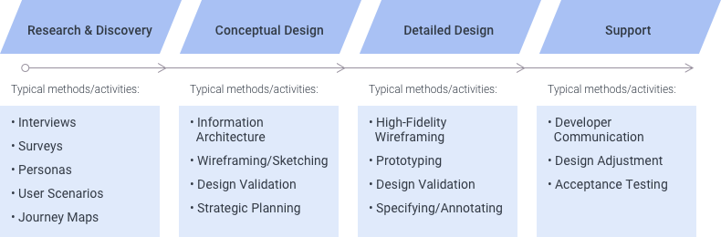
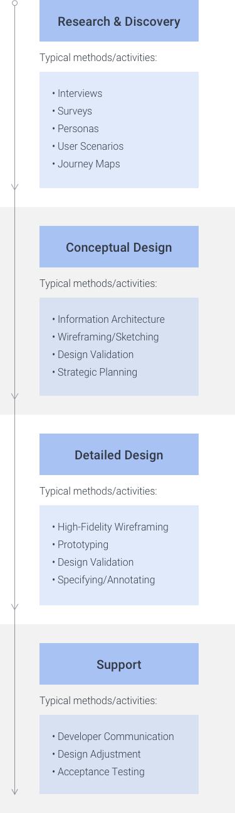

> # **3.2** UX Methodology

Successful user experience design requires accomplishing a number of successive, iterative steps, each helping drive towards a higher level of specificity and fidelity than the prior.

_{srcset="../../_assets/3.2_ux_methodology@2x.png 2x"}_
{.desktop-only}

_{srcset="../../_assets/3.2_ux_methodology_mobile@2x.png 2x"}_
{.mobile-only .center}

{srcset="../../_assets/3.2_specificity_and_fidelity@2x.png 2x"}
