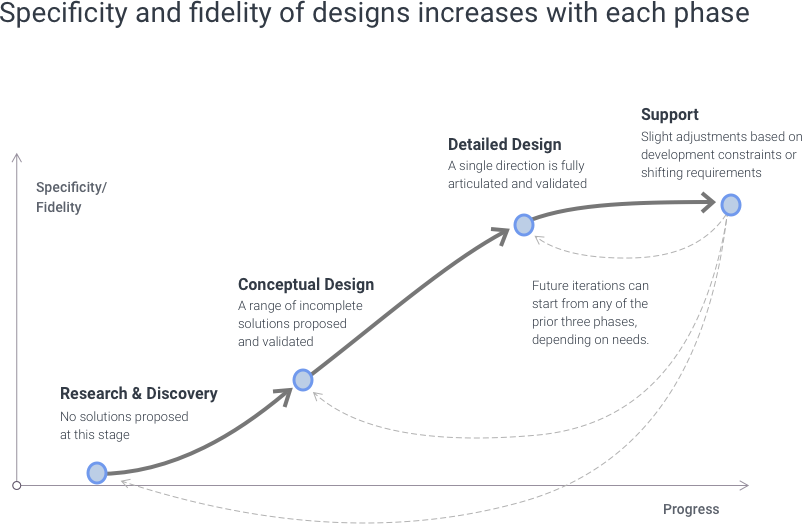

> # **3.2** UX Methodology

Successful user experience design requires accomplishing a number of successive, iterative steps, each helping drive towards a higher level of specificity and fidelity than the prior.

