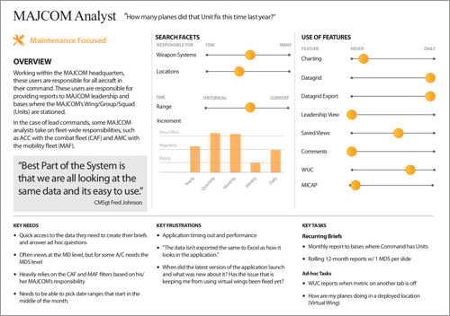

[Back to Phase 1: Research & Discovery](3-3-research.md)

# 3.3.2.1 Personas

Personas are realistic amalgamated representations of your key audience segments. Their humanistic details offer your team the ability to better empathize with your user types. They attempt to help your team understand, relate to, and remember the end user throughout the development process.

## When to use

Use to humanize your users, especially in order to create rich scenarios and journey maps. Referring back to a well-crafted persona that contains specific human concerns and feelings, can help identify opportunities for your system to better match their needs.

## Requirements

- Deep understanding of your users, including an understanding of how to break them up into meaningfully different segments, from direct user input collected in your research.

## Product/output

The output should be a single page or card, that fully characterizes its represented user segment, including goals and motivations, challenges and frustrations, behaviors and habits, attitudes and concerns.

Personas are used as the insight to generate scenarios and journey maps that include a comprehensive user perspective.

## Practical considerations

- Avoid adding details to a persona when they are not relevant to helping achieve that user segment’s goals. Examples could be demographic information like gender and age or lifestyle information like occupation or hobbies. In some instances, those details may be meaningful, but generally are not. Instead, those details allow for bias, unconscious or otherwise, to affect our consideration of the user segment.
- Write personas such that they are always sympathetic, meaning they are always able to elicit fondness and sympathy from your team. Creating opportunity for antagonism in a persona will only serve to alienate your team from a valid user segment.

## References

Describing Personas – Indi Young

Personas Make Users Memorable for Product Team Members – Nielsen Norman Group

