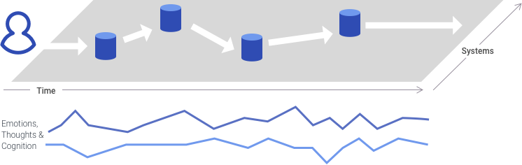
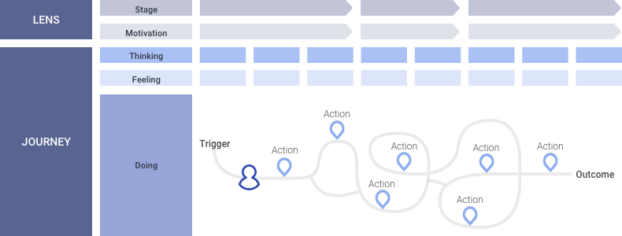

[Back to Phase 1: Research & Discovery](3-3-research.md)

# 3.3.2.3 Journey Maps

A journey map is a narrative-driven graph that describes the typical journey of an end user by representing the different touchpoints and interactions that encompass their experience with the system and surrounding environment.

{srcset="../../_assets/3.3.3.3_journey_maps@2x.png 2x"}

## When to use

Use journey maps to explore how users might use your system as part of accomplishing the goals laid out in specific scenarios. This exploration should foster insight into ways to optimize the system’s design to best support these journeys, thus increasing the value your system offers its users.

## Requirements

- An understanding of meaningful scenarios to map, and the user insights to map them, from user research (interviews in particular).

## Product/output

The map product is a timeline-based chart, typically split into two primary sections. The first section, the lens, depicts the user’s perspective as they become oriented to the activities and requirements of each new stage of the journey. The journey section then captures the specific activities and interactions in which the user is involved at each stage, along with typical thoughts and feelings they might have along the way. This layer of thoughts and feelings provides context for ideas about better ways to support their experience.

{srcset="../../_assets/3.3.3.3_product_output@2x.png 2x"}

The process of depicting a user journey will uncover insights and opportunities to better align the current experience with user needs, or introduce new capabilities to fill gaps in the experience. These ideas should next be explored in conceptual designs, evaluated for feasibility, and finally be roadmapped for implementation. If the journey occurs as part of a larger service offering from your system, a next step could be exploring the full details of the service execution in a service design blueprint.

## Resource

- Journey Mapping in Real Life: A Survey of UX Practitioners [https://www.nngroup.com/articles/journey-mapping-ux-practitioners](https://www.nngroup.com/articles/journey-mapping-ux-practitioners)