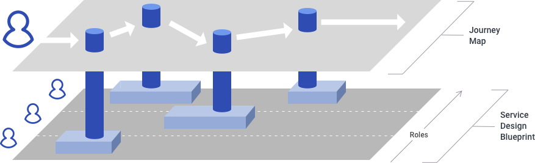
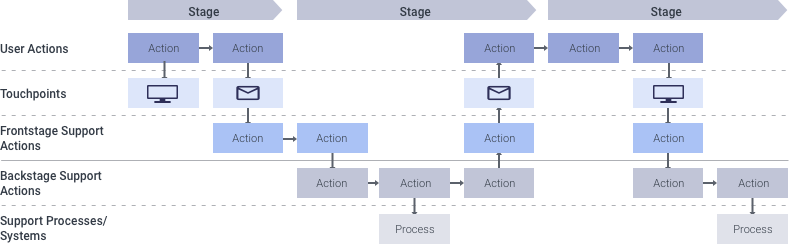

[Back to Phase 1: Research & Discovery](3-3-research.md)

# 3.3.2.4 Service Design Blueprints

A service design blueprint is detailed diagram that captures key processes in the delivery of a service, starting from the end user’s actions and system touchpoints and layering in the front- and backstage support personnel’s tasks and roles and the additional systems that all ultimately enable the service.

## When to use

Use blueprinting to model solutions that address specific process inefficiencies and pain points. This is especially useful in cases where a provided service is complex, such as when multiple support roles or systems are required to facilitate accomplishing the end user’s goal.

## Requirements

- Service design blueprints work best when layered onto an existing journey map, but can be executed independently.

- A thorough understanding of the service delivery process is necessary to accurately capture it. Because complex services can require the efforts of a host of different support personnel and systems, elicit direct input from all participants through interviews or a collaborative workshop session.

## Product/output

A service design blueprint should be a time-based diagram, with swim lanes for the end user’s actions, system touchpoints, frontstage support personnel actions, backstage actions, and additional support processes/additional required systems. The detailed analysis inherit in creating a service blueprint will uncover gaps, inefficiencies, and pain points in your current service delivery model that your conceptual designs can address.

## Resources

Service Blueprints: Laying the Foundation – Cooper

The difference between a journey map and a service blueprint – Megan Erin Miller and Erik Flowers