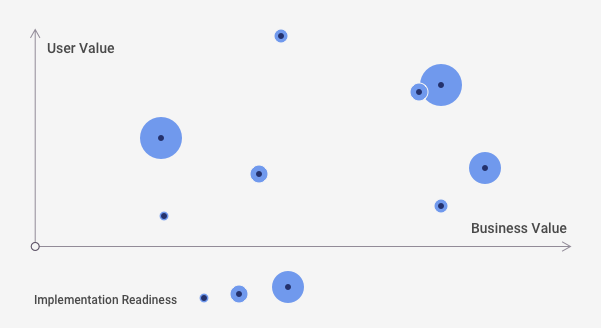
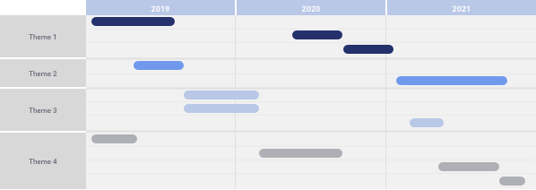

[Back to Phase 2: Conceptual Design](3-4-conceptual.md)

# 3.4.2.1 Roadmapping

The process of roadmapping is done to translate the totality of the collected requirements and conceptual design direction into an actionable plan for phased implementation. First, the requirements and designs are decomposed into an itemization of features and development efforts. Each item is then prioritized by assessing a combination of its user value, organizational value and implementation readiness. Finally, the prioritized items are strategically grouped and sequenced into releases that deliver the greatest incremental value to all parties.

{srcset="../../_assets/3.4.2.1_maturity_levels@2x.png 2x"}

## When to use

Use roadmapping when the scope of the designed solution looks likely to exceed the capacity of a single development increment (release or similar), or valuable features require additional planning and preparation to be ready to implement.

## Requirements

- An itemization of designed features to be roadmapped.
- Stakeholder input on user and business value, and implementation readiness, of itemized features.
- Participation from all disciplines, from product ownership through the development team, to ensure the targets 
  are realistic.

## Product/output

The roadmap itself can take many forms, but a common one is a timeline-based chart that reflects the team’s plan for implementation. It shows a target execution period or completion date for each thread of currently identified and prioritized features.

{srcset="../../_assets/3.4.2.1_roadmap_example@2x.png 2x"}

## Resources

Roadmap Basics – ProductPlan