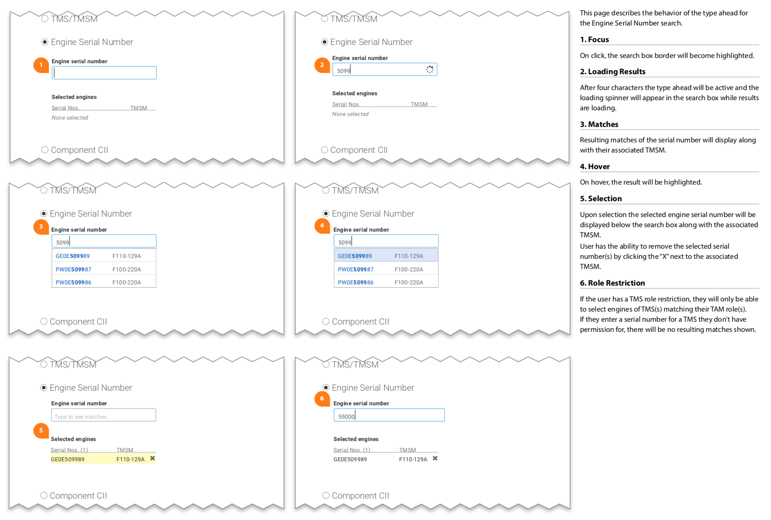

[Back to Phase 3: Detailed Design](3-5-detailed.md)

# 3.5.1.4 Specifying/Annotating

In order to properly support development, all possible states of the interface should be depicted in wireframe or comp, or described in detailed specifications. These specifications and annotations are an opportunity to describe the design’s intent beyond what can be conveyed in a static wireframe of visual design comp alone. This typically includes details like dynamic language, how business rules drive presentation, or exact details on how an interaction should function.

## Requirements

- High-fidelity wireframes or visual design comps to start from.

## Product/output

Design specifications are most useful when presented side-by-side with the detailed design artifacts (wireframes or comps). Typically, a numbered marker is placed on top of the artifact, that references its respective annotation.

{srcset="../../_assets/3.5.1.4_product_output@2x.jpg 2x"}

## Practical considerations

- In Agile and Lean environments, verbal and collaborative communication is favored to extensive documentation like fully annotated wireframes. Even so, some level of specification is still generally necessary to fully convey the designs for implementation. 

## Resource

- Wireframing – The Perfectionist's Guide [https://www.smashingmagazine.com/2016/11/wireframe-perfectionist-guide/#annotating-the-wireframes](https://www.smashingmagazine.com/2016/11/wireframe-perfectionist-guide/#annotating-the-wireframes)
