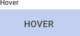
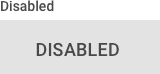
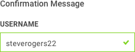

> # **4.11** Buttons & Controls

## Creating Custom-Styled Controls 

Buttons and controls, in the context of this design playbook, are key interactive elements that are custom-styled to match the look & feel of a USAF application. There are many other types of controls (radio buttons, inline scrolls, dropdown menus, etc.), but these most frequently adopt the style of the browser itself, and are thus excluded. Additional styled elements (like navigation and breadcrumbs) can be found within the Component Library of 
this playbook.

## Buttons

Buttons are a key component of interaction design, and are often the primary call-to-action at the page and component level. They usually “commit” the action of a user – submitting a form or piece of data, opening / closing a page element, or navigating to a new content section. Buttons should adhere to the following best practices:

- **Buttons should look like buttons.** Unlike links – which are often just highlighted text – buttons employ a containing element (usually a square or rounded rectangle) to look like the buttons of the physical world. This helps increase their visual emphasis in a layout, and communicate their clickability. 
- **Buttons should be findable.** The button location should be logical in relation to the actions of the layout. A “submit” button, for instance, should be readily visible as the user is completing the last required field of a form. A “next” button should live near the end of a content section (or universally accessible, if the content is intended to be scanned and not read to completion). Buttons placement should never be a hunting game. 
- **Buttons should communicate their action.** Button labels should be clear and obvious, indicating the behavior of the button. “Submit form,” “Learn More,” and “Next” articulate the intention of the button, and relate directly to the content around it. Furthermore, combining buttons labels and buttons styles – such as in the case with a “Cancel” button and an adjacent “OK” button -- enhances the clarity of each button’s action.

## Button Emphasis & States

Buttons often come in primary and secondary styles, both of which follow call-to-action color rules but are treated differently to communicate priority and emphasis. In this case, a primary button style might be used to submit a form, while a secondary button style might be used to cancel the form submission.

_{srcset="../../_assets/4.11_button_primary@2x.png 2x"}_
_{srcset="../../_assets/4.11_button_secondary@2x.png 2x"}_
{.padded .well}

As interactive elements, buttons often have multiple states to communicate to the user the status of the button. Commonly these states are active, hover (on desktop) / clicked, and disabled. The disabled button state is particularly useful for compelling the user to provide all mandatory data before they can proceed; once all form fields have been completed, the button changes to an active – thus clickable – state.

_{srcset="../../_assets/4.11_button_states_active@2x.png 2x"}_
_{srcset="../../_assets/4.11_button_states_hover@2x.png 2x"}_
_{srcset="../../_assets/4.11_button_states_clicked@2x.png 2x"}_
_{srcset="../../_assets/4.11_button_states_disabled@2x.png 2x"}_
{.padded .well}

Styling custom buttons should follow your application’s design guidelines, and the rules of contrast, legibility, and color mentioned elsewhere in this playbook. The basic button states follow a complementary logic: 

- The active button state reflects the call-to-action color, improving the obviousness of its function. 
- The hover state is a slightly lighter or darker than the active state, further communicating that it is an 
interactive element. 
- The disabled state is desaturated and reduced in opacity; ideally, it is just visible enough to discern as a button, but not distract from the other active page elements. 

## Button Feedback

As a key site interaction, users often want validation that their button-click has performed the intended operation. In some cases, loading the subsequent page will be an adequate response to clicking “Learn More.” In others – such as when submitting a form – additional validation may be required. In these cases, consider confirmation and error message styles that are unique and explicit. 

_{srcset="../../_assets/4.11_button_feedback_confirmation@2x.png 2x"}_
_{srcset="../../_assets/4.11_button_feedback_error@2x.png 2x"}_
{.well}

These feedback elements are a perfect example of the interrelatedness of UX and visual design.

## Tabs

Tabs are a common interactive element – especially within data tables – and communicate lateral movement between content of like categories. They are useful in navigation, and also in comparing similar content types on separate layouts.

- **Combine in like categories**. Tabbed items should live at the same hierarchical level with one another. They should also have mutually exclusive content. For example, if the tab category is “media,” individual tabs could be “Music,” “Movies,” and “Books.” 
- **Arrange tabs in a logical order**. The first (leftmost) tab in the set is usually the default tab, and thus sets the standard for content and behavior of other tabs. This tab should also feature your prioritized content, with less prioritized content as the user moves right. There are some exceptions, of course, such as in the case of tabs that are organized alphabetically or numerically.  
- **Mind horizontal space**. Since tabs are usually bound by screen width (other than an infinite vertical scroll), your tab solution should be meaningful at the given device’s viewport. That might mean a scalable tab set that goes “offscreen,” using truncated text, or switching from text to icons when users reach the mobile breakpoint. Tabs must maintain their meaning and scannability, at any scale.

Similar to buttons and navigation elements, tabs often have states to communicate their status.

_{srcset="../../_assets/4.11_tab@2x.png 2x"}_
{.well}
## Ref

Button Design Best Practices
https://uxplanet.org/7-basic-rules-for-button-design-63dcdf5676b4 
https://www.smashingmagazine.com/2016/11/a-quick-guide-for-designing-better-buttons/ 
https://material.io/design/components/buttons.html#
 
Table Design Best Practices
https://uxplanet.org/tabs-for-mobile-ux-design-d4cc4d9410d1  
https://www.justinmind.com/blog/8-tips-to-get-tabs-right-in-web-design/ 
https://material.io/design/components/tabs.html# 
 