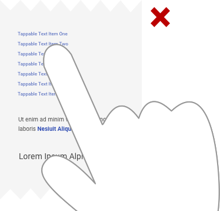

> # **4.12** Key Mobile Standards

## Designing for In-Hand and On-the-Go 

“Mobile first” is a design mantra that helps remind us that an ever-increasing percentage of platform access is via mobile device (both phone and tablet). In some cases, mobile devices make up the majority of access. So while we can’t yet dismiss the importance of desktop devices, it’s a best practice to remember that our users first reach for the computers in their pockets. 

## Mobile is Different

Most visual design principles are universal, and applicable across devices. The elements of type and color and imagery employ the same best practices. But two key factors (and many smaller ones) require slightly different design thinking, and a real consideration of user experience.

- **The device is in-hand**. Mobile devices have small viewports, obviously. That smaller screen size means that longer copy and larger interactive elements need to be treated with a sort of shorthand. An icon, perhaps, where before there was icon and text. That viewport means a smaller keyboard with smaller keys. They’re often thumb-typed, making long form entry uncomfortable. And to just shrink interactive elements fails the user – often resulted in the dreaded “fat finger” mis-tap. 

_{srcset="../../_assets/4.12_responsive_do_dont@2x.png 2x"}_
{.well .center}

- **The user is on-the-go**. Mobile access often indicates that the user isn’t at their workstation, is in a remote working environment, or is even working “multi-screen.” They may be using cellular data and thus reluctant to download large files, if they’re able to at all. They may be in an “in-between time,” waiting in line or walking to their next meeting, hoping for the most efficient task completion, without frills. 

When translating desktop designs to mobile, don’t just miniaturize it – consider how the device and context should influence changes. 

Other mobile best practices include: 

- **Hide and reveal content**. Text truncation, “show more” buttons, and accordion controls increase the scannability of a mobile page, and allow the user to reveal content only on demand. Additionally, menus, headers, and footers can hide when scrolling away, and reveal when scrolling toward – reclaiming that visual real estate for higher priority elements.
- **Remove unnecessary ornamentation**.  A beautiful brand image might work on a desktop design (and over reliable wifi), but on mobile is a waste of bandwidth. Keep only those images that orient and communicate critical information – and optimize those to the viewport of your target devices.
- **Embrace scrolling**. The most predictable, responsive, mobile designs translate desktop layouts into long, scrollable pages. Components should be prioritized from top to bottom in a logical linear order, and when possible provide an affordance for the component that follows.
- **Test vigorously**!  Minor differences between devices tend to disrupt pixel-precise mobile designs. The most reliable way to assure a predictable user experience is to test on your user’s most common devices, within the browser of that device. If the actual phones / tables are unavailable, device emulators and browser plugins can still remove some of the guesswork. 

## Phone vs. Tablet Differences

Remember that a mobile device isn’t just a phone. Scalability across devices, more specifically between a phone and tablet, is a common challenge among designers. While the phone and tablet share many similarities, users use tablets, phones, phablets (not small enough to be a phone, not big enough to be a tablet) very differently. 

_{srcset="../../_assets/4.12_phone_interfaces@2x.png 2x"}_
_{srcset="../../_assets/4.12_tablet_interfaces@2x.png 2x"}_
{.well .space-between .extended .align-bottom}

### Phone Interfaces

Mobile interfaces less than 7 inches width should be treated as a phone. Layout should be aligned across these devices as much as possible, and should also leverage native platform guidelines and capabilities when possible. 

**Mobile phone designs should include only necessary information**. The phone is a convenient way to consume information on the go. Airmen use a phone to complete quick actions while they are not at their workspace, capture data in the field, view content, and perhaps return to look later on a larger device.

### Tablet Interfaces

Mobile interfaces greater 7 inches width should be treated as a tablet. Layout should be aligned across these devices as much as possible; they do not need to align to phone interfaces. 

Tablet designs should look and feel like desktop web, but function like a phone (tap / swipe / hold gestures, etc.). Tablets are more likely to be held in landscape view – approximating the desktop viewport – and in this way, many users consider the tablet a hybrid device.

### “Hit Area” and Button Design

Unlike the pixel-precise cursor on desktop, mobile interactions rely on human fingers of vastly different sizes. The rule of thumb (!) is that any clickable element should be 48px x 48px (accounting for 2x or greater design if necessary) to accommodate the average fingertip. This hit area should also have adequate padding around it; immediately adjacent clickable elements are not recommended. 

_{srcset="../../_assets/4.12_hit_area_do@2x.png 2x"}_
_{srcset="../../_assets/4.12_hit_area_dont@2x.png 2x"}_
{.extended .space-between}

### Native Device Capabilities

While most USAF platforms are web-based application viewed within the mobile device browser, native OS design (mobile apps) unlocks the potential of an integrated device. 

Smart phones and tablets have a lot to offer: touch, voice, pressure, location tracking, accelerometer, notifications, etc. You are designing around the device, the platform, the user experience. How can these device features be utilized in products? How can the mobile device benefit users beyond the screen interface in front of them? 

When designing for native platforms, however, consistently refer to the native OS design guidelines. These constantly evolve with new version releases and system redesigns, so it’s always good practice to stay on top of these guidelines and refresh your memory and knowledge often.

## References

- Apple’s Human Interface Guidelines [https://developer.apple.com/ios/human-interface-guidelines](https://developer.apple.com/ios/human-interface-guidelines)
- Google’s Material Design Guidelines [https://material.io/guidelines](https://material.io/guidelines)
- Mobile Design Principles [https://medium.com/blueprint-by-intuit/native-mobile-app-design-overall-principles-and-common-patterns-26edee8ced10](https://medium.com/blueprint-by-intuit/native-mobile-app-design-overall-principles-and-common-patterns-26edee8ced10) [https://uxplanet.org/7-rules-for-mobile-ui-button-design-e9cf2ea54556](https://uxplanet.org/7-rules-for-mobile-ui-button-design-e9cf2ea54556)
 
