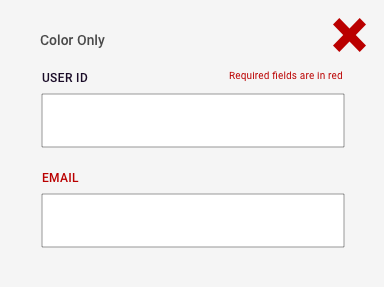
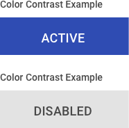
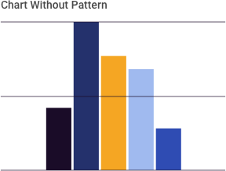

> # **4.13** Accessibility

## Accessibility Considers the User Experience for All Users 

As excerpted from the WCAG Guidelines, “Accessibility defines how to make Web content more accessible to people with disabilities. Accessibility involves a wide range of disabilities, including visual, auditory, physical, speech, cognitive, language, learning, and neurological disabilities.” While this might not be a requirement of your particular application’s users, accessibility standards often reflect the most stringent interpretation of contrast, legibility, and usability best practices – and thus are of use to all designers. 

## Accessibility Tips for Designers

Accessible application design is a collaboration between designers and developers, affecting UI and code alike. In the interest of a useful shorthand for this playbook’s primary users, this section focuses on best practices of visual design & accessibility (quoted heavily from the Web Accessibility Initiative): 

- **Provide sufficient contrast between foreground and background**. Foreground text needs to have sufficient contrast with background colors. This includes text on images, background gradients, buttons, and other elements.  
- **Don’t use color alone to convey information**. While color can be useful to convey information, color should not be the only way information is conveyed. When using color to differentiate elements, also provide additional identification that does not rely on color perception. For example, use an asterisk in addition to color to indicate required form fields, and use labels to distinguish areas on graphs. 

_{srcset="../../_assets/4.13_color_only_dont@2x.png 2x"}_
_{srcset="../../_assets/4.13_color_only_do@2x.png 2x"}_
{.space-between}

- **Ensure that interactive elements are easy to identify**. Provide distinct styles for interactive elements, such as links and buttons, to make them easy to identify. For example, change the appearance of links on mouse hover, keyboard focus, and touch-screen activation. Ensure that styles and naming for interactive elements are used consistently throughout the website. 
- **Provide clear and consistent navigation options**. Ensure that navigation across pages within a website has consistent naming, styling, and positioning. Provide more than one method of website navigation, such as a site search or a site map. Help users understand where they are in a website or page by providing orientation cues, such as breadcrumbs and clear headings. 
- **Ensure that form elements include clearly associated labels**. Ensure that all fields have a descriptive label adjacent to the field. For left-to-right languages, labels are usually positioned to the left or above the field, except for checkboxes and radio buttons where they are usually to the right. Avoid having too much space between labels and fields.

_{srcset="../../_assets/4.13_form_labeling@2x.png 2x"}_
{.well}

- **Provide easily identifiable feedback**. Provide feedback for interactions, such as confirming form submission, alerting the user when something goes wrong, or notifying the user of changes on the page. Instructions should be easy to identify. Important feedback that requires user action should be presented in a prominent style. 

_{srcset="../../_assets/4.13_identifiable_feedback_confirm@2x.png 2x"}_
_{srcset="../../_assets/4.13_identifiable_feedback_error@2x.png 2x"}_
{.well}

- **Use headings and spacing to group related content**. Use whitespace and proximity to make relationships between content more apparent. Style headings to group content, reduce clutter, and make it easier to scan and understand. 
- **Create designs for different viewport sizes**. Consider how page information is presented in different sized viewports, such as mobile phones or zoomed browser windows. Position and presentation of main elements, such as header and navigation can be changed to make best use of the space. Ensure that text size and line width are set to maximize readability and legibility. 
- **Include image and media alternatives in your design**. Provide a place in your design for alternatives for images and media. For example, you might need: visible links to transcripts of audio, visible links to audio described versions of videos, text along with icons and graphical buttons, and / or captions and descriptions for tables or complex graphs. Work with content authors and developers to provide alternatives for non-text content. 
- **Provide controls for content that starts automatically**. Provide visible controls to allow users to stop any animations or auto-playing sound. This applies to carousels, image sliders, background sound, and videos. 

_{srcset="../../_assets/4.13_provide_controls_left@2x.png 2x"}_
_{srcset="../../_assets/4.13_provide_controls_right@2x.png 2x"}_
{.well .space-between}

Most government platforms are subject to the Revised Section 508 Standards and thus WCAG 2.0 Level AA Success Criteria. In addition to other requirements, this will most commonly affect a designer’s text & background color (contrast) choices:

- Text (including images of text) have a contrast ratio of at least 4.5:1. For text and images of that is at least 24px and normal weight or 19px and bold, use a contrast ratio that is at least 3:1. 
- Color contrast for graphics and interactive UI components must be at least 3:1 so that different parts can be distinguished. 
- When providing custom states for elements (e.g. hover, active, focus), color contrast for those states should be at least 3:1.

_{srcset="../../_assets/4.13_contrast_examples@2x.png 2x"}_
_{srcset="../../_assets/4.13_contrast_text_on_image@2x.png 2x"}_
{.float}

_{srcset="../../_assets/4.13_chart_wout_pattern@2x.png 2x"}_
_{srcset="../../_assets/4.13_chart_w_pattern@2x.png 2x"}_
{.well .center}

## References

- W3.org Tips & Resources for Designers [https://www.w3.org/WAI/tips/designing](https://www.w3.org/WAI/tips/designing)
- Web Content Accessibility Guidelines (WCAG) 2.0 [https://www.w3.org/TR/WCAG20](https://www.w3.org/TR/WCAG20)
- US Web Design System [https://www.usability.gov/what-and-why/accessibility.html](https://www.usability.gov/what-and-why/accessibility.html) [https://designsystem.digital.gov/documentation/accessibility](https://designsystem.digital.gov/documentation/accessibility)
- HHS Design Standards [https://webstandards.hhs.gov/guidelines](https://webstandards.hhs.gov/guidelines)
 
