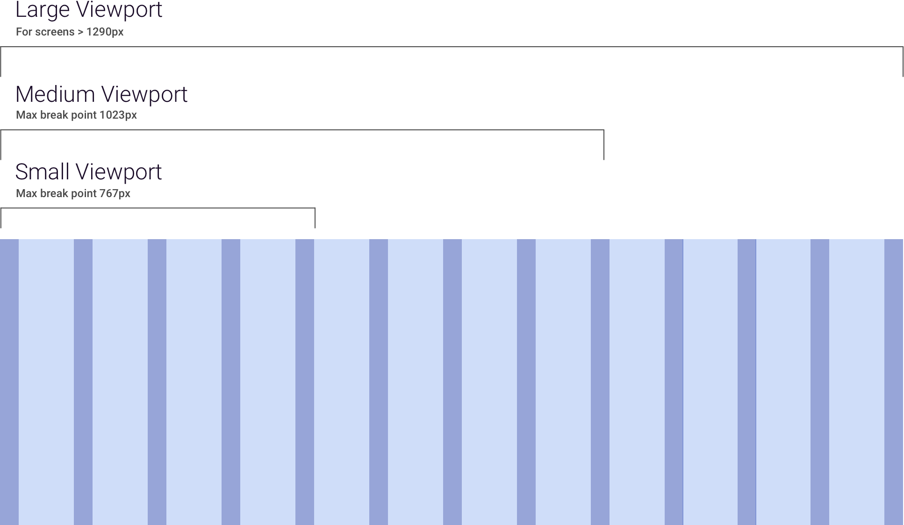

> # **4.3** Grids & Breakpoints

## About the Grid

A grid is an organizing system of a layout, consisting of invisible rulers that align layout elements like copy, images, and navigation. Most often, a grid defines a series of equally sized columns with smaller, equally sized columns for padding (“gutters”) in between. The grid behaves differently depending upon the viewport, as defined by the device upon which the layout is viewed. The viewport is essentially the screen size of the device, measured in pixels, and is the amount of visual real estate available for your layout.

A thoughtful grid is particularly helpful in responsive design. This type of design is a collaboration with front-end development, and programmatically scales down the layout to be most appropriate for the device / viewport in use. As the browser window shrinks horizontally, the point at which a grid “breaks” to a fewer-column grid is called the breakpoint.

## Defining Pixels

As device display technology improves, the density of pixels has grown to differ across devices. Names like HD and 4k indicate different numbers of pixels per inch – all in pursuit of a crisper image. To retain predictability and consistency, designers and developers rely on **CSS pixels**, which provide a standard definition of pixel size for the web that does not vary based on the device’s pixel density.

It is highly recommended that designers work with their front-end developers to define target devices and pixel densities, and use resources that track changing display technology (like https://vizdevices.yesviz.com/).

{srcset="../../_assets/4.3_grid_image@2x.png"}
{.extended}

### Small Viewport

The Small Viewport grid is intended to accommodate portrait-view smartphones (approx. 320 px) and many landscape view smartphones. On these devices, the 8-column grid switches to a 4-column structure to create a more comfortable layout on a handheld, as well as to allow for larger tap-targets. This format equates to a **maximum width of 767 px**, with a **minimum width of 320 px**.

## Medium Viewport

The Medium Viewport grid is intended to accommodate most portrait-view tablets (768 px), most landscape view phablets (768 px), and larger landscape view smart phones. On these devices, the 12-column grid switches to an 8-column structure to create a more comfortable layout on tablets, as well as to allow for larger tap-targets. This format equates to a **maximum width of 1023 px**, with a **minimum width of 768 px**.

## Large Viewport

The Large Viewport grid is intended to accommodate high-resolution monitors, most landscape-view tablets (1042 px), and everything in between. This equates to a **maximum width that is infinite**, and a **minimum width of 1024 px**.

## Responsive Component Reordering

As responsive layouts break to smaller viewports, page elements – components – should logically reorder and stack vertically to maintain the intent of the layout. 

This diagram illustrates one solution for component reorganization with respect to responsive layouts. Each component is designed to occupy a minimum of 2 columns and maximum of 6.

_{srcset="../../_assets/4.3_responsive_reordering_small@2x.png 2x"}_
_{srcset="../../_assets/4.3_responsive_reordering_medium@2x.png 2x"}_
_{srcset="../../_assets/4.3_responsive_reordering_large@2x.png 2x"}_
{.space-between}

The Medium Viewport layout includes a potential for additional white space to appear, in the event that a design contains a 3-component row. Being that the use-case is relatively obscure (with respect to hardware, UI, content, and user needs), the choice was made to include the layout as described, thus avoiding either bespoke solutions or arbitrary hierarchical relationships. 

As a takeaway, design with a minimum of 4 columns / 1 component width for the smallest viewport, and otherwise subdivide the total number of grid columns evenly to create a consistent layout on table and desktop.

## Reference

- Interaction Design Foundation [https://www.interaction-design.org/literature/article/responsive-design-let-the-device-do-the-work](https://www.interaction-design.org/literature/article/responsive-design-let-the-device-do-the-work)