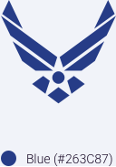
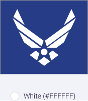
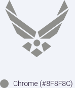

> # **4.4** Branding/Logo

## Our Identification

The Air Force Symbol is the official symbol of the United States Air Force. It honors the heritage of our past and represents the promise of our future. Furthermore, it retains the core elements of our Air Corps heritage, the "Arnold" wings and star with circle, and modernizes them to reflect our air and space force of today and tomorrow. The USAF symbol was thoughtfully crafted to represent the Air Force’s history as well as the promise of the future of the armed forces branch. The symbol can take on two different forms depending on how you choose to see it: a medal of valor in service or our nation’s emblem of freedom, an eagle. 

(These images are misaligned. They should be exported so they have the same height)

_{srcset="../../_assets/4.4_our_identification_01@2x.png 2x"}_
_{srcset="../../_assets/4.4_our_identification_02@2x.png 2x"}_
{.space-between}

## Some Rules Around the USAF Signature

- A 15% stand-off space around the Symbol and/or signature is required. The stand-off space takes the shape of a square, not the outline of the Symbol.  
- The U.S. Air Force signature consists of the Air Force Symbol and the logotype (U.S. Air Force)  
- The Symbol can be used with or without the logotype 
- If used with the logotype, the two elements are in a fixed relationship and cannot be altered.
- The only alternate words permitted “directly” under the Symbol are those approved by the Chief of Staff of the Air Force (see Formats)

(These images are misaligned. They should be exported so they have the same height)

_{srcset="../../_assets/4.4_logo_blue@2x.png 2x"}_
_{srcset="../../_assets/4.4_logo_white@2x.png 2x"}_
_{srcset="../../_assets/4.4_logo_chrome@2x.png 2x"}_

## Logo Application

The spacing and positioning for the logomark has been carefully considered and optimized to create an ideal optical balance. Because the shape is comprised of sharp, angular points, in tandem with the illusion of a 3-dimensional shape, a sense of symmetry is achieved through subtle repositioning of the mathematical center.

#### Spacing

The spacing and positioning for the logomark has been carefully considered and optimized to create an ideal optical balance. Because the shape is comprised of sharp, angular points, in tandem with the illusion of a 3-dimensional shape, a sense of symmetry is achieved through subtle repositioning of the mathematical center.

#### Sizing

The shape of the mark should maintain its integrity at relatively small sizes. Designers should use discretion and consider the output-media when utilizing the mark at a smaller size.

