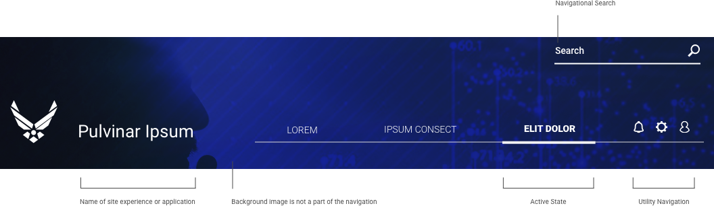

> # **4.5** Global Headers & Footers

## Headers & Footers

In a web page layout, the header is the upper (topmost) part of the page, immediately beneath the browser chrome (where the URL, search field, and bookmarks are located). The footer is the lower (bottommost) part of the page, where scrolling terminates. Most mobile devices remove the chrome from the browser in order to allow more space for the header and footer elements. 

## Headers

Headers can include a variety of meaningful elements:

- Basic elements of brand identity: logo, brand / application name, tagline or brand statement, application colors, corporate colors, etc. 
- Navigation to primary site or application sections 
- Language-switching functionality (if applicable) 
- Search field 

Not all of the mentioned elements should be included in one web page header: in this case, the risk is high that the header section would be overloaded with information. The more objects that attract a user’s attention, the harder it is to concentrate on the vital ones. As with all design decisions, apply UX best practices to focus on user orientation (“where am I and what does this do?”) and task completion (“how do I do it?”). 

## Desktop Navigation

_{srcset="../../_assets/4.5_header_example@2x.png 2x"}_
{.wide}

## Search is Intertwined with Navigation

Search is a form of navigation. In many situations, the reader will use a combination of the “content 
gatherers”. They will use search to bring them to the subject area or product type they are interested in. 
Then the navigation should kick in, giving them the context for their search.

## Footers

The footer is the lower (bottommost) part of the page, where scrolling terminates. Footers can support wide varieties and large volumes of content, and often contain universal content (contact details and forms), expanded navigation options, and links outside of the given site or application. 

Contemporary users have demonstrated comfort scrolling long pages and engaging with large page footers, provided both follow layout best practices. It is reasonable to use the page footer as a repository for all content that is both deprioritized but should also be universally accessible. 

_{srcset="../../_assets/4.5_footer_dark_graphic@2x.png 2x"}_
{.wide}

_{srcset="../../_assets/4.5_footer_light_graphic@2x.png 2x"}_
{.wide}

### Visual Hierarchy

Given that the footer is often more visually dense than other page components, a visual hierarchy is critical. Adequate spacing helps improve both focus and legibility. Thoughtful typography helps improve scanning and the overall layout. 

Consider “reversing” the colors of the main page in the page’s footer in order to communicate that they’ve reached the end of the page. That is, if the body of the page is on a light background, put the footer on a dark background. Given that this is a common technique, note that “reversing” the colors of a component in the page body can sometimes create a “false bottom,” causing users to believe they’ve hit the footer, and possibly miss the rest of the page.

### Anchoring

Both headers and footers can “anchor” to the top or bottom of the page (though rarely should both page elements should behave this way simultaneously). An anchored – or “sticky” – element stays on screen as the user scrolls, no matter the scroll depth. This is particularly useful for bringing persistent information or interaction along with the user, such as a form submission, call to action, or mode toggle (edit / review).

## References

- U.S. Web Design System [https://designsystem.digital.gov/page-templates/#documentation-page](https://designsystem.digital.gov/page-templates/#documentation-page)
- UX Planet [uxplanet.org](https://uxplanet.org)