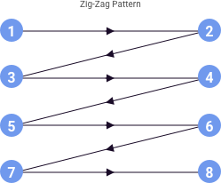
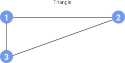

> # **4.6** Page Layouts

## Layouts

Generally speaking, the layout of a page should prioritize content importance from top to bottom, providing orientation (wayfinding and labels) to components throughout. Layouts should also follow the natural flow of task completion; users completing a number of form fields on a long vertical page might encounter the “submit” button – the primary call-to-action – beneath the original viewport and offscreen. This is permissible because the form fields are the prerequisite for completing the task of the page, and should thus be prioritized in the visual hierarchy.

### F Pattern

Studies have found that, in cultures that read from left to right, most people scan screens in an “F” pattern, with preference given to elements that are positioned at the top and left of the screen. Consider placing the most important elements at the top and left of your layout. The upper right of the page is considered secondary in importance due to its positioning at the top of the page, but the importance of the right side rapidly diminishes as you move further down the page.

{srcset="../../_assets/4.6_f_pattern_graphic@2x.png 2x"}

Other layout patterns support different densities of content and types of tasks to complete. They all acknowledge the way the user scans the page, tending to favor the top and left.

_{srcset="../../_assets/4.6_zigzagpattern@2x.png 2x"}_
_{srcset="../../_assets/4.6_z_pattern@2x.png 2x"}_
_{srcset="../../_assets/4.6_trianglepattern@2x.png 2x"}_
{.extended .space-between}

## References

- NN/g Nielsen Norma Group : Pattern of Reading [https://www.nngroup.com/articles/f-shaped-pattern-reading-web-content/](https://www.nngroup.com/articles/f-shaped-pattern-reading-web-content/)
- Vanseo Design : Design Layouts : Gutenberg Diagram, Z-OPattern and F-Pattern [http://vanseodesign.com/web-design/3-design-layouts](http://vanseodesign.com/web-design/3-design-layouts/)
 - U.S. Web Design System [https://designsystem.digital.gov](https://designsystem.digital.gov)
 