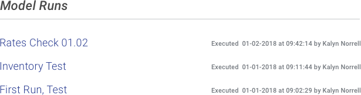
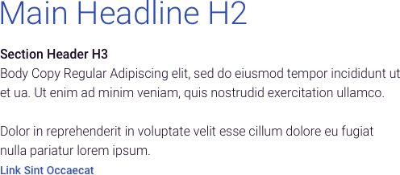
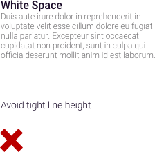

> # **4.7** Typography

## Reinforcing the Goals of Typography

More than 95% of information on the web is in the form of written language. If typography is done well, it goes unnoticed. If it’s not, it sticks out like a sore thumb and moreover disrupts the user experience. Typography holds an important place in any form of design that features text, and this is especially true for web and application design.

## Three Fundamental Aspects of Typography

_{srcset="../../_assets/4.7_fundamental_aspects_typography_legibility@2x.png 2x"}_
_{srcset="../../_assets/4.7_fundamental_aspects_typography_readability@2x.png 2x"}_
_{srcset="../../_assets/4.7_fundamental_aspects_typography_aesthetics@2x.png 2x"}_
{.space-between}

Although in a non-technical sense “legible” and “readable” are often used synonymously, typographically they are separate but related concepts. Legibility is the ease with which a reader can recognize individual characters in text. Readability is the ease with which a reader can recognize words, sentences, and paragraphs comprised of characters. Aesthetics is the emotional property of the text, communicating everything from precision to speed to humor.

Typography as an art is nuanced; our primary concern is functional – the fluid communication of information by the written word. As such, we focus on core concepts for achieving legibility, readability, and context-appropriate aesthetics. 

_{srcset="../../_assets/4.7_serif_comparison_mobile@2x.png 2x"}_ 
_{srcset="../../_assets/4.7_sansserif_comparison@2x.png 2x"}_
{.center .padded .type-4-7}

### Font Type

Of the many font categorizations, the two largest (and most common categories) are “serif” and “sans-serif” fonts (literally translating to “feet” and “without feet”). The “feet” to which they refer are the small visual elements that branch out at the end of a stroke. 

Due to their clean-line, technical appearance, sans-serif fonts are often considered a more modern aesthetic. They are appropriate for both headline and body copy; when used as headlines they often pair well with serif body copy. 

Due to their origins in mechanical letterpress, serif fonts are often considered a more timeless aesthetic. Studies have shown larger blocks of copy to be more readable when printed in serif type, which is why most books and long-form copy employ serif fonts to this day.

### Font Size

Font size is another major determinant of text readability. A font size of about 16px is optimal for easy online reading of long-form content. To support overall visual hierarchy, consider using three or fewer different font sizes in any given component, Rules on minimum font size can be found on the Accessibility section.

{srcset="../../_assets/4.7_engines_model_run_image@2x.png 2x"}
{.center .padded}

### Contrast

Color contrast ultimately determines whether or not text is readable. Black text on a white background, for example, is very high contrast, but for optimum readability, place very dark grey text on a white background; it will maximize contrast while lowering eye strain. 

The rules of contrast are outlined specifically in the Web Content Accessibility Guidelines (WCAG) 2.0, addressed elsewhere in this playbook. Depending upon accessibility requirements for the visually impaired, contrast compliance may need to be more or less strictly followed.

### Hierarchy

Text hierarchy becomes especially important in web and application design because it helps users navigate through a site quickly and scan text easily. If all type was the same size and weight, it would be difficult to know which was the most important information on the page.  

In order to orient the user to critical layout components, headings are usually the most dominant, sub-headings less so, and body type even less so. This hierarchy is accomplished through a combination of font size (px), contrast (color), and weight (thin, bold).

{srcset="../../_assets/4.7_type_sample@2x.png 2x"}
{.center .padded}

### Line Height

Line height, or leading, refers to the space between lines in a body of text. A general rule for readable text is that your leading value should be 125–150% of the font size. Frustratingly, the “single spacing” default is typically too tight for text on a web page while “double spacing” can be so loose that the text no longer looks as though it is part of one unit. Consider adjusting your line height to satisfy this 125–150% rule.

{srcset="../../_assets/4.7_line_height_graphic@2x.png 2x"}
{.center .padded}

### Line Length

Line length defines the number of characters in a single line of text, until the reader returns to the beginning of the following line. In large viewports, long lines of body text can be cumbersome to consume. A best practice for body text is a single line character length of 50-60 characters, beyond which diminishes the readability of text.

### White Space

Your layout’s “white space” – visual areas unoccupied by text or images – is essential for offsetting large amounts of text, and providing focus and orientation for users. It should offer separation between different elements of the text layout, such as text and images, and body text and headers.

_{srcset="../../_assets/4.7_line_height_do@2x.png 2x"}_
_{srcset="../../_assets/4.7_line_height_dont@2x.png 2x"}_
{.center .padded}

### References

- Tubik Blog [https://tubikstudio.com/20-wise-thoughts-by-typography-master-erik-spiekermann](https://tubikstudio.com/20-wise-thoughts-by-typography-master-erik-spiekermann)
- Smashing Design [https://www.smashingmagazine.com/2011/01/guidelines-for-responsive-web-design](https://www.smashingmagazine.com/2011/01/guidelines-for-responsive-web-design)  
