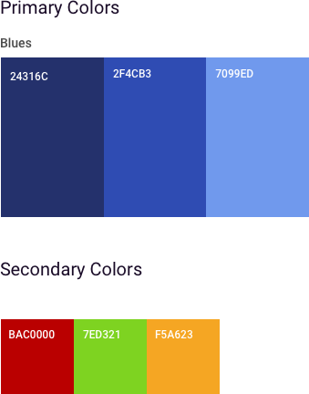
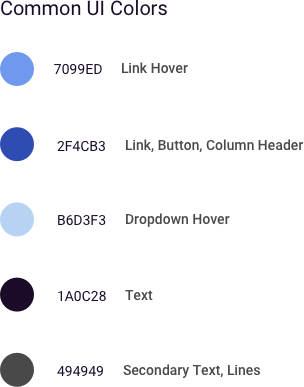

> # **4.8** Color

## About Colors

Color theory hypothesizes that humans react to color in visceral ways. The heat we feel from reds, the chill from blues – these reactions to color are ingrained in us. It gives color the power to spark emotions and be a sort of shorthand for categorical types. When leveraging the tool of color, remember that not everyone sees the colors the way you do and usability trumps beauty. 

## Colors

Color is one of the visual designer’s most powerful tools, reinforcing both the brand and user experience. In addition to supporting brand recognition, color is particularly useful for:

- Creating contrast 
- Grouping elements 
- Encoding additional meaning 
- Communicating interactivity 

### Primary Colors

The primary palette should be applied in marketing communications and application design. The darker palette lends sophistication and polish has been designed to give a bold and exciting direction to the brand. Percentage tints can be used in any of these colors.

### Secondary Colors

The secondary palette extends the original colors to support new contexts, such as color-coded categorization, complex data visualization, and interactive color cues.

_{srcset="../../_assets/4.8_colors_01@2x.png 2x"}_
_{srcset="../../_assets/4.8_colors_02@2x.png 2x"}_
{.wide .well .space-between .extended}

### Colors for Accessibility 

WCAG (Web Content Accessibility Guidelines) ensure that content is accessible by everyone, regardless of disability or user device. To meet the highest standards, text and interactive elements should have a color contrast ratio of at least 4.5:1. The contrast ratio is the comparison of luminance between two adjacent colors, one darker and one lighter. An appropriate ensures that viewers who cannot see the full color spectrum are able to read the text. 

The options below offer color palette combinations that fall within the range of Section 508 compliant foreground/background color contrast ratios. To ensure that text remains readable and accessible, use only these permitted color combinations. 

If you choose to customize beyond this palette, https://webaim.org/resources/contrastchecker/ is a useful resource for testing the compliance of any color combination. 

_{srcset="../../_assets/4.8_common_ui_colors_01@2x.png 2x"}_
_{srcset="../../_assets/4.8_common_ui_colors_02@2x.png 2x"}_
{.wide .well .space-between .extended}

Colors should be used to denote the type of component or content being displayed. Large blocks of passive, read-only text should be colored to achieve maximum readability, whereas interactive links within that text should be colored with a more eye-catching “call-to-action" (CTA) standard. Reds and greens should be used sparingly, as they are often reserved for “alert colors,” or stylized system notifications (for when a form field is filled incorrectly, for instance). A color that indicates a disabled state could be the same as one that indicates active, but applied at 50% opacity. 

_{srcset="../../_assets/4.8_color_usage_cta@2x.png 2x"}_
_{srcset="../../_assets/4.8_color_usage_alert@2x.png 2x"}_
_{srcset="../../_assets/4.8_color_usage_checkmark@2x.png 2x"}_
_{srcset="../../_assets/4.8_color_usage_alert@2x.png 2x"}_
{.wide .well .space-between .extended}

While your particular USAF application may adhere to its own style guide, all color palettes should comply with the USAF brand and digital best practices. 

As a matter of example, the following color palettes have been designed and optimized specifically for USAF experiences. Careful consideration has been made with regards to content, data, accessibility, mobile form factors, and eye fatigue. In addition, hues have been strategically chosen to either compliment or reinforce the existing USAF parent brand palettes. In this way, the following schemes should be seen as an extension of the USAF brand, with additions and minor modifications included to create an optimal digital experience. First consult your application’s style guide, should one exist. 

## References

- From AF Branding & Trademark Licensing [https://www.trademark.af.mil/About-Us/The-Air-Force-Symbol/Display-guidelines](https://www.trademark.af.mil/About-Us/The-Air-Force-Symbol/Display-guidelines)
 - From CCE [https://company-123432.frontify.com/d/YQiReCF6Sab5/usaf-cce-style-guide#/brand-design/colors](https://company-123432.frontify.com/d/YQiReCF6Sab5/usaf-cce-style-guide#/brand-design/colors)
 
