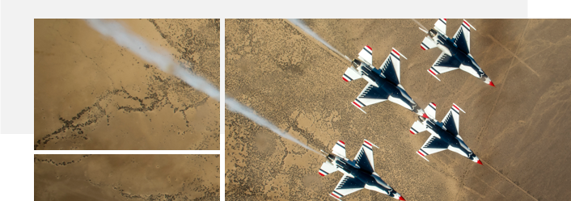

> # **5.1** Introduction

## Design is the Little Things

Elements. Components. Modules. We often use these words interchangeably, but all of them refer to the pieces of varying complexity that make up a design system. From the single pixel to the entire page, their consistency contributes to both usability and visual appeal.

{srcset="../../_assets/5.1_intro_image@2x.png 2x"}

## How to use this Component Library

As previously noted, **this playbook is not a style guide; it is intended to complement and fill gaps** in style guides. As such, please:

1. Refer to your application’s style guide for your specific design standards,

2. Work with your design and front-end teams to determine an appropriate pre-existing solution

3. Confirm any relevant standards within the USAF brand or US government guidelines. In the absence 
of that standards documentation, this library provides general design guidance.

## Style Specificity

Given the differences between specific application style guides, this component library frequently refers to page elements by the purpose they serve or their front-end (HTML) shorthand. So, instead of defining a block of copy by its specific typographic properties, for instance (font name, size, hex color, etc.), we label it as “Body” or “H1 - Headline” in reference to your specific application’s styles.

_{srcset="../../_assets/5.1_style_specificity_desktop@2x.jpg 2x"}_
_{srcset="../../_assets/5.1_style_specificity_mobile@2x.jpg 2x"}_
{.float}

In the case of entirely new components, enterprise-wide updates, or emergent devices / contexts / interaction patterns not accounted for in foundational style guides, this library provides a more prescriptive design: “Alpha Standard.” Again, these styles should only be applied if you’ve exhausted all other standards, and are primarily to demonstrate the best practices outlined in Web Design Standards.

## Desktop / Tablet / Mobile

This component library places an increased focus on mobile (small viewport) use cases. When possible, desktop (and landscape tablet) components are shown with their behavior at the mobile breakpoint.

## USAF Application Style Guides

USAF Branding & Trademark Licensing
https://www.trademark.af.mil/About-Us/The-Air-Force-Symbol/Display-guidelines/

US Web Design System
https://designsystem.digital.gov/
 
 
