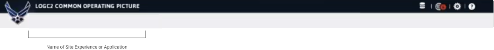
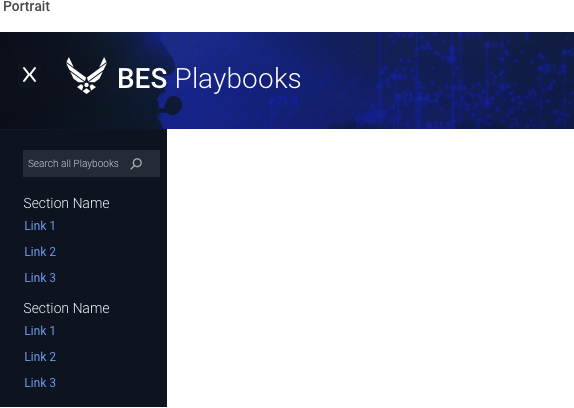

> # **5.2** Global Navigation

## About Global Navigation

Any element that, upon interaction, moves a user through an application or site is technically a navigation element. Our focus is on those items that persist regardless of the user’s location within the application: global navigation.  

The vast majority of global navigation exists at the top of the screen, either within or adjacent to the page header. Some global navigation exists at the left or right side of the screen, and may also behave like a “drawer” of other user options. 

{srcset="../../_assets/5.2_nav_example_01@2x.png 2x"}
{.wide .nav-5-2}

{srcset="../../_assets/5.2_nav_example_02@2x.jpg 2x"}
{.wide}

{srcset="../../_assets/5.2_nav_example_03@2x.png 2x"}
{.wide}

---

## Alpha Standard

The following example component illustrates the web standards outlined previously, with the practical choices that make it so. Note that the Alpha Standard below is a stylistic proposal only. The inclusion / exclusion of particular navigation items (including utility nav, search, and functional elements) is usually determined by UX designers in accordance with user needs.

- **Task Completion**. In content and layout, it first considers the user’s intention.
 
- **Hierarchy**. The component features prioritized items that must be universally accessible, with interactivity and a search component to access everything else.

- **Status**. Design elements communicate interactivity, as well as the active state of nav items (I.e. the user’s location). As reflected in the web standards, the following should be considered: a hover state to indicate interactivity, a highlighted state to indicate the currently selected option, a disabled state where applicable to indicate something is disabled. 

- **Contrast**. The combination of color ratios and the spacing between elements assures scannability and distinction of critical items. 

- **Legibility**. The combination of color contrast and font characteristics (font type, size, line weight) meet visual accessibility standards.

**Disclaimer**: Please default to your application’s and USAF styles; the following component standards are to be used only if those assets are not applicable or not available. 

## Desktop Navigation

{srcset="../../_assets/5.2_desktop_navigation@2x.png 2x"}
{.wide}

{srcset="../../_assets/5.2_desktop_navigation_dropdown@2x.png 2x"}
{.wide}

---

## Tablet Navigation

{srcset="../../_assets/5.2_tablet_navigation_dropdown@2x.png 2x"}

{srcset="../../_assets/5.2_tablet_portrait_navigation@2x.png 2x"}

---

## Phablet Navigation

_{srcset="../../_assets/5.2_phablet_nav@2x.png 2x"}_
_{srcset="../../_assets/5.2_phablet_nav_dropdown@2x.png 2x"}_
{.extended .space-between}

---

## Mobile Navigation

_{srcset="../../_assets/5.2_phone_nav@2x.jpg 2x"}_
_{srcset="../../_assets/5.2_phone_nav_dropdown@2x.jpg 2x"}_
{.float}

## References

- U.S. Web Design System [https://designsystem.digital.gov/page-templates/#documentation-page](https://designsystem.digital.gov/page-templates/#documentation-page)
- UX Planet [uxplanet.org](https://uxplanet.org)
