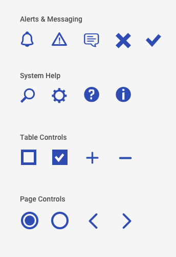

> # **5.3** Icons

## USAF Application Styles

The following icons are an aggregate of USAF applications and labeled accordingly. When selecting new icons, choose only from a single “family” to retain consistency, or match the characteristics of your pre-existing icon set. An icon family is usually created by the same designer, and each icon will have similar complexity, line weight, repeating elements, and themes.

_{srcset="../../_assets/5.3_application_styles_left@2x.png 2x"}_
_{srcset="../../_assets/5.3_application_styles_right@2x.png 2x"}_
{.wide .well .space-between .align-bottom}

When selecting new icons, choose only from a single family to retain consistency, or match the characteristics of your pre-existing icon set. A good practice is ensuring the icons fit within the same square, having matching line weight / complexity when compared at the same size. 

_{srcset="../../_assets/5.3_icon_uniformity@2x.png 2x"}_

---

## Alpha Standard

The following example component illustrates the best practices outlined previously, with the practical choices that make it so. 

- **Clear meaning**. Icon designs favor obvious over clever, communicating one- or two-word concepts in culturally established standards.  
- **Simple design**. Limited visual complexity improves scannability, plus the ability to scale up and down as contexts require.  
- **Standardization**. Stylistic similarities between icons (complexity, line weight, repeating elements) improve the coherence of the design system. These styles are made consistent within an icon family. 

### Example Icon Classifications

_{srcset="../../_assets/5.3_icon_classifications@2x.png 2x"}_

**Disclaimer**: Please default to USAF application styles; these component standards are to be used only if those assets are not applicable or not available. 