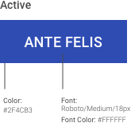
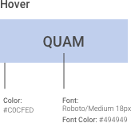
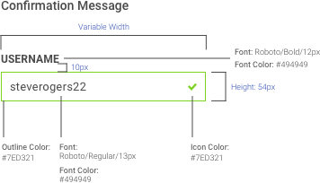

> # **5.4** Buttons & Labels

## USAF Application Styles

Buttons styles are specific to applications, though button behaviors should follow best practices laid out in [Buttons & Controls](4-11-buttons) (4.11).

#### Machine Learning

{srcset="../../_assets/5.4_machine_learning@2x.png 2x"}
{.padded}

---

#### Engines Health

{srcset="../../_assets/5.4_engines@2x.png 2x"}
{.padded}

---

#### Positive Inventory Control

{srcset="../../_assets/5.4_positive_inventory_control@2x.png 2x"}
{.padded}

## Alpha Standard

The following example component illustrates the best practices outlined previously, with the practical choices that make it so.

- **Obvious**. By placing active text into a containing element (usually a rectangle or rounded rectangle), they follow the design standard of the web and real-world.
- **Clear**. Button labels like “Submit” and “Learn More” communicate the action that the user is taking upon click.
- **Feedback**. Interacting with the button changes its style, and clicking it provides other feedback (like success / error messages) to clarity the user experience.
- **Contrast**. The spacing and color ratios of the element provide adequate legibility and scannability.

**Disclaimer**: Please default to your application’s and USAF styles; the following component standards are to be used only if those assets are not applicable or not available.

_{srcset="../../_assets/5.4_alpha_standard_primary@2x.png 2x"}_
_{srcset="../../_assets/5.4_alpha_standard_secondary@2x.png 2x"}_
_{srcset="../../_assets/5.4_alpha_standard_text_link@2x.png 2x"}_
{.space-between}

---

_{srcset="../../_assets/5.4_button_state_active@2x.png 2x"}_
_{srcset="../../_assets/5.4_button_state_hover@2x.png 2x"}_
_{srcset="../../_assets/5.4_button_state_clicked@2x.png 2x"}_
_{srcset="../../_assets/5.4_button_state_disabled@2x.png 2x"}_
{.space-between}

---

_{srcset="../../_assets/5.4_confirmation_message@2x.png 2x"}_
_{srcset="../../_assets/5.4_error_message@2x.png 2x"}_
{.space-between}

---

{srcset="../../_assets/5.4_tab@2x.png 2x"}