> # **5.5** Content Modules

## Designing for Editorial Content

When layouts are particularly content-heavy (such as in the case of an article page), they may require components that support copy, images, and other editorial elements. These components are called “content modules,” and can be used individually or stacked to create long-form content.

_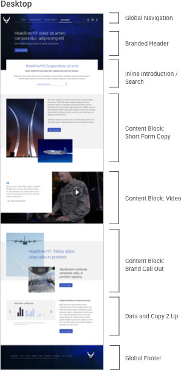{srcset="../../_assets/5.5_editorial_desktop_01@2x.png 2x"}_
_{srcset="../../_assets/5.5_editorial_mobile_01@2x.png 2x"}_
{.space-between}

---

_{srcset="../../_assets/5.5_editorial_desktop_02@2x.png 2x"}_
_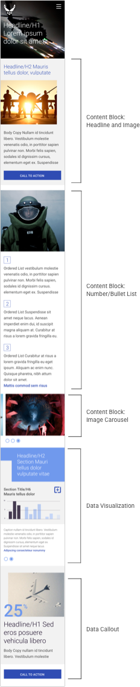{srcset="../../_assets/5.5_editorial_mobile_02@2x.png 2x"}_
{.space-between}

Your application will likely feature content modules specific to the style of your platform. For the sake of consistency and efficiency, first try re-purposing an existing design solution. Should one not exist within your style guide or front-end code, the following examples act as a guide for designing new components.

## Full-Width Content Modules

Full-width content modules span the width of the viewport at any breakpoint, split and stack as the layout responds down. Particularly in the mobile viewport, these modules should follow best practices of content reordering [(section 4.6)](4-6-layouts.md) and degradation of individual elements like images, nav elements, and longer copy blocks [(section 4.12)](4-12-mobile.md).

### Global Navigation [(See section 5.2)](5-2-nav.md)

_{srcset="../../_assets/5.5_globalnavigation_desktop@2x.png 2x"}_
_{srcset="../../_assets/5.5_globalnavigation_mobile@2x.png 2x"}_
{.well .padded}

### Branded Header 

A header for major content categories (generally those items featured in top-level navigation); generally reserved for more editorial (and less functional) pages. Can support large calls-to-action that drive to elsewhere on the page, or other pages entirely.

_{srcset="../../_assets/5.5_globalnavigation_desktop@2x.png 2x"}_
_{srcset="../../_assets/5.5_brandedheader_mobile@2x.png 2x"}_
{.well .padded}

### Inline Introduction / Search

Combining both introductory text and a search element, this component is useful for guiding the user through long-form content (articles, FAQs, etc.) via search.

_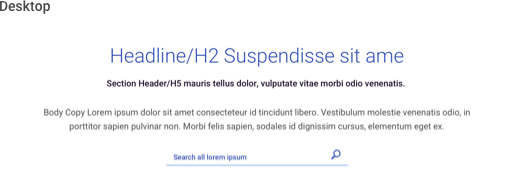{srcset="../../_assets/5.5_inline_introduction_search_desktop@2x.png 2x"}_
_{srcset="../../_assets/5.5_inline_introduction_search_mobile@2x.png 2x"}_
{.well .padded}

### Content Block: Short Form Copy

A simple inline content block supporting short-form copy, branded images, and a call-to-action.

_{srcset="../../_assets/5.5_content_block_copy_desktop@2x.png 2x"}_
_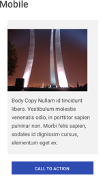{srcset="../../_assets/5.5_content_block_copy_mobile@2x.png 2x"}_
{.well .padded}

### Content Block: Video

A simple inline content block supporting quoted text and a video player; the video can play either 
inline or within a modal.

_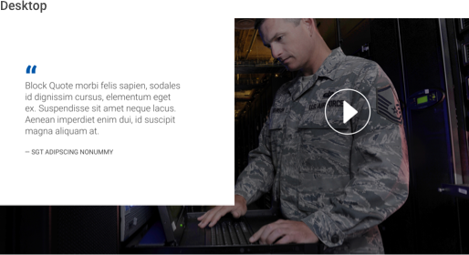{srcset="../../_assets/5.5_content_block_video_desktop@2x.png 2x"}_
_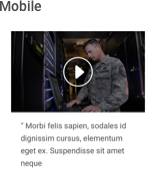{srcset="../../_assets/5.5_content_block_video_mobile@2x.png 2x"}_
{.well .padded}

### Content Block: Brand Call Out

A simple inline content block supporting brand taglines, images, and a call-to-action.

_{srcset="../../_assets/5.5_content_block_brandcallout_desktop@2x.png 2x"}_
_{srcset="../../_assets/5.5_content_block_brandcallout_mobile@2x.png 2x"}_
{.well .padded}

### Content Block: Headline and Image

This variant on Editorial Block A introduces a headline element; useful for linking to articles and major content sections, or employing near the top of the layout in lieu of a branded header.

_{srcset="../../_assets/5.5_content_block_headline_image_desktop@2x.png 2x"}_
_{srcset="../../_assets/5.5_content_block_headline_image_mobile@2x.png 2x"}_
{.well .padded}

### Content Block: Number/Bullet List

Another variant on Editorial Block A refactors the copy to support a numbered or bulleted list. Inline links provide additional details without disrupting the sequence of content.

_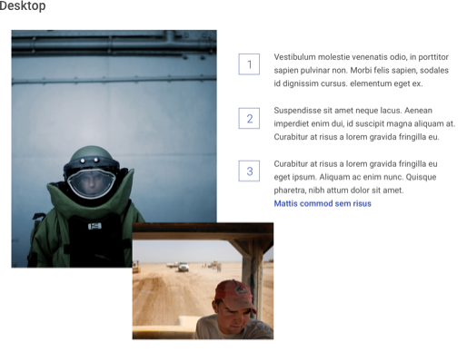{srcset="../../_assets/5.5_content_block_bulletedlist_desktop@2x.png 2x"}_
_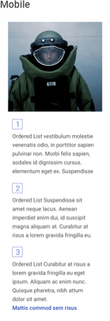{srcset="../../_assets/5.5_content_block_bulletedlist_mobile@2x.png 2x"}_
{.well .padded}

### Content Block: Image Carousel

Appropriate for galleries of five or fewer images, this inline carousel can rotate automatically after a few 
seconds, or based on user click.

_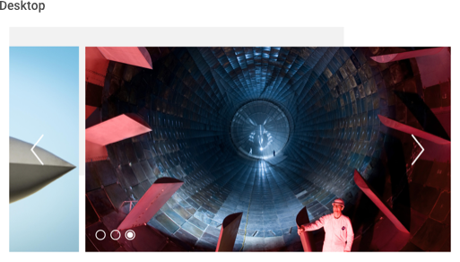{srcset="../../_assets/5.5_content_block_imagecarousel_desktop@2x.png 2x"}_
_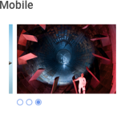{srcset="../../_assets/5.5_content_block_imagecarousel_mobile@2x.png 2x"}_
{.well .padded}

### Content Block: Data Visualization

A chart, table, or graph – in part or whole – featuring either inline interactivity or a call-to-action linking to the interactive data. Dependent upon your application, this module may exist within a summary article or on an “dashboard” view.

_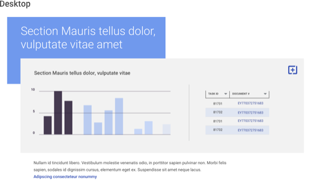{srcset="../../_assets/5.5_content_block_datavisualization_desktop@2x.png 2x"}_
_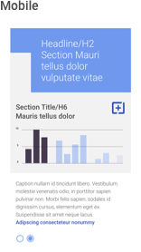{srcset="../../_assets/5.5_content_block_datavisualization_mobile@2x.png 2x"}_
{.well .padded}

### Content Block: Data Callout

“Big idea” callouts focus on important, singular data points and support headlines, body copy, and branded images; useful for providing an executive view into data without overwhelming with data visualizations.

_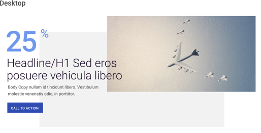{srcset="../../_assets/5.5_content_block_datacallout_desktop@2x.png 2x"}_
_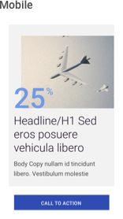{srcset="../../_assets/5.5_content_block_datacallout_mobile@2x.png 2x"}_
{.well .padded}

### Global Footer [(see section 5.2)](5-2-nav.md)

{srcset="../../_assets/5.5_globalfooterdark_desktop@2x.png 2x"}

## Half-Width (2-Up) Content Modules

Half-width (or 2-up) content modules split the viewport down the middle, and are useful for shorter-form content, callouts, and links to other pages / sections. They are to be avoided in the mobile viewport, were instead they span full-width.

### Copy 2-Up

This simple copy module supports short-form text and a call-to action; given its visual dominance it is appropriate for content of lower priority.

_{srcset="../../_assets/5.5_content_module_2up_desktop@2x.png 2x"}_
_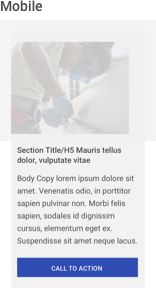{srcset="../../_assets/5.5_content_module_2up_mobile@2x.png 2x"}_
{.well .padded}

### Image 2-Up

A simple static element supporting an image, caption / body copy, and call-to-action. Can also support inline animation or video.

_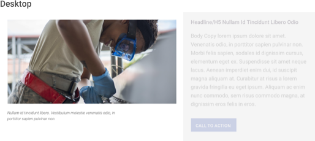{srcset="../../_assets/5.5_content_module_2up_image_desktop@2x.png 2x"}_
_{srcset="../../_assets/5.5_content_module_2up_image_mobile@2x.png 2x"}_
{.well .padded}

### Data 2-Up

So named because of its half-width nature in desktop view, this component supports a data visualization preview and caption, though most often links to a full scale data display.

_{srcset="../../_assets/5.5_content_module_2up_data_desktop@2x.png 2x"}_
_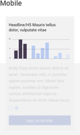{srcset="../../_assets/5.5_content_module_2up_data_mobile@2x.png 2x"}_
{.well .padded}

