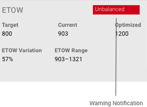
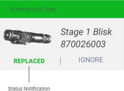
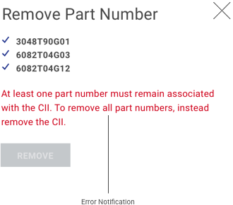
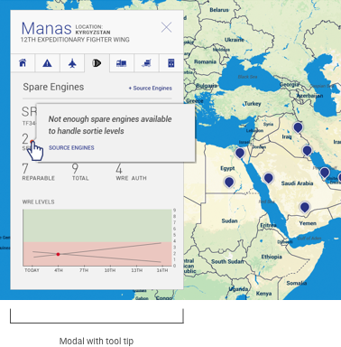
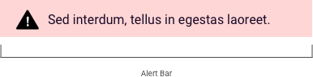
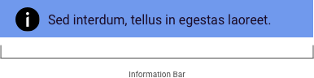

> # **5.6** Alerts & Messaging

## USAF Application Styles

Alerts & messaging are specific to applications, though their triggers, appearance, and behaviors should follow 
best practices.

#### Machine Learning

_{srcset="../../_assets/5.6_ml_notification_warning@2x.png 2x"}_
_{srcset="../../_assets/5.6_ml_notification_status_green@2x.png 2x"}_
_{srcset="../../_assets/5.6_ml_notification_status_red@2x.png 2x"}_
{.space-between .padded}

---

#### Engines Health Management

_{srcset="../../_assets/5.6_engine_health_management_warning@2x.png 2x"}_
_{srcset="../../_assets/5.6_engine_health_management_tooltip@2x.png 2x"}_
{.space-between .padded}

_{srcset="../../_assets/5.6_engine_health_management_error@2x.png 2x"}_
{.space-between .padded}

---

#### Log Common Operating Picture

_{srcset="../../_assets/5.6_log_modal_inv_add_res@2x.png 2x"}_
_{srcset="../../_assets/5.6_log_error_notification@2x.png 2x"}_
{.space-between .padded}

---

#### Positive Inventory Control

_{srcset="../../_assets/5.6_pic_install_step_error@2x.png 2x"}_
_{srcset="../../_assets/5.6_pic_install_step_error_02@2x.png 2x"}_
{.float}

_{srcset="../../_assets/5.6_pic_modal_add_comments@2x.png 2x"}_
_{srcset="../../_assets/5.6_pic_modal_loading@2x.png 2x"}_
{.float}

_{srcset="../../_assets/5.6_pic_results_warning@2x.png 2x"}_
_{srcset="../../_assets/5.6_pic_results_alert@2x.png 2x"}_
{.float}

_{srcset="../../_assets/5.6_pic_error_link_notfound@2x.png 2x"}_
_{srcset="../../_assets/5.6_pic_error_link_database_down@2x.png 2x"}_
{.float}

_{srcset="../../_assets/5.6_pic_assetslocation_no_matches@2x.png 2x"}_
_{srcset="../../_assets/5.6_pic_assetslocation_tool_tip@2x.png 2x"}_
{.float}

## Alpha Standard

The following example component illustrates the best practices outlined previously, with the practical choices that make it so.

- **Clear**. Alerts state in clear language, and with obvious color cues that they are positive / negative / neutral, the reason for the alert, and the action required of the user in order to resolve it.
- **Consistent**. Alerts follow web or application-standard patterns that are repeating and predictable. If a user were to perform the same triggering action twice, they would receive the same alert twice.
- **Actionable**. Alerts & messages offer clear next steps to resolve or address them. When appropriate to the context, alter text offers inline links, or anchor links to the offending component.

**Disclaimer**: Please default to your application’s and USAF styles; the following component standards are to be used only if those assets are not applicable or not available

_{srcset="../../_assets/5.6_as_form_field_email@2x.png 2x"}_
_{srcset="../../_assets/5.6_as_form_field_symbol_and_color_01@2x.png 2x"}_
{.float}

_{srcset="../../_assets/5.6_as_form_field_email@2x.png 2x"}_
_{srcset="../../_assets/5.6_as_form_field_error@2x.png 2x"}_
{.float}

(missing 2X)
_{srcset="../../_assets/5.6_example_alert@2x.png 2x"}_
_{srcset="../../_assets/5.6_example_warning@2x.png 2x"}_
_{srcset="../../_assets/5.6_example_checkmark@2x.png 2x"}_
_{srcset="../../_assets/5.6_example_alert@2x.png 2x"}_
_{srcset="../../_assets/5.6_example_error@2x.png 2x"}_
_{srcset="../../_assets/5.6_example_information@2x.png 2x"}_
{.float}

_{srcset="../../_assets/5.6_as_banner_alert@2x.png 2x"}_
_{srcset="../../_assets/5.6_as_banner_warning@2x.png 2x"}_
_{srcset="../../_assets/5.6_as_banner_information@2x.png 2x"}_
{.float}

## Reference Page

Alerts U.S. Web Design System
https://designsystem.digital.gov/components/alerts/
 
 