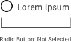
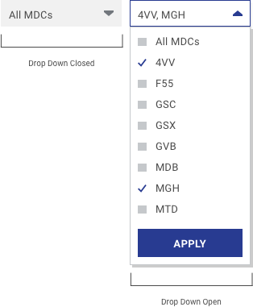

> # **5.7** Forms & Controls

Form controls are specific to applications, though their triggers, appearance, and behaviors should follow best practices (see Buttons & Controls in section 4.11). Note that many form controls are defined by the user’s browser, and thus should be presumed to default to that design.

#### Engines Health Management

{srcset="../../_assets/5.7_engines_datepicker@2x.png 2x"}
{.padded}

{srcset="../../_assets/5.7_engines_radio_on@2x.png 2x"}
{srcset="../../_assets/5.7_engines_radio_off@2x.png 2x"}

---

#### Positive Inventory Control

_{srcset="../../_assets/5.7_pic_auto_complete@2x.png 2x"}_
_{srcset="../../_assets/5.7_pic_dropdown_states@2x.png 2x"}_
{.space-between}

{srcset="../../_assets/5.7_pic_accordion@2x.png 2x"}

## Alpha Standard

The following example component illustrates the best practices outlined previously, with the practical choices that make it so.

- **Looks interactive**. Controls are differentiated from “passive” content by their label, form factor, and/or use of the design system’s call-to-action color.
- **Proximity**. Controls are placed logically near the form or element they are intended to affect. For instance, a “SUBMIT” button lives at the bottom of the related text field.
- **Predictable**. Context, form label, and control label give the user a clear understanding of what will occur when they’ve interacted with the component.

**Disclaimer**: Please default to your application’s and USAF styles; the following component standards are to be used only if those assets are not applicable or not available

{srcset="../../_assets/5.7_as_media_and_table_controls@2x.png 2x"}

_{srcset="../../_assets/5.7_as_carousel_pagenation@2x.png 2x"}_
_{srcset="../../_assets/5.7_as_video@2x.png 2x"}_
{.space-between}