> # **5.8** Visualizations

## USAF Application Styles

The styles of visualizations are specific to applications, though their appearance and behaviors should follow best practices. In the absence of a style guide, see the bottom of this section for common data visualization types, plus application-agnostic styles.

#### Log Common Operating Picture

_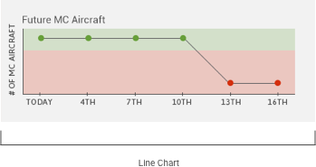{srcset="../../_assets/5.8_log_linechart@2x.png 2x"}_
_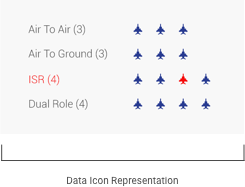{srcset="../../_assets/5.8_log_data_icon_representation@2x.png 2x"}_
_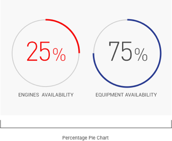{srcset="../../_assets/5.8_log_percentage_pie_chart@2x.png 2x"}_
_{srcset="../../_assets/5.8_log_sorties_per_day@2x.png 2x"}_
_{srcset="../../_assets/5.8_log_chart_sortie@2x.png 2x"}_
{.float}

---

#### Positive Inventory Control

_{srcset="../../_assets/5.8_pic_pop_up@2x.png 2x"}_
_{srcset="../../_assets/5.8_pic_progress_bar@2x.png 2x"}_
_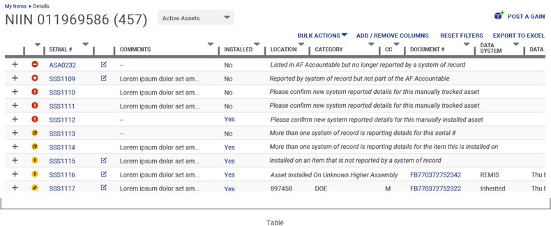{srcset="../../_assets/5.8_pic_table@2x.png 2x"}_
{.float}

---

#### Machine Learning

_{srcset="../../_assets/5.8_ml_linechart@2x.png 2x"}_
_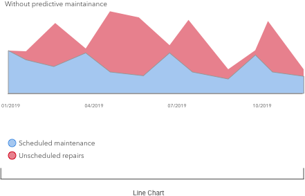{srcset="../../_assets/5.8_ml_linechart_02@2x.png 2x"}_
_{srcset="../../_assets/5.8_ml_number_treatments@2x.png 2x"}_
_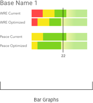{srcset="../../_assets/5.8_ml_bar_graphs@2x.png 2x"}_
_{srcset="../../_assets/5.8_ml_plotgraph@2x.png 2x"}_
{.float}

## Alpha Standard

Data visualizations should, in their very design, do most of the work of making sense of the data being displayed. Dominant sizes, color cues, and labels should provide the user the orientation and clarity they need to understand data at a glance. 

### Fundamentals of Data Visualization

- **Simplify the data**. The intention of a data visualization is to reduce the overall complexity of what is being shared. The visualization should be selected and executed in such a way that does the majority of the mental legwork for the audience.
- **Focus on a single story**. The visualization should allow the viewer to clearly understanding the situation: “things are trending well,” or “this inventory item is low,” for instance. Sometimes, this story is user-selected, such as when they sort columns by different data characteristcs (status, low-to-high, etc.).
- **Express data accurately**. In telling the single story, it can be tempting to artificially increase the size of a data element – which actually distorts the real picture of it. Try to employ techniques that draw the user’s eye without changing the visual area of the data on display.

## Data Visualizations

As the most common data visualization type in USAF applications, tables warrant particular attention. Even as relatively dense displays, certain visual design choices can aid the user in making sense of the table, and focusing on particular elements.

- **Bold and emphasize** key data points and outliers, or highlight these particular cells. This improves the scannability of the table, and draws attention to information that may require action.
- **Use standard color conventions** to communicate additional meaning. In financial data, for instance, black numbers indicate a gain, and red numbers indicate a loss. Generally, green indicates a positive trend, and red indicates a negative one.
- **Minimize “chart junk.”** Chart junk refers to the design elements that are everything except the data – separating lines, containing elements, grids, etc. They should be applied as light-handedly as possible, to create an obvious contrast between the subject of the visualization and the container in which it lives.

_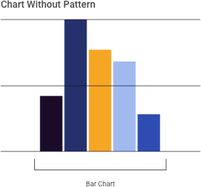{srcset="../../_assets/5.8_chart_without_pattern@2x.png 2x"}_
_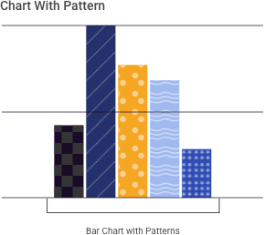{srcset="../../_assets/5.8_chart_w_pattern@2x.png 2x"}_
{.well .center}

_Caption nullam id tincidunt libero. Vestibulum molestie venenatis odio, in porttitor sapien pulvinar non._
{.caption-example}

_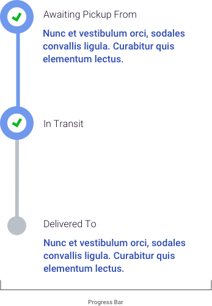{srcset="../../_assets/5.8_as_progressbar@2x.png 2x"}_
_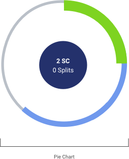{srcset="../../_assets/5.8_as_pie_chart@2x.png 2x"}_
_{srcset="../../_assets/5.8_as_chart@2x.png 2x"}_
_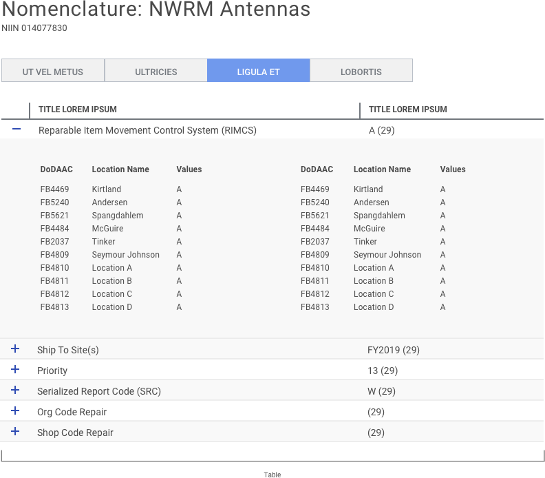{srcset="../../_assets/5.8_as_table@2x.png 2x"}_
{.float}

## Reference

- Catalog of Data Visualizations [https://datavizcatalogue.com](https://datavizcatalogue.com)
- Data Visualization Best Practices [https://www.promptcloud.com/blog/design-principles-for-effective-data-visualization](https://www.promptcloud.com/blog/design-principles-for-effective-data-visualization)
