> # **5.9** Key Mobile Components

## Mobile Requires Unique UI

The small viewport and native operating systems of mobile devices require unique design considerations and, accordingly, unique UI elements. This section outlines the key components that differ from tablet / desktop, and their most common applications. For additional guidance on the theory and practice of designing for mobile, refer to elsewhere in this playbook: [Key Mobile Standards](4-12-mobile.md) and [Content Modules](5-5-modules.md).

## Considerations & Best Practices

As a reminder, the core consideration of the mobile context is that the **device is in-hand** and **the user is on-the-go**. When translating desktop designs to mobile, don’t just miniaturize it – consider how the device and context should influence changes.

Additionally, mobile designs should

- Hide and reveal content.
- Remove unnecessary ornamentation. 
- Embrace scrolling. 
- Be tested vigorously!

## Navigation

One of the most common differences in mobile UI is the navigation, which is most commonly collapsed into a three-line icon nicknamed the “hamburger menu.” While the hamburger treatment may wane in popularity, its intent to minimize the navigation into an interactive icon remains an important mobile requirement.

_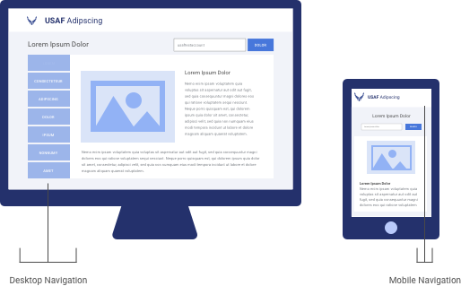{srcset="../../_assets/5.9_navigation_example@2x.png 2x"}_
{.well .extended .center}

## Other Mobile-Specific Components

Certain mobile-specific elements satisfy the best practices of small viewport design, which other leverage the functionality of the phone itself. Below are common examples.

---

#### Expand and Collapse

_{srcset="../../_assets/5.9_expand_and_collapse@2x.png 2x"}_

---

#### More Button

_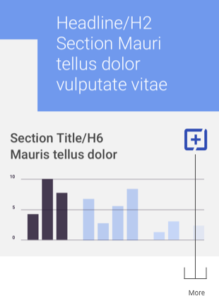{srcset="../../_assets/5.9_more_01@2x.png 2x"}_
_{srcset="../../_assets/5.9_more_02@2x.png 2x"}_
{.float}

---

#### Call Button

_{srcset="../../_assets/5.9_call_us_btn@2x.png 2x"}_

---

#### Share

_{srcset="../../_assets/5.9_share_btn@2x.png 2x"}_

## Full-screen Components

Given the small viewport, it is more common in mobile designs to completely overtake the screen with modals, forms, alerts, and error messages that must be dismissed or completed by the user. These should be used sparingly, but are useful for focusing the user’s attention.

_{srcset="../../_assets/5.9_full_screen_modal@2x.png 2x"}_
_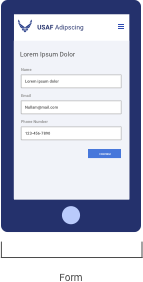{srcset="../../_assets/5.9_full_screen_form@2x.png 2x"}_
_{srcset="../../_assets/5.9_full_screen_notification@2x.png 2x"}_
{.well .center .extended}

## Accommodating OS Native Elements

When designing components, consider any native OS elements that may be triggered by interacting with the component. For instance, an open text field will trigger the appearance of the native keyboard, potentially obscuring the component and resulting in a frustrating user experience.

_{srcset="../../_assets/5.9_native_element_correct@2x.png 2x"}_
_{srcset="../../_assets/5.9_native_element_incorrect@2x.png 2x"}_
{.well .center .extended}

## Alpha Standard

The following mobile components illustrate the best practices outlined previously, with the practical choices that make it so.

**Disclaimer**: Please default to USAF application styles; these component standards are to be used only if those assets are not applicable or not available.

#### Closed and Open Hamburger Menu

_{srcset="../../_assets/5.9_as_nav_closed_cta@2x.png 2x"}_
_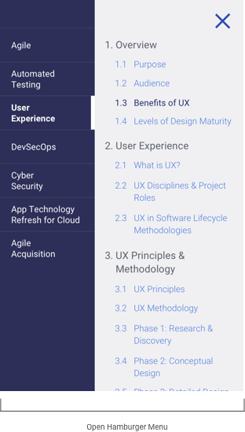{srcset="../../_assets/5.9_as_nav_open_cta@2x.png 2x"}_
{.float}

---

#### Headers

_{srcset="../../_assets/5.9_header_01@2x.png 2x"}_
_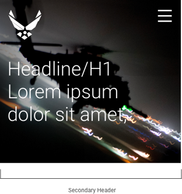{srcset="../../_assets/5.9_header_02@2x.png 2x"}_
{.float}

---

#### Content Block and Images

_{srcset="../../_assets/5.9_cb_image_01@2x.png 2x"}_
_{srcset="../../_assets/5.9_cb_image_02@2x.png 2x"}_
_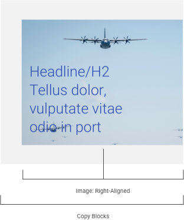{srcset="../../_assets/5.9_cb_image_03@2x.png 2x"}_
_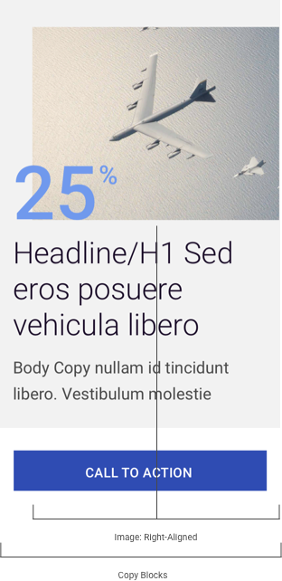{srcset="../../_assets/5.9_cb_image_04@2x.png 2x"}_
_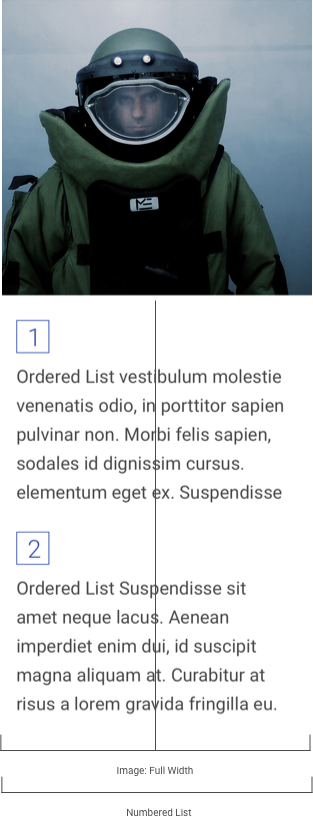{srcset="../../_assets/5.9_cb_image_05@2x.png 2x"}_
{.float .columns-5-9}

---

#### Media

_{srcset="../../_assets/5.9_media_video_player@2x.png 2x"}_
_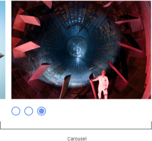{srcset="../../_assets/5.9_media_carousel@2x.png 2x"}_
{.float}

---

#### Charts and Graphs

_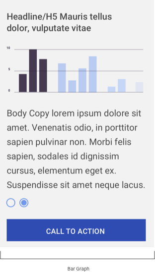{srcset="../../_assets/5.9_charts_graphs_01@2x.png 2x"}_
_{srcset="../../_assets/5.9_charts_graphs_02@2x.png 2x"}_
_{srcset="../../_assets/5.9_charts_graphs_03@2x.png 2x"}_
{.float}

---

#### Alerts & Messaging

_{srcset="../../_assets/5.9_alert_messaging_alert@2x.png 2x"}_
_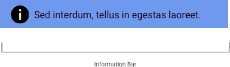{srcset="../../_assets/5.9_alert_messaging_information@2x.png 2x"}_
_{srcset="../../_assets/5.9_alert_messaging_warning@2x.png 2x"}_
{.float}

_{srcset="../../_assets/5.9_alert_messaging_confirmation@2x.png 2x"}_
_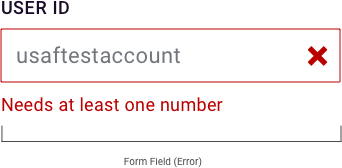{srcset="../../_assets/5.9_alert_messaging_error@2x.png 2x"}_
{.float}

_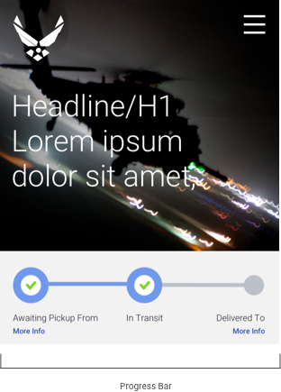{srcset="../../_assets/5.9_alert_messaging_progressbar_01@2x.png 2x"}_
_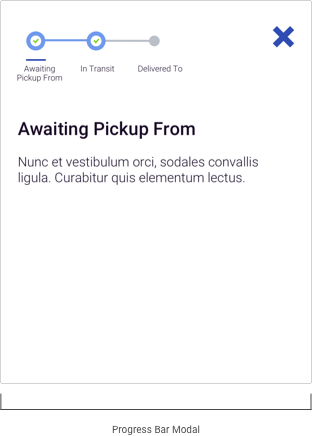{srcset="../../_assets/5.9_alert_messaging_progressbar_02@2x.png 2x"}_
{.float}

---

#### Tables Translated from Desktop to Mobile

_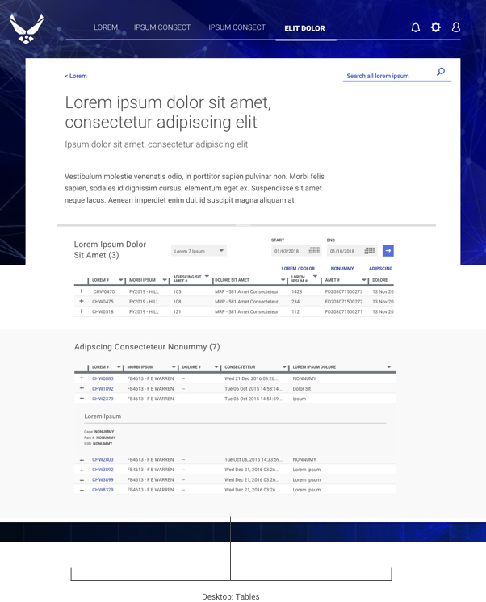{srcset="../../_assets/5.9_table_desktop@2x.png 2x"}_
_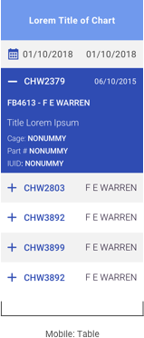{srcset="../../_assets/5.9_table_mobile@2x.png 2x"}_
{.space-between}

## References

- iOS Design Standards [https://developer.apple.com/design/human-interface-guidelines/ios/overview/themes](https://developer.apple.com/design/human-interface-guidelines/ios/overview/themes)
- Android Design Standards [https://developer.android.com/design/handhelds](https://developer.android.com/design/handhelds)
 
 