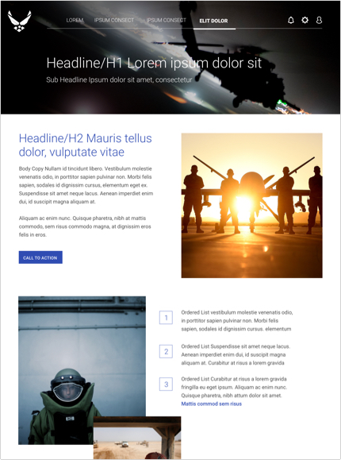
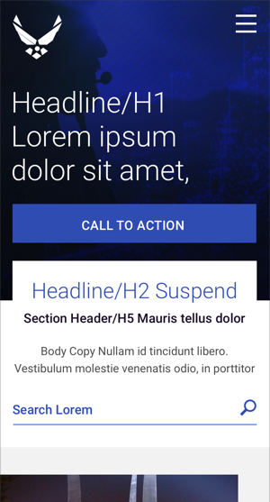

> # **6.2** Additional Standard Layouts

## Bringing Components Together

The following examples show full-page desktop and mobile layouts of the Alpha Standard design system. This is intended to further demonstrate design best practices, as well as provide a tangible example of the stacking relationship of responsive components. As with all examples in this playbook, please first refer to your specific application’s style guide

_[_{srcset="../../_assets/6.2_desktop_main@2x.jpg 2x"}_](../_assets/6.2_desktop_main.jpg 'Desktop')_
_[_{srcset="../../_assets/6.2_desktop_secondary@2x.jpg 2x"}_](../_assets/6.2_desktop_main.jpg 'Desktop Secondary')_
{.layouts-6-2 .space-between .padded}

_[_{srcset="../../_assets/6.2_desktop_table@2x.jpg 2x"}_](../_assets/6.2_desktop_main.jpg 'Desktop')_
_[_{srcset="../../_assets/6.2_mobile@2x.jpg 2x"}_](../_assets/6.2_desktop_main.jpg 'Desktop Secondary')_
{.layouts-6-2 .space-between .padded}